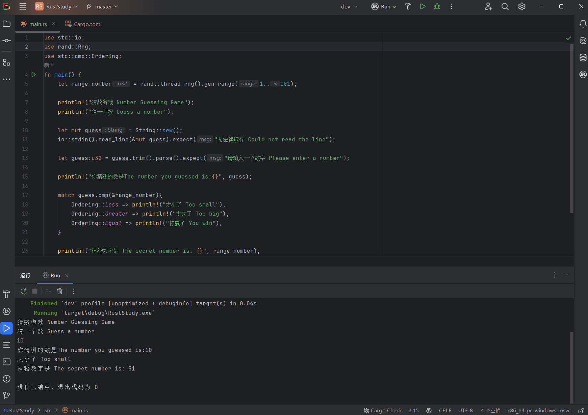

## 2.3.0 What You Will Learn
In this chapter, you will learn:
- How to use `match`
- Shadowing
- Type casting
- The `Ordering` type

## 2.3.1 Game Goal
- Generate a random number between 1 and 100
- Prompt the player to enter a guess
- **After the guess, the program will tell the player whether the guess is too large or too small (covered in this chapter)**
- If the guess is correct, print a celebration message and exit the program

## 2.3.2 Code Implementation
Here is the code written up to the previous article:
```rust
use std::io;
use rand::Rng;

fn main() {
    let range_number = rand::thread_rng().gen_range(1..101);

    println!("Number Guessing Game");

    println!("Guess a number");

    let mut guess = String::new();

    io::stdin().read_line(&mut guess).expect("Could not read the line");

    println!("The number you guessed is:{}", guess);

    println!("The secret number is: {}", range_number);
}
```

### Step 1: Convert the data type
From the code, we can see that `guess` is a string, while `range_number` is `u32`. The return type of `gen_range` follows the numeric type of the range. In this case, because `1` and `101` are inferred as `u32`, the return value is also `u32`. These two variables have different types and cannot be compared directly. We need to convert the string into an integer.
```rust
let guess: u32 = guess.trim().parse().expect("Please enter a number");
```

- `let guess: u32`: declares a variable named `guess` of type `u32` (an unsigned 32-bit integer, which means it cannot represent negative numbers).
  But there is a problem here: in the previous code (`let mut guess = String::new();`), a variable named `guess` has already been declared. Would this cause an error? No, because Rust allows a new variable with the same name to shadow the old one. This is called **shadowing** (*when a variable, function, or type name is redefined in the current scope, it hides the variable, function, or type with the same name in the outer scope*). It allows the code to reuse the same variable name without declaring a new one. We will discuss this feature in detail in the next chapter.

  Here is an example:
```rust
fn main() {
    let a = 1;
    println!("{}", a);
    let a = "one";
    println!("{}", a);
}
```
This code does not produce an error, and it prints:
```
1
one
```
When the program executes the second line, `a` is assigned the value `1`, so `1` is printed. On the fourth line, the program notices that `a` is being reused, discards the old value `1`, and assigns `"one"` to `a`, so the next line prints `one`. This is **shadowing**.

- `=`: assignment
- `guess.trim()`: here, `guess` refers to the old `guess`, whose type is a string containing the user’s input. Because `read_line()` records the user’s Enter key as well, we need to use `.trim()`. `.trim()` removes leading and trailing spaces and newlines from the string, similar to `.strip()` in Python.
- `.parse()`: parses a string into **some numeric type**. The user’s normal input will be a number between 1 and 100, and that value can fit into types like `i32`, `u32`, or `i64`. So what type does it become after parsing? You need to tell Rust which type you want, which is why the variable declaration explicitly specifies `u32` (similar to static type annotations in Python, by adding `:desired_type` after the variable name).
  Of course, conversion can fail. For example, if the input is `xyz`, it cannot be parsed as an integer. Rust is smart enough to make `.parse()` return a `Result` type (which we covered in Pt. 1). This enum has two variants: `Ok` and `Err`. If conversion succeeds, the enum returns `Ok` and the converted result; if it fails, it returns `Err` and the reason for the failure.
- `.expect()`: a method on the `Result` type, which is the same type returned by `.parse()`. If parsing fails, `.parse()` returns `Err`, and `.expect()` immediately triggers `panic!`, ends the current program, and prints the error message inside `expect`. Otherwise, `.parse()` returns `Ok`, and `.expect()` returns the attached value, which is the converted number assigned to `guess`.

### Step 2: Compare the numbers
After the data type conversion succeeds, we can compare the two numbers.
First, import the type at the top of the code:
```rust
use std::cmp::Ordering;
```
This code imports the `Ordering` type from the `std` standard library. `Ordering` is an enum with three **variants** (you can think of them as three possible values): `Ordering::Less`, `Ordering::Greater`, and `Ordering::Equal`, which mean less than, greater than, and equal to.

Then write the comparison code in `main`:
```rust
match guess.cmp(&range_number) {
    Ordering::Less => println!("Too small"),
    Ordering::Greater => println!("Too big"),
    Ordering::Equal => println!("You win"),
}
```
- `guess.cmp(&range_number)`: `guess` has a method called `.cmp()` (`cmp` is short for compare). It compares the value before the dot with the value inside the parentheses. Here, the value before the dot is `guess`, and the value inside the parentheses is a reference to `range_number` (`&` is the address-of operator, which represents a reference). The return type of `.cmp()` is `Ordering`, which is the type imported above.

  This also involves Rust’s type inference. Here are two IDE screenshots, one before this `match` expression was written and one after it was written. Pay attention to the line `let range_number = rand::thread_rng().gen_range(1..101);` (line 5):
  
  
  You can see that without the `match` expression, the IDE suggests that `range_number` is `i32`. After writing the `match` expression, the IDE suggests that `range_number` is `u32`. Why is that? Because `guess.cmp(&range_number)` performs a comparison, and although `range_number` is not explicitly typed, `guess` has already been explicitly defined as `u32`. Thanks to Rust’s powerful context-based type inference, the requirement of `guess.cmp(&range_number)` causes `range_number` to be inferred as `u32`. Without the `match` expression, because Rust’s default integer type is `i32` and there are no other constraints forcing `range_number` to be another type, the compiler infers `i32`.

- `match`: Rust’s pattern-matching expression. It lets us decide what to do next based on the value returned by `.cmp()`, which is the `Ordering` enum. A `match` expression is made up of multiple arms (also called branches). Each branch contains a **matching pattern** (the condition used to match the input value) and a **code block to execute** (the block that runs when the pattern matches). If the value after `match` (in this program, `guess.cmp(&range_number)`) matches one branch, the program runs that branch’s code.

  In this program, `Ordering::Less`, `Ordering::Greater`, and `Ordering::Equal` are the **matching patterns**, and `println!("Too small")`, `println!("Too big")`, and `println!("You win")` are their corresponding **code blocks**. For example, if `guess` is equal to `range_number`, `.cmp()` returns `Ordering::Equal`, `match` finds the third branch that matches it, and then executes that branch’s code block, namely `println!("You win")`.

  `match` checks branches from top to bottom. In this program, that means it checks `Ordering::Less` first, then `Ordering::Greater`, and finally `Ordering::Equal`.

  We will explain `match` in more detail in the next chapter.

## 2.3.3 Result
Here is the complete code so far:
```rust
use std::io;
use rand::Rng;
use std::cmp::Ordering;

fn main() {
    let range_number = rand::thread_rng().gen_range(1..101);

    println!("Number Guessing Game");
    println!("Guess a number");

    let mut guess = String::new();
    io::stdin().read_line(&mut guess).expect("Could not read the line");

    let guess: u32 = guess.trim().parse().expect("Please enter a number");

    println!("The number you guessed is:{}", guess);

    match guess.cmp(&range_number) {
        Ordering::Less => println!("Too small"),
        Ordering::Greater => println!("Too big"),
        Ordering::Equal => println!("You win"),
    }

    println!("The secret number is: {}", range_number);
}
```

The result is:

