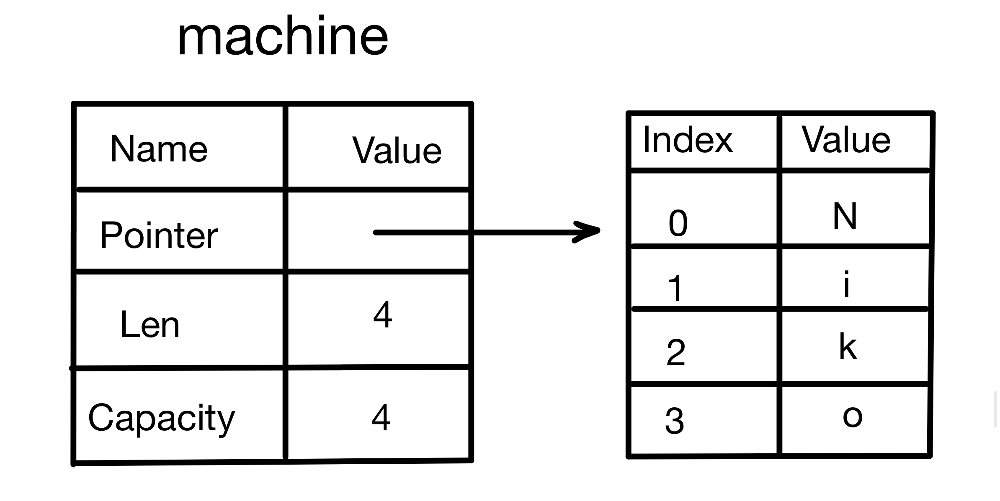

## 4.2.0 Before We Begin
After learning Rust’s general programming concepts, you’ve arrived at the most important topic in all of Rust—**ownership**. It’s quite different from other languages, and many beginners find it hard to learn. This chapter aims to help beginners fully master this feature.

This chapter has three sections:
- Ownership: Stack Memory vs. Heap Memory
- **Ownership Rules, Memory, and Allocation (this article)**
- Ownership and Functions


## 4.2.1 Ownership Rules
Ownership has three rules:
- Every value has a variable, and that variable is the owner of the value
- Every value can only have one owner at a time
- When the owner goes out of scope, the value is deleted

## 4.2.2 Variable Scope
Scope is the valid range of an item in a program.
```rust
fn main(){
	// machine is not available
	let machine = 6657; // machine is available
	// operations can be performed on machine
} // machine’s scope ends here, and machine is no longer available
```
In the third line of the sample code, the variable `machine` is declared, while in the second line the variable has not yet been declared, so it is not available there. In the third line, since it is declared, it becomes available. In the fourth line, you can perform related operations on `machine`. In the fifth line, `machine`’s scope ends, and from that line onward, `machine` is no longer available.

This example involves two key points:
- `machine` becomes valid once it enters its scope
- `machine` remains valid until it leaves its scope
These two points are similar in other languages, so there is no need to go into detail.

## 4.2.3 The String Type
To demonstrate some ownership-related rules, we need a slightly more complex data type, and `String` fits the need.

The `String` type is more complex than scalar types: the basic data types mentioned earlier store their data on the stack, and their data is popped off the stack when they go out of scope; **the `String` type is stored on the heap**.

This chapter focuses on the ownership-related aspects of `String`. If you want to understand `String` itself in depth, you will have to wait for later chapters.

String literals (`&'static str`) are the string values you write directly in code. But they cannot meet all needs. First, they are **immutable**; second, not all string values are known when writing the program (for example, user input).

For these cases, Rust provides a second string type, `String`. `String` can allocate on the heap, and it can store text whose size is unknown at compile time.

## 4.2.4 Creating `String` Values
Use the `from` function to create a `String` from a string literal, for example:
```rust
let machine = String::from("6657");
```
- `::` means that `from` is a function under `String`. You can think of it as a static method in other languages.

The `String` declared this way is mutable, for example:
```rust
fn main(){
	let mut machine = String::from("6657");
	machine.push_str(" up up!");
	println!("{}", machine);
}
```
- Adding `mut` after `let` means that the variable `machine` can be modified
- `.push_str()` is a method on this variable that appends a string literal to the end of the value; in the example, that literal is `" up up!"`

Its output is:
```
6657 up up!
```

Why is `String` mutable, while `&'static str` (string literals) are not:
- `String` is a **heap-allocated** mutable string type that can grow or shrink its contents dynamically.
- String literals are of type `&'static str` and are stored in the program’s **static memory** (a read-only region).

## 4.2.5 Memory and Allocation
For string literals, because they are written in source code, their contents are known at compile time. Their text content is hard-coded directly into the final executable. Their speed and efficiency come from their immutability.

To support mutability, `String` needs to allocate memory on the heap to store text whose size is unknown at compile time. This requires the operating system to request memory at runtime (which happens through `String::from`).

After using a `String`, some way is needed to return the memory to the operating system:
- In languages with a GC (garbage collector), such as C#, the GC tracks and cleans up memory that is no longer being used

- In languages without a GC, such as C/C++, programmers must identify when memory is no longer in use and write code to return it
  - If you forget, memory is wasted
  - If you do it too early, the variable becomes invalid
  - If you do it twice, a very serious bug occurs—**double free**. This may cause data that is still in use to become corrupted and create potential security risks. One allocation must correspond to one free.

- Rust uses a different mechanism: for a given value, when the variable that owns it goes out of scope, Rust calls a special function—the **drop function**—and the memory is immediately returned to the operating system, meaning it is immediately freed.

## 4.2.6 How Variables Interact with Data
### 1. Move
Multiple variables can interact with the same data in a unique way.
```rust
let x = 5;
let y = x;
```
In this example, 5 is bound to the variable `x`; on the next line, it is equivalent to creating a copy of `x` and binding that copy to `y`. Because integers are simple values with known and fixed sizes, these two 5s are pushed onto the stack.

But if the situation is more complex, such as with the `String` type, things are different.
```rust
let machine = String::from("Niko");
let wjq = machine;
```
In this example, the first line uses the `from` function under `String` to obtain a `String` value from a string literal, named `machine`. Then the second line binds `machine` to `wjq`.

Although the code looks similar, ***the way the two examples run is completely different***.

First we need to understand that a `String` consists of three parts, as shown below:


- A pointer to the memory that stores the string contents
- A length
- A capacity

This part of the data is pushed onto the stack, while the part that stores the string contents is on the heap. The length (`len`) is the number of bytes required to store the string contents, and the capacity (`capacity`) is the total number of bytes of memory `String` obtained from the operating system.

When the value of `machine` is assigned to `wjq`, the data on the stack is copied to `wjq`, but the data on the heap pointed to by the pointer is not copied.


When a variable goes out of scope, Rust automatically calls the `drop` function and frees the heap memory used by the variable. This was mentioned above. But when `machine` and `wjq` go out of scope at the same time, both will try to free the same memory, causing a very serious bug—**double free**. Its danger has already been explained above, so it will not be elaborated here.

To ensure memory safety, Rust directly invalidates the first variable `machine` and moves the value to `wjq`. When `machine` goes out of scope, Rust does not need to free any memory related to `machine` (of course `wjq` still needs to be freed, because it is valid), because `machine` has already become invalid.

If you try to use `machine` after it has been invalidated, an error will occur (the code and result are shown below):
Code:
```rust
fn main(){
	let machine = String::from("Niko");
	let wjq = machine;
	println!("{}", machine);
}
```
Result:
```
error[E0382]: borrow of moved value: 'machine'
```

People who have studied other languages may have encountered shallow copy and deep copy. Some people consider copying the pointer, length, and capacity to be a shallow copy, but because Rust invalidates `machine`, a new term is used here: move.

There is a hidden design principle here: **Rust does not automatically create deep copies of data**. In other words, in terms of runtime performance, any automatic assignment operation is cheap.

### 2. Clone
If you really want to deeply copy `String` data on the heap, rather than just the data on the stack, you can use the `clone` method.
```rust
let machine = String::from("Niko");
let wjq = machine.clone();
```
Using this method, both the stack data and the heap data are fully copied.


However, cloning is relatively resource-intensive, so use it carefully.

### 3. Stack Data: Copy
For data on the stack, cloning is not needed; copying is enough.
```rust
let x = 5;
let y = x;
println!("{},{}", x, y)
```
In this example, both `x` and `y` **are valid** because `x` is an integer type. Integer types are basic types in Rust (such as `i32`, `u32`, and so on). Their sizes are already known at compile time, and their values are fully stored on the stack. Because these types implement the **Copy trait** (you can think of a trait as an interface), assignment is actually a direct copy of the value rather than a transfer of ownership.

For types that implement the Copy trait, creating a new variable such as `y` triggers a bitwise copy operation, which is very efficient. At the same time, the original variable such as `x` remains valid. Therefore, in this case, calling `clone` makes no difference from direct assignment, because the copying behavior is essentially the same.

If a type implements the Copy trait, the old variable is still usable after assignment. If a type or part of a type implements the **Drop trait**, Rust will **not allow it to implement the Copy trait**.

**Some types that have the Copy trait**:
- Any composite type made up only of simple scalar values can implement the Copy trait
- Anything that needs to allocate memory or some other resource cannot implement the Copy trait

For tuples, if all of the elements can implement the Copy trait, then the tuple can as well; if even one element cannot implement the Copy trait, then the entire tuple cannot.
- `(i32, u32)` can implement the Copy trait
- `(i32, String)` cannot implement the Copy trait because `String` cannot implement the Copy trait
