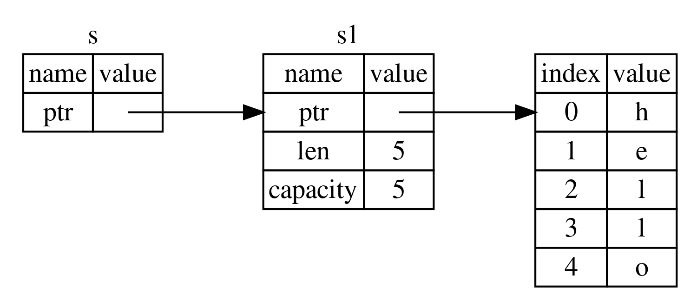

## 4.4.0 Before the Main Text
This section is actually similar to how C++'s move semantics for smart pointers are constrained at the compiler level. The way references are written in Rust becomes, through compiler restrictions, the most ideal and most standardized way to write pointers in C++. So anyone who has studied C++ will definitely find this chapter very familiar.


## 4.4.1 References
References **let a function use a value without taking ownership of it**. When declaring one, add `&` before the type to indicate a reference. For example, a reference to `String` is `&String`. If you have studied C++, the dereference operator in C++ is `*`, and it is the same in Rust.

After learning references, you can simplify the example at the end of the previous article.

Here is the previous code:
```rust
fn main() {
    let s1 = String::from("hello");
    let (s2, len) = calculate_length(s1);
    println!("The length of '{}' is {}", s2, len);
}

fn calculate_length(s: String) -> (String, usize) {
    let length = s.len();
    (s, length)
}
```
Here is the modified code:
```rust
fn main() {
    let s1 = String::from("hello");
    let length = calculate_length(&s1);
    println!("The length of '{}' is {}", s1, length);
}

fn calculate_length(s: &String) -> usize {
    s.len()
}
```
Comparing the two, in the latter version, a pointer to the data is passed into the `calculate_length` function for it to operate on, while ownership of the data remains with the variable `s1`. There is no need to return a tuple, and there is no need to declare another variable `s2`, which makes it much more concise.

The parameter `s` of the function `calculate_length` is actually a pointer that points to the stack memory location where `s` resides (it does not directly point to the data on the heap). When this pointer goes out of scope, Rust does not destroy the data it points to, because `s` does not own it. Rust only pops the pointer information stored on the stack, which means it frees the memory occupied by the leftmost part in the image below.


Using a reference as a function parameter is called **borrowing**.

## 4.4.2 Properties of Borrowing
**Borrowed content cannot be modified unless it is a mutable reference.**

Take a house as an example: if you rent out a house that you own, that is borrowing. The tenant can live in it but cannot freely renovate it; this is the property that borrowed content cannot be modified. If you allow the tenant to renovate it, that is a mutable reference.

Using this code as an example:
```rust
fn main() {
    let s1 = String::from("hello");
    let length = calculate_length(&s1);
    println!("The length of '{}' is {}", s1, length);
}

fn calculate_length(s: &String) -> usize {
    s.push_str(", world");
    s.len()
}
```
This code will produce a compile-time error:
```
error[E0596]: cannot borrow `*s` as mutable, as it is behind a `&` reference
```
The reason for the error is the line `s.push_str(", world");`: references are immutable by default, but this line modifies the data.

Just like ordinary variable declarations, references are immutable by default, but they become mutable when the `mut` keyword is added:
```rust
fn main() {
    let mut s1 = String::from("hello");
    let length = calculate_length(&mut s1);
    println!("The length of '{}' is {}", s1, length);
}

fn calculate_length(s: &mut String) -> usize {
    s.push_str(", world");
    s.len()
}
```
Writing it this way will not cause an error, but remember to declare `s1` as a mutable variable when you declare it.

This kind of reference that can modify the data is called a **mutable reference**.

## 4.4.3 Restrictions on Mutable References

*Mutable references have two very important restrictions. The first is: **within a specific scope, for a particular piece of data, there can only be one mutable reference.***

Using this code as an example:
```rust
fn main() {
    let mut s = String::from("hello");
    let s1 = &mut s;
    let s2 = &mut s;
}
```
Because both `s1` and `s2` are mutable references pointing to `s`, and they are in the same scope, the compiler will report an error:
```
error[E0499]: cannot borrow `s` as mutable more than once at a time
```

The purpose of this is to prevent **data races**. A data race occurs when the following three conditions are all met at the same time:
- Two or more pointers access the same data at the same time
- At least one pointer is used to write to the data
- No mechanism is used to synchronize access to the data

The error message mentions `at a time`, meaning simultaneously, which is to say within the same scope. So as long as they are not simultaneous, that is, **two mutable references pointing to the same data in different scopes are allowed**. The following code illustrates this:
```rust
fn main() {
    let mut s = String::from("hello");
    {
        let s1 = &mut s;
    }
    let s2 = &mut s;
}
```
`s1` and `s2` do not have the same scope, so pointing to the same piece of data is allowed.

*The second important restriction on mutable references is: **you cannot have one mutable reference and one immutable reference at the same time**.* The purpose of a mutable reference is to modify the data, while the purpose of an immutable reference is to keep the data unchanged. If both exist at the same time, then once the mutable reference changes the value, the immutable reference no longer serves its purpose.
```rust
fn main() {
    let mut s = String::from("hello");
    let s1 = &mut s;
    let s2 = &s;
}
```
Because `s1` is a mutable reference and `s2` is an immutable reference, and both appear in the same scope pointing to the same piece of data, the compiler will report an error:
```
error[E0502]: cannot borrow `s` as mutable because it also borrowed as immutable
```

Of course, **multiple immutable references can exist at the same time**.

*In summary*: multiple readers (immutable references) can **exist simultaneously**, multiple writers (mutable references) can exist but **not simultaneously**, and multiple writers together with simultaneous read/write access are **not allowed**.

## 4.4.4 Dangling References
When using pointers, it is very easy to cause an error called a **dangling pointer**. It is defined as: **a pointer refers to some address in memory, but that memory may already have been freed and reassigned for someone else to use.**

**If you reference some data, Rust’s compiler guarantees that the data will not go out of scope before the reference goes out of scope.** This is how Rust ensures that dangling references never occur.

Using this code as an example:
```rust
fn main() {
    let r = dangle();
}

fn dangle() -> &String {
    let s = String::from("hello");
    &s
}
```
- **A local variable `s` is created**:
  The variable `s` is a `String`. It is allocated on the stack, but its underlying data is stored on the heap.
- **A reference to `s` is returned**:
  The function returns a reference to `s` via `&s` at the end.
- **`s` goes out of scope**:
  After the function `dangle` returns, the variable `s` leaves scope. According to Rust’s ownership rules, the memory for `s` is automatically freed. The memory data pointed to by `&s` no longer stores the data of `s`, so the returned reference points to an already freed memory address and becomes a dangling reference.

Rust’s compiler will detect this and report an error at compile time.

## 4.4.5 Reference Rules
- At any given time, you can only satisfy one of the following conditions:
  - One mutable reference
  - Any number of immutable references
- References must always be valid
