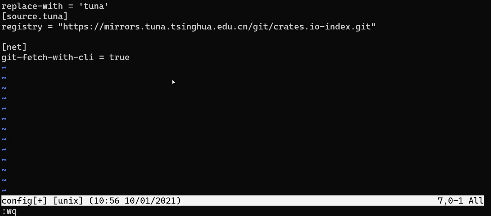

## 7.5.1 Re-importing Names with `pub use`
After using `use` to bring a path into scope, that name is **private** within the lexical scope.

Using the code from the previous article as an example:
```rust
mod front_of_house {  
    pub mod hosting {  
        pub fn add_to_waitlist() { }  
        fn seat_at_table() { }  
    }  
}  
  
use crate::front_of_house::hosting::add_to_waitlist;  
  
pub fn eat_at_restaurant() {  
    add_to_waitlist();  
}
```
For external code, `eat_at_restaurant` is accessible because it was declared with the `pub` keyword, but external code cannot see the `add_to_waitlist` used inside `eat_at_restaurant`, because items imported with `use` are private by default. If you want external code to access it as well, you need to add `pub` in front of `use`:
```rust
mod front_of_house {  
    pub mod hosting {  
        pub fn add_to_waitlist() { }  
        fn seat_at_table() { }  
    }  
}  
  
pub use crate::front_of_house::hosting::add_to_waitlist;  
  
pub fn eat_at_restaurant() {  
    add_to_waitlist();  
}
```
This allows external code to access the item brought in with `use`.

When we want to expose code publicly, we can use this technique to adjust the outward-facing API instead of following the internal code structure exactly. In this way, the internal structure and the outward view of the code may differ a bit. After all, the person writing the code and the person calling the code usually expect different things.

To summarize: **`pub use` both re-exports the item into the current scope and makes that item available for external code to import into their scope.**

## 7.5.2 Using External Packages
First, add the package name and version of the dependency to `Cargo.toml`, and Cargo will download that package and its dependencies from `crates.io` to your local machine (you can also use an unofficial crate and fetch it from GitHub, but that is strongly discouraged). Then use `use` in the code to bring the specific item into scope.

Do you remember the guessing game from Chapter 2? Back then we needed the `rand` package to generate random numbers. We will still use `rand` as an example:
## Step 1: Modify `Cargo.toml`
Open your project’s `Cargo.toml` file, and under `[dependencies]`, write the package name and version, connected with `=`:
```toml
[package]  
name = "RustStudy"  
version = "0.1.0"  
edition = "2021"  
  
[dependencies]  
rand = "0.8.5"
```

## Step 2: Import the Package in Source Code
To use something from a package, just use `use` to import the corresponding path. Here I need the function that generates random numbers, so I import the parent module of that function, `Rng`, like this:
```rust
use rand::Rng;
```

The Rust standard library, `std`, is also treated as an external package, but it is built into Rust itself, so you do not need to add it to `Cargo.toml`. You can just import it in the source code with `use`, which is somewhat like libraries such as `re`, `os`, and `ctype` in Python.

For example, if we want to import the `HashMap` struct from the `collections` module under `std`, we write:
```rust
use std::collections::HashMap;
```
No changes to `Cargo.toml` are needed.

## 7.5.3 Cleaning Up Many `use` Statements with Nested Paths
Sometimes you use multiple items from the same package or module, and the beginning of the path is the same, but you still have to write it repeatedly. If there are many imports, writing them one by one is not practical. Rust therefore allows **nested paths** to simplify imports **on a single line**. This is similar to the brace expansion feature in `bash`.

The format is:
```rust
use common_part::{different_part1, different_part2, ...}
```

Look at an example:
```rust
use std::cmp::Ordering;
use std::io;
```
They share the common part `std`, so they can be rewritten with a nested path:
```rust
use std::{cmp::Ordering, io};
```

If one import is a subpath of another import, Rust also allows the `self` keyword when using nested paths, as shown below:
```rust
use std::io;
use std::io::Write;
```
This can be shortened to:
```rust
use std::io::{self, Write};
```

## 7.5.4 The Wildcard `*`
Using `*` brings all public items in a path into scope. For example, if I want to import all public items from the `collections` module under the `std` library, I can write:
```rust
use std::collections::*;
```
But this kind of import must be used very carefully, and is usually avoided.

Its use cases are:
- Importing all tested code into the `test` module during testing
- Sometimes used in prelude modules

## 7.5.5 Switching the Download Source for Rust Dependencies
Because the `crates.io` website is overseas, downloads can be slow in China, so you can switch to Tsinghua University’s mirror.

Open Windows Terminal (*built into Win11; Win10 users need to download it from the Microsoft Store for free*), find the path to your project folder, and enter the command, then press Enter:
```
cd your-folder-path
```

Then create a `config` file in the folder by entering:
```
touch config
```

Edit it by entering:
```
vim config
```

Paste this in:
```
[source.crates-io]
registry = "https://github.com/rust-lang/crates.io-index"
replace-with = 'tuna'
[source.tuna]
registry = "https://mirrors.tuna.tsinghua.edu.cn/git/crates.io-index.git"
[net]
git-fetch-with-cli = true
```
Move the cursor (*not the mouse pointer!*) down from

to

then enter:
```
:wq
```
and press Enter to save.

Then rebuild your project.
