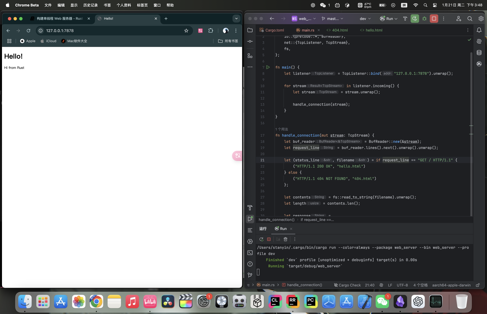
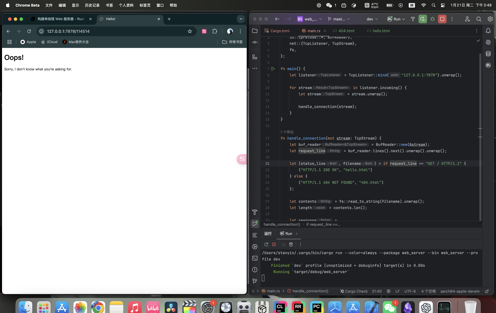

# 20.1.1. 什么是TCP和HTTP
Web 服务器涉及的两个主要协议是*超文本传输​​协议*(Hypertext Transfer Protocol，简称HTTP)和*传输控制协议*(Transmission Control Protocol，简称TCP)。这两种协议都是*请求-响应*协议，即*客户端*发起请求，然后*服务器*监听请求并向客户端提供响应。这些请求和响应的内容由协议定义。

TCP是较低级别的协议，它描述信息如何从一台服务器传输到另一台服务器的详细信息，但不指定该信息是什么。HTTP通过定义请求和响应的内容构建在TCP之上。从技术上讲，可以将HTTP与其他协议结合使用，但在绝大多数情况下，HTTP通过TCP发送数据。我们将使用TCP和HTTP请求和响应的原始字节。

# 20.1.2. 监听TCP
了解了以上信息之后，我们就开始实践吧！首先创建这个项目：
```bash
cargo new web_server
```

打开`main.rs`，初步的代码如下：
```rust
use std::net::TcpListener;

fn main() {
    let listener = TcpListener::bind("127.0.0.1:7878").unwrap();

    for stream in listener.incoming() {
        let stream = stream.unwrap();

        println!("Connection established!");
    }
}
```
- `std::net::TcpListener`是一个标准库提供的监听TCP的模块

- `TcpListener::bind`函数会监听传进去的这个地址，我们这里传进去的是"127.0.0.1:7878"，也就是本地的7878接口，它的返回类型是一个`Result<T, E>`，需要使用`unwrap`进行错误处理。如果能成功监听，就会返回`TcpListener`类型赋给变量`listener`。

- `TcpListener`类型上有`incoming`方法，它会返回一个产生流序列的这个迭代器，也就是`TcpStream`流，而单个流就表示客户端和服务器之间打开了一个连接，而使用`for`循环就会依次处理每一个连接，生成一系列的流让我们处理。

让我们尝试运行这段代码。在终端调用`cargo run`然后加载 Web 浏览器中的`127.0.0.1:7878`。浏览器应该显示一条错误消息，例如“连接重置”，因为服务器当前没有发回任何数据。但是当你查看终端时，你应该会看到浏览器连接到服务器时打印的几条消息。


# 20.1.3. 读取请求
我们已经实现了监听TCP，接下来我们来尝试读取请求。我们直接在上文的代码上修改：
```rust
use std::{  
    io::{prelude::*, BufReader},  
    net::{TcpListener, TcpStream},  
};  
  
fn main() {  
    let listener = TcpListener::bind("127.0.0.1:7878").unwrap();  
  
    for stream in listener.incoming() {  
        let stream = stream.unwrap();  
  
        handle_connection(stream);  
    }  
}  
  
fn handle_connection(mut stream: TcpStream) {  
    let buf_reader = BufReader::new(&stream);  
    let http_request: Vec<_> = buf_reader  
        .lines()  
        .map(|result| result.unwrap())  
        .take_while(|line| !line.is_empty())  
        .collect();  

	println!("Request: {:#?}", http_request);
}
```
- 我们定义了一个名为`handle_connection`的函数，用于处理客户端连接。参数`stream`是一个可变的`TcpStream`类型实例，用于与客户端通信。`TcpStream`的内部状态可能会随着数据读取和写入发生变化，因此需要将其声明为`mut`。

- 我们通过`BufReader`包裹了`stream`，创建了一个缓冲读取器`buf_reader`。

- 我们使用`map(|result| result.unwrap())`解包`Result`，提取其中的字符串。如果读取发生错误，程序会因`unwrap`调用而恐慌。

- `take_while(|line| !line.is_empty())`过滤迭代器中的元素，直到遇到空行为止。HTTP请求以空行（`""`）标志请求头结束，因此我们仅收集非空行。

- 我们将所有非空行收集到一个向量`Vec<_>`中，存储为`http_request`。

- 使用`println!`打印出来`http_request`。

试一下：

终端输出的信息如下：
```
Request: [
    "GET / HTTP/1.1",
    "Host: 127.0.0.1:7878",
    "Connection: keep-alive",
    "sec-ch-ua: \"Not(A:Brand\";v=\"99\", \"Google Chrome\";v=\"133\", \"Chromium\";v=\"133\"",
    "sec-ch-ua-mobile: ?0",
    "sec-ch-ua-platform: \"macOS\"",
    "Upgrade-Insecure-Requests: 1",
    "User-Agent: Mozilla/5.0 (Macintosh; Intel Mac OS X 10_15_7) AppleWebKit/537.36 (KHTML, like Gecko) Chrome/133.0.0.0 Safari/537.36",
    "Accept: text/html,application/xhtml+xml,application/xml;q=0.9,image/avif,image/webp,image/apng,*/*;q=0.8,application/signed-exchange;v=b3;q=0.7",
    "Sec-Fetch-Site: none",
    "Sec-Fetch-Mode: navigate",
    "Sec-Fetch-User: ?1",
    "Sec-Fetch-Dest: document",
    "Accept-Encoding: gzip, deflate, br, zstd",
    "Accept-Language: zh-US,zh;q=0.9,en-US;q=0.8,en;q=0.7,zh-CN;q=0.6",
]
```

HTTP是基于文本的协议，它的请求采用以下格式：
```
Method Request-URI HTTP-Version CRLF
headers CRLF
message-body
```
第一行是*请求行*，保存有关客户端请求的信息。请求行的第一部分指示正在使用的*方法*，例如`GET`或`POST` ，它描述了客户端如何发出此请求。我们的客户使用了`GET`请求，这意味着它正在询问信息。

请求行的下一部分是`/`，它表示客户端请求的*统一资源标识符* (URI)：URI几乎与*统一资源定位符*(URL)相同，但不完全相同。URI和URL之间的区别对于本章的目的并不重要，但HTTP 规范使用了术语URI，因此我们可以在这里用URL代替URI。

最后一部分是客户端使用的 HTTP 版本，然后请求行以*CRLF序列*结束。（CRLF代表*回车*和*换行*) CRLF序列也可以写成 `\r\n`，其中 `\r` 是回车，`\n` 是换行。CRLF 序列将请求行与其余请求数据分开。请注意，当打印CRLF时，我们会看到一个新的行而不是 `\r\n`。
# 20.1.4. 编写响应
实现了读取请求，接下来我们来写响应。响应和请求是差不多的格式：
```
HTTP-Version Status-Code Reason-Phrase CRLF
headers CRLF
message-body
```
第一行是一个*状态行*，其中包含响应中使用的HTTP版本、一个数字状态代码，以及状态代码对应的文本描述，最后是一个CRLF序列。

有了格式就好写代码：
```rust
let response = "HTTP/1.1 200 OK\r\n\r\n";  

stream.write_all(response.as_bytes()).unwrap();
```
- `HTTP/1.1`是HTTP版本，200是数字状态码，`OK`是文本描述，`\r\n\r\n`是CRLF序列。

- 我们在`response`中调用`as_bytes`将字符串数据转换为字节。 `stream`上的`write_all`方法采用`&[u8]`并直接通过连接发送这些字节。由于`write_all`操作可能会失败，因此我们使用`unwrap` 。在实际应用程序中，也可以添加其它错误处理方法。

接下来我们来返回一个真正的HTML文档。在项目根目录建立`hello.html`：

然后这么写：
```html
<!DOCTYPE html>
<html lang="en">
  <head>
    <meta charset="utf-8">
    <title>Hello!</title>
  </head>
  <body>
    <h1>Hello!</h1>
    <p>Hi from Rust</p>
  </body>
</html>
```
这是一个最小的HTML5文档，带有标题和一些文本。

为了返回HTML，我们需要修改`main.rs`。首先引入`std::fs`:
```rust
use std::fs;
```
`fs`是文件系统包。

然后在`handle_connection`函数里稍微修改一下`response`变量：
```rust
let status_line = "HTTP/1.1 200 OK";  
let contents = fs::read_to_string("hello.html").unwrap();  
let length = contents.len();  
  
let response =  
    format!("{status_line}\r\nContent-Length: {length}\r\n\r\n{contents}");  
  
stream.write_all(response.as_bytes()).unwrap();
```
- 通过`fs`下的`read_to_string`方法把文件的内容转化为字符串
- 然后通过`format!`函数把字符串按照刚才写的响应格式放在消息里

完整代码：
```rust
use std::{  
    io::{prelude::*, BufReader},  
    net::{TcpListener, TcpStream},
    fs,  
};  
  
fn main() {  
    let listener = TcpListener::bind("127.0.0.1:7878").unwrap();  
  
    for stream in listener.incoming() {  
        let stream = stream.unwrap();  
  
        handle_connection(stream);  
    }  
}  

fn handle_connection(mut stream: TcpStream) {
    let buf_reader = BufReader::new(&stream);
    let http_request: Vec<_> = buf_reader
        .lines()
        .map(|result| result.unwrap())
        .take_while(|line| !line.is_empty())
        .collect();

    let status_line = "HTTP/1.1 200 OK";
    let contents = fs::read_to_string("hello.html").unwrap();
    let length = contents.len();

    let response =
        format!("{status_line}\r\nContent-Length: {length}\r\n\r\n{contents}");

    stream.write_all(response.as_bytes()).unwrap();
}
```

试一下：


# 20.1.5. 有选择地响应
现在，无论客户端请求什么，我们的Web服务器都会返回文件中的HTML。让我们添加功能来检查浏览器是否在正常访问。正常访问就是访问`127.0.0.1:7878/`或`127.0.0.1:7878`。在返回HTML文件之前，如果浏览器请求其他任何内容，则返回错误。

在项目根目录下创建一个`404.html`，里面的内容如下：
```html
<!DOCTYPE html>
<html lang="en">
  <head>
    <meta charset="utf-8">
    <title>Hello!</title>
  </head>
  <body>
    <h1>Oops!</h1>
    <p>Sorry, I don't know what you're asking for.</p>
  </body>
</html>
```

我们把之前返回HTML的代码部分放在`if`判断里，如果是正常的访问就返回正常的内容，否则就返回`404.html`：
```rust
fn handle_connection(mut stream: TcpStream) {  
    let buf_reader = BufReader::new(&stream);  
    let request_line = buf_reader.lines().next().unwrap().unwrap();  
  
    if request_line == "Get / HTTP/1.1\r\n" {  
        let status_line = "HTTP/1.1 200 OK";  
        let contents = fs::read_to_string("hello.html").unwrap();  
        let length = contents.len();  
  
        let response = format!(
            "{status_line}\r\nContent-Length: {length}\r\n\r\n{contents}"
            );  
  
        stream.write_all(response.as_bytes()).unwrap();  
    } else {  
        let status_line = "HTTP/1.1 404 NOT FOUND";  
        let contents = fs::read_to_string("404.html").unwrap();  
        let length = contents.len();  
  
        let response = format!(  
            "{status_line}\r\nContent-Length: {length}\r\n\r\n{contents}"  
        );  
  
        stream.write_all(response.as_bytes()).unwrap();  
    }  
}
```
- 我们删去了打印出请求的部分，反正用不到。
- 通过请求行来判断用户是否是正常访问。正常访问的流程不变，非正常访问就返回`404.html`的内容。

目前的代码有很多重复的地方，我们来重构一下：
```rust
fn handle_connection(mut stream: TcpStream) {  
    let buf_reader = BufReader::new(&stream);  
    let request_line = buf_reader.lines().next().unwrap().unwrap();  
  
    let (status_line, filename) = if request_line == "GET / HTTP/1.1" {  
        ("HTTP/1.1 200 OK", "hello.html")  
    } else {  
        ("HTTP/1.1 404 NOT FOUND", "404.html")  
    };  
  
    let contents = fs::read_to_string(filename).unwrap();  
    let length = contents.len();  
  
    let response =  
        format!("{status_line}\r\nContent-Length: {length}\r\n\r\n{contents}");  
  
    stream.write_all(response.as_bytes()).unwrap();  
}
```
通过元组的模式匹配和`if`语句来确定`status_line`和`filename`的值。

试一下：

正常访问：


非正常访问：


# 20.1.5. 总结
以下是源代码：
`main.rs`:
```rust
use std::{  
    io::{prelude::*, BufReader},  
    net::{TcpListener, TcpStream},  
    fs,  
};  
  
fn main() {  
    let listener = TcpListener::bind("127.0.0.1:7878").unwrap();  
  
    for stream in listener.incoming() {  
        let stream = stream.unwrap();  
  
        handle_connection(stream);  
    }  
}  
  
fn handle_connection(mut stream: TcpStream) {  
    let buf_reader = BufReader::new(&stream);  
    let request_line = buf_reader.lines().next().unwrap().unwrap();  
  
    let (status_line, filename) = if request_line == "GET / HTTP/1.1" {  
        ("HTTP/1.1 200 OK", "hello.html")  
    } else {  
        ("HTTP/1.1 404 NOT FOUND", "404.html")  
    };  
  
    let contents = fs::read_to_string(filename).unwrap();  
    let length = contents.len();  
  
    let response =  
        format!("{status_line}\r\nContent-Length: {length}\r\n\r\n{contents}");  
  
    stream.write_all(response.as_bytes()).unwrap();  
}
```

`hello.html`:
```html
<!DOCTYPE html>  
<html lang="en">  
<head>  
    <meta charset="utf-8">  
    <title>Hello!</title>  
</head>  
<body>  
<h1>Hello!</h1>  
<p>Hi from Rust</p>  
</body>  
</html>
```

`404.html`:
```html
<!DOCTYPE html>  
<html lang="en">  
<head>  
  <meta charset="utf-8">  
  <title>Hello!</title>  
</head>  
<body>  
<h1>Oops!</h1>  
<p>Sorry, I don't know what you're asking for.</p>  
</body>  
</html>
```