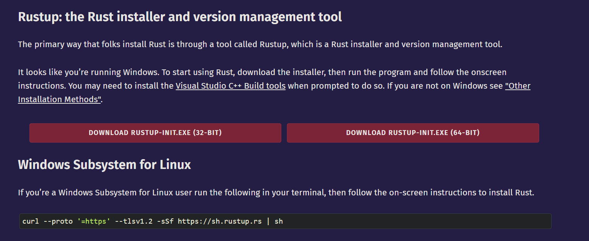
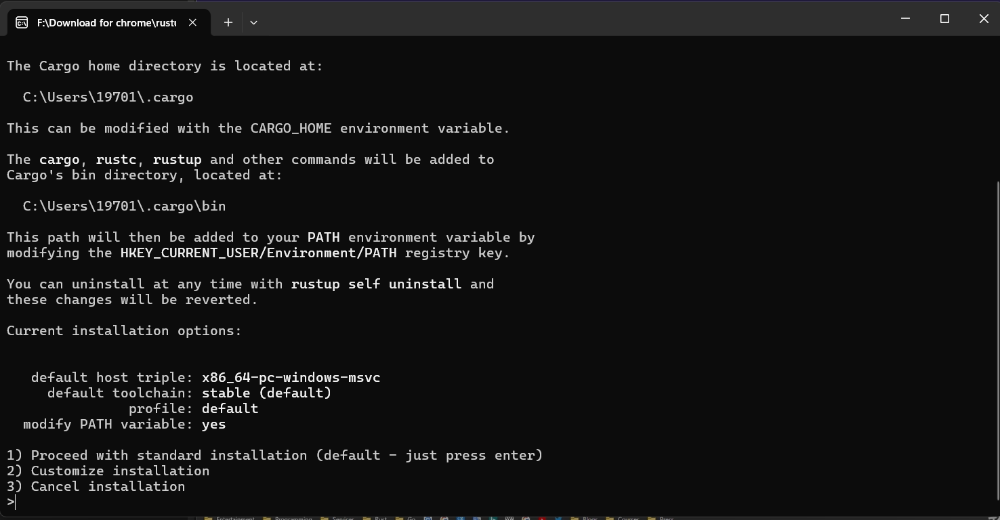
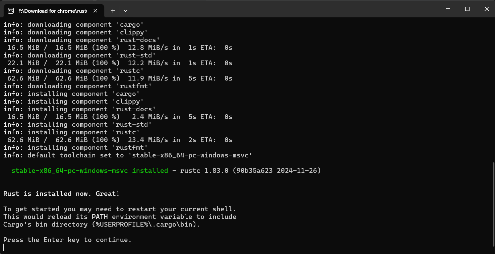
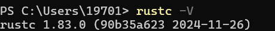

# 1.1 Install Rust

## 1.1.1 Installing from the Official Site
Go to the [official Rust website](https://www.rust-lang.org/), where you can change the language in the top-right corner.

Click "Get Started" and you will see the following page:

Choose the download that matches your system: 32-BIT for 32-bit systems and 64-BIT for 64-bit systems. Most computers today are 64-bit. If you do not know whether your computer is 64-bit or 32-bit, and it is not an ancient machine, 64-bit will probably work.

If you want to install Rust on **macOS**, **Linux**, or the **Windows Subsystem for Linux**, run the following command in the terminal:
`curl --proto '=https' --tlsv1.2 -sSf https://sh.rustup.rs | sh`

Open the downloaded installer and you will see the following screen:

There are three options here:
- Option 1 (default): standard installation
- Option 2: custom installation, where you can choose the installation path, components, toolchain version, and more
- Option 3: cancel installation

For most people, Option 1 is enough (either type `1` and press Enter, or just press Enter directly).

If you see the following screen, Rust has been installed successfully:

The installer will prompt you to restart your shell. Press Enter and the program will exit, and Rust will be installed.

## 1.1.2 Rust Command-Line Operations
Rust commands on Windows can be run in `Terminal` (it comes with Windows 11; if you do not have it, search for `Windows Terminal` in the Microsoft Store and install it).

- Update Rust: `rustup update`
  Rust is a relatively new language and is updated very frequently, so it is recommended to run this from time to time to get the latest version.

- Uninstall Rust: `rustup self uninstall`

- Check the installation: `rustc --version` or `rustc -V`
  Output format: `rustc x.y.z (xxxxxxxxx yyyy-mm-dd)`
  - `x.y.z` indicates the version number
  - `xxxxxxxxx` indicates the hash of the current version
  - `yyyy-mm-dd` indicates the commit date of that version in that year

- Open the local Rust documentation manual: `rustup doc`

## Development Tools
- Install the Rust plugin for VS Code
- VIM
- Helix
- RustRover
- ...
