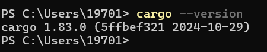
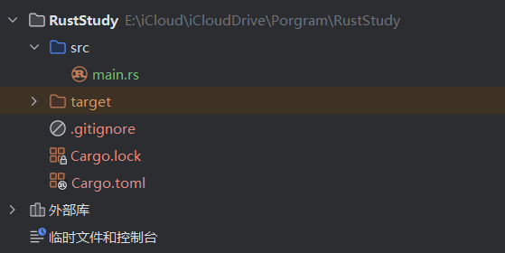
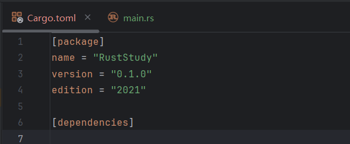
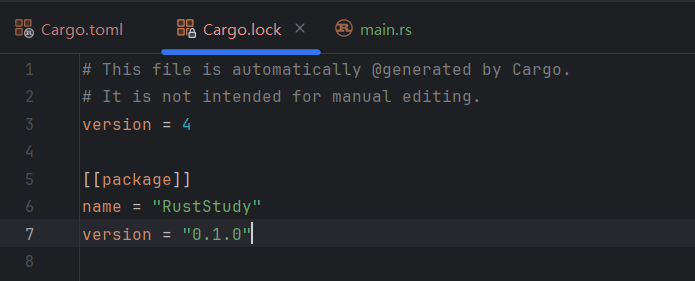

# 1.3 Basic Knowledge of Rust Cargo

## 1.3.0 Review
At the end of the article **[1.2. Basic Understanding of Rust and Printing "Hello World"](../1.2/1.2._Basic_Understanding_of_Rust_and_Printing_"Hello_World".md)**, it was mentioned that only small and simple Rust projects are suitable for compilation with `rustc`, while large projects need **Cargo**. This article introduces Cargo in detail.

## 1.3.1 What Is Cargo
Cargo is Rust's build system and package manager. It can build code, download dependent libraries, build those libraries, and more.

Cargo is installed together with Rust. To check whether Cargo is installed correctly, run the command `cargo --version` in the terminal.

## 1.3.2 Creating Projects with Cargo
Projects created in RustRover automatically come with Cargo configuration, and you can see a file named `Cargo.toml` in the project tree on the left.

For users who do not use RustRover, you can configure Cargo in the terminal:
- Copy the folder path where you want the Cargo project to be, open the terminal, and run `cd desired_path`
- Then run `cargo new desired_project_name` to create the project
- Open this path in your IDE, and the project will be inside the folder named after your Cargo project

The final project structure should look like this:

*PS: Some IDEs do not create the `target` folder and the `Cargo.lock` file immediately; they appear only after the first compilation*

Project structure explained:
- `src` is short for Source Code. This folder stores your code.

- `.gitignore` indicates that a Git repository has been initialized when the project was created. You can also use another VCS (Version Control System) or no VCS at all; just set it when creating the project (`cargo new desired_project_name`), using the `--vcs` option.

- The contents of `Cargo.toml` will be explained below.

## 1.3.3 Cargo.toml
The `.toml` format (Tom's Obvious, Minimal Language) is Cargo's configuration file format.

Its content is as follows:

Content explanation:
- `[package]` is a section header indicating that the content below is used to configure the package
  - `name` specifies the project name
  - `version` specifies the project version
  - `authors` specifies the project authors. It is optional and not included here. If present, the format should be:
    `authors = ["your_name <your_email@xxx.com>"]`
  - `edition` specifies the Rust edition being used

- `[dependencies]` is another section header. The content below is used to configure dependencies, and it lists the project's dependencies. If there are no dependencies, this section is empty.

*PS: In Rust, code packages (libraries) are called crates.*

## 1.3.4 Project Structure Format
- All source code should be placed in the `src` directory
- `Cargo.toml` should be placed in the top-level directory
- The top-level directory can contain README files, licenses, configuration files, and other files unrelated to source code

## 1.3.5 Converting a Non-Cargo Project to Cargo
- Move the source code into the `src` directory
- Create `Cargo.toml` and fill in the configuration based on the source code

## 1.3.6 Building a Cargo Project
- Copy the folder path where the Cargo project is located, open the terminal, and run `cd Cargo_project_path`

- Run `cargo build`. This command creates an executable file. On Windows, its path is `target\debug\your_Cargo_project_name.exe`; on Linux/macOS, its path is `target/debug/your_Cargo_project_name`

- Run that executable file; first make sure you have completed the first step. On Windows, enter `.\target\debug\your_Cargo_project_name.exe` in the terminal; on Linux/macOS, enter `./target/debug/your_Cargo_project_name`

- The first time you run `cargo build`, a `cargo.lock` file will be generated in the top-level directory

## 1.3.7 Cargo.lock
`cargo.lock` is generated after the project is compiled for the first time (some IDEs generate it automatically before the first compilation). Its content looks like this:

This file is used to track the exact versions of the project's dependencies. As the comment in the file says, **you do not need to and should not manually edit this file**.

## 1.3.8 Running a Cargo Project
- Copy the folder path where the Cargo project is located, open the terminal, and run `cd Cargo_project_path`
- Run `cargo run`

`cargo run` actually performs two steps: compile the code and execute the result. It first generates an executable file and then runs that file. If the project compiled successfully before and the source code has not changed, it will run the executable directly.

## 1.3.9 Checking Code
The purpose of `cargo check` is to check whether the code can be compiled successfully, but it does not produce an executable file. `cargo check` is much faster than `cargo build`, so you can use it repeatedly while writing code to improve efficiency.

Usage:
- Copy the folder path where the Cargo project is located, open the terminal, and run `cd Cargo_project_path`
- Run `cargo check`

## 1.3.10 Building for Release
The `cargo build` command is used during **development (debugging)**. When you finish writing the code and want to **release** it, you should use `cargo build --release`, which builds a **release version** instead of `cargo build`. Compared with the development build, the former **takes longer to compile but runs faster**. The executable generated by the former will be in `target/release` instead of `target/debug`.
