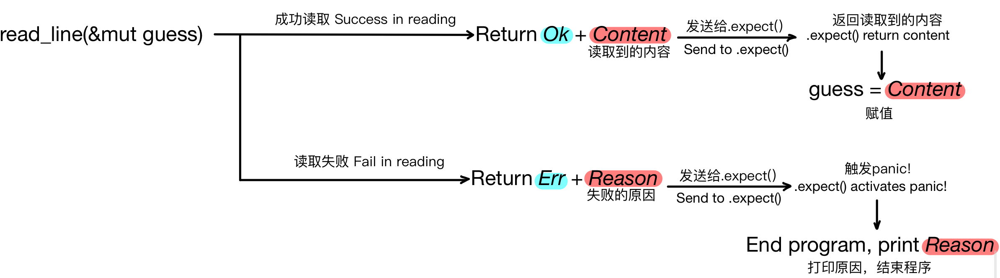
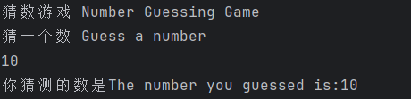

# 2.1 Number Guessing Game Pt.1 - One Guess

## 2.1.0 What You Will Learn
In this chapter, you will learn:
- Variable declarations
- Related functions
- Enum types
- Advanced use of `println!()`
- ...

## 2.1.1 Game Goal
- Generate a random number between 1 and 100
- **Prompt the player to enter a guess (covered in this chapter)**
- After the guess, the program will tell the player whether the guess is too large or too small
- If the guess is correct, print a celebration message and exit the program

## 2.1.2 Code Implementation
### Step 1: Print the game title and prompt the user
- Build the `main` function. How to build a function and its format were mentioned in **[1.2. Basic Understanding of Rust and Printing "Hello World"](../../Chapter-01/1.2/1.2._Basic_Understanding_of_Rust_and_Printing_"Hello_World".md)**, so I will not repeat them here:
```rust
fn main() {

}
```

- Use the `println!()` macro to print text:
```rust
fn main() {
    println!("Number Guessing Game");

    println!("Guess a number");
}
```

### Step 2: Create a variable to store the user's input
After prompting the user for input, the program needs a variable to store that input. The code line should look like this:
```rust
let mut guess = String::new();
```
- `let` declares a new variable, and by default the variable is immutable.
- Adding `mut` after `let` means the declared variable is mutable.
- `guess` is the name of the variable.
- `=` is used for assignment.
- `String::new()` is a static method used to create a new, empty string. `String` is the UTF-8 dynamic string type provided by Rust’s standard library. `::` indicates that `new()` is an associated function of the `String` type, meaning it is implemented for the type itself rather than for a specific string instance, similar to a static method in C# or Java. Calling `String::new()` returns a new `String` instance with no content, that is, an empty string.

Many types in Rust have a `new()` function, and `new()` is a common name for creating instances of a type.

### Step 3: Read the user's input
Next we need to read the user’s input. The code is:
```rust
io::stdin().read_line(&mut guess).expect("Could not read the line");
```
- `io` is the **module name**. This module contains the `stdin()` function we need.
- `::` is used to access an associated function.
- `stdin()` is a **function** that obtains the standard input stream and returns an instance of the `Stdin` type. It is used as a **handle** to process standard input from the terminal.
- `.read_line()` is a method provided by the `Stdin` type. It reads a line from standard input into a string and passes it to a **mutable string variable**. `read_line()` also returns a `Result`, an enum with two variants: `Ok` and `Err`. If `read_line()` succeeds, it returns `Ok` with the number of bytes read; if it fails, it returns `Err` with the reason for failure.
- `&mut guess` passes the content read by `.read_line()` into the **mutable variable** `guess`. Here, `&` means taking a reference, which allows the same data (memory address) to be accessed in different parts of the code. `mut` means the referenced variable is mutable.
- Errors may occur while reading, so we need to call `.expect()`, which is a method on the `Result` type returned by `read_line()`. If reading fails, `read_line()` returns `Err`, and `.expect()` immediately triggers `panic!`, ends the current program, and prints the error message provided to `expect`. If reading succeeds, `read_line()` returns `Ok`, and `.expect()` gives back the attached value.

*PS: You can omit `.expect()`, but `cargo build` will emit a warning.*

If you are writing this in an IDE, you may notice that `io` is highlighted in red. That is because this program has not yet declared that module as a dependency. You only need to add the import at the beginning of the program:
```rust
use std::io;
```
- `use` is the keyword for importing items.
- `std::io` refers to the `io` module under the standard library (`std`).

You can also add the library name directly on the line that uses the `io` module, so you do not need to add an import at the top of the program:
```rust
std::io::stdin().read_line(&mut guess).expect("Could not read the line");
```

In fact, by default Rust imports the contents of a module called `prelude` into the **scope** of every program (a concept we will discuss later). Some people call it the prelude module. If the type you want to use is not in the `prelude`, you need to import it explicitly.

### Step 4: Print the user's input
Finally, print the user’s input:
```rust
println!("The number you guessed is:{}", guess);
```
- In `"The number you guessed is:{}"`, `{}` is a placeholder whose value will be replaced at output time by the value of the following variable, which is `guess` here.

## 2.1.3 Result
Here is the complete code:
```rust
use std::io;

fn main() {
    println!("Number Guessing Game");

    println!("Guess a number");

    let mut guess = String::new();

    io::stdin().read_line(&mut guess).expect("Could not read the line");

    println!("The number you guessed is:{}", guess);
}
```

Result:

