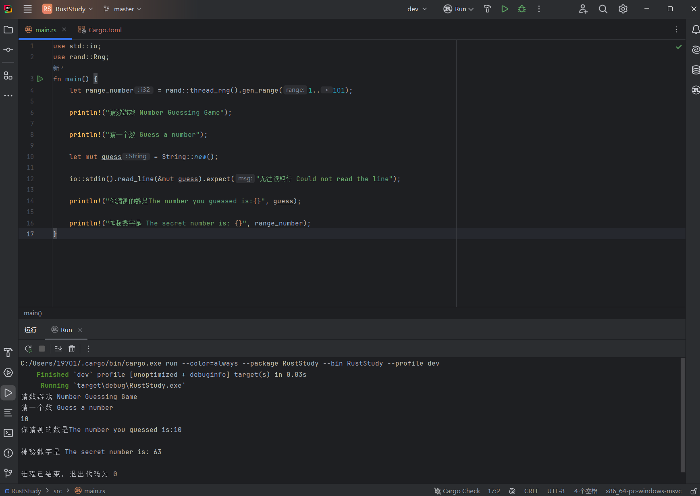

# 2.2 Number Guessing Game Pt.2 - Generating Random Numbers

## 2.2.0 What You Will Learn
In this chapter, you will learn:
- Searching for and downloading external crates
- Cargo dependency management
- Semantic versioning rules for upgrades
- The `rand` random-number generator
- ...

## 2.2.1 Game Goal
- **Generate a random number between 1 and 100 (covered in this chapter)**
- Prompt the player to enter a guess
- After the guess, the program will tell the player whether the guess is too large or too small
- If the guess is correct, print a celebration message and exit the program

## 2.2.2 Code Implementation
### Step 1: Find an external library
Although Rust’s standard library does not provide functions for generating random numbers, the Rust team has developed an external library with this capability. Search for `rand` on [the official Rust crates registry](https://crates.io/) to find it. The page provides a very detailed introduction to the crate.


Rust crates are divided into two types:
- **Library crate**: a crate that provides functionality or logical modules. It does not have a `main` function and cannot run on its own. It is typically used to share functionality with other code. The `rand` crate is a library crate.
- **Binary crate**: an executable program that contains a `main` function and produces a runnable binary after compilation. It is used to build independent, runnable Rust applications.

### Step 2: Add the external crate to Cargo dependencies
Next, add the external crate to Cargo dependencies (Cargo was introduced in [1.3. Basic Knowledge of Rust Cargo](../../Chapter-01/1.3/1.3._Basic_Knowledge_of_Rust_Cargo.md), so I will not repeat that here) so that the program can use it.

Open the project’s `Cargo.toml` file and add the dependency under `dependencies` in the form `dependency_name = "dependency_version"` (this format can also be found under the `Install` section on the crate page). This program needs the `rand` dependency, version `0.8.5`, so you should write `rand = "0.8.5"`. If this dependency has its own dependencies, Cargo will automatically download them during compilation.

In fact, the version format `0.8.5` is shorthand. Its full form is `^0.8.5`, which means any version that is compatible with the public API of `0.8.5` is allowed. For example, if a dependency version is `1.2`, that means it can be upgraded to any `1.2.x` version, but not to `2.0.0` or later.

**Cargo keeps using the version you specify until you manually choose a different version.**

If a dependency update breaks code that was written against an older version, what happens after rebuilding? The answer is in `Cargo.lock`. During a build, Cargo checks whether a `Cargo.lock` file already exists. If it does, Cargo uses the versions specified there, which avoids compatibility issues.

If you want to update versions to the current standard, you can use `cargo update` in the terminal. The steps are:
- Copy the path to the Cargo project, open the terminal, and enter `cd Cargo_project_path`
- Enter `cargo update`

This command ignores `Cargo.lock` and uses the updated registry to find the latest dependency versions that satisfy the requirements in `Cargo.toml`, but the versions written in `Cargo.toml` will not change. For example, if a dependency is declared as version `1.2` in `Cargo.toml`, `cargo update` can upgrade it to the latest `1.x.x` version, but not to `2.0.0` or later; the version written in `Cargo.toml` remains `1.2`.

### Step 3: Use the dependency in code
At the top of the program, use the `use` keyword to import the dependency:
```rust
use rand::Rng;
```
`rand::Rng` is a `trait`. Traits are similar to interfaces in other languages, such as Java interfaces or C++ pure virtual base classes, and define a set of functions and methods that types must implement. `rand::Rng` defines the methods needed by random-number generators.

Next, use this trait in `main` to generate a random number:
```rust
let range_number = rand::thread_rng().gen_range(1..101);
```
*PS: In older versions, this would be written as `gen_range(1, 101)`.*

- `let range_number`: declares an immutable variable named `range_number`
- `=`: assignment
- `rand::thread_rng()`: returns a `ThreadRng` value, which is a random-number generator. This generator lives in local thread space and obtains its seed from the operating system.
- `.gen_range(1..101)`: a method on `rand::thread_rng()` that takes a range and generates a random number within it. Here, it generates a number from 1 up to, but not including, 101.

Finally, print the random number (the use of `println!` was introduced in the previous article, so I will not repeat it):
```rust
println!("The secret number is: {}", range_number);
```

## 2.2.3 Result
Here is the complete code:
```rust
use std::io;
use rand::Rng;

fn main() {
    let range_number = rand::thread_rng().gen_range(1..101);

    println!("Number Guessing Game");

    println!("Guess a number");

    let mut guess = String::new();

    io::stdin().read_line(&mut guess).expect("Could not read the line");

    println!("The number you guessed is:{}", guess);

    println!("The secret number is: {}", range_number);
}
```

The result is:

