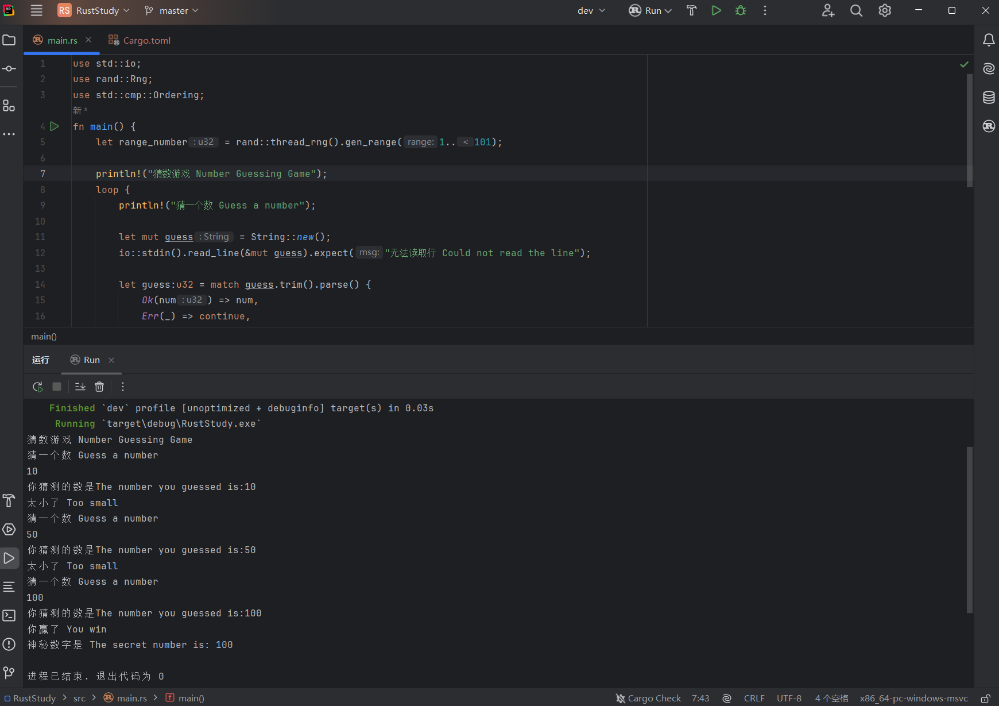

## 2.4.0 What You Will Learn
This is the final part of the number guessing game. In this chapter, you will learn:
- The `loop` loop
- `break`
- `continue`
- Flexible use of `match`
- How to handle enums

## 2.4.1 Game Goal
- Generate a random number between 1 and 100
- Prompt the player to enter a guess
- After the guess, the program will tell the player whether the guess is too large or too small
- **Repeatedly prompt the player. If the guess is correct, print a celebration message and exit the program (covered in this chapter)**

## 2.4.2 Code Implementation
### Step 1: Implement the loop
In the previous code, we implemented a single round of input and comparison. Next, we need to make the program ask and compare repeatedly until the user guesses the correct number.

Here is the code up to the previous chapter:
```rust
use std::io;
use rand::Rng;
use std::cmp::Ordering;

fn main() {
    let range_number = rand::thread_rng().gen_range(1..101);

    println!("Number Guessing Game");

    println!("Guess a number");

    let mut guess = String::new();

    io::stdin().read_line(&mut guess).expect("Could not read the line");

    let guess: u32 = guess.trim().parse().expect("Please enter a number");

    println!("The number you guessed is:{}", guess);

    match guess.cmp(&range_number) {
        Ordering::Less => println!("Too small"),
        Ordering::Greater => println!("Too big"),
        Ordering::Equal => println!("You win"),
    }

    println!("The secret number is: {}", range_number);
}
```

The code we need to repeat is the part from prompting the user to comparing the guess and printing the result:
```rust
println!("Guess a number");

let mut guess = String::new();
io::stdin().read_line(&mut guess).expect("Could not read the line");

let guess: u32 = guess.trim().parse().expect("Please enter a number");

println!("The number you guessed is:{}", guess);

match guess.cmp(&range_number) {
    Ordering::Less => println!("Too small"),
    Ordering::Greater => println!("Too big"),
    Ordering::Equal => println!("You win"),
}
```

Rust provides the keyword `loop` for an **infinite loop**. Its structure is:
```rust
loop {
	// Write code here that wants to loop indefinitely
}
```

Just place the code that needs to be repeated inside this structure:
```rust
loop {
    println!("Guess a number");

    let mut guess = String::new();
    io::stdin().read_line(&mut guess).expect("Could not read the line");

    let guess: u32 = guess.trim().parse().expect("Please enter a number");

    println!("The number you guessed is:{}", guess);

    match guess.cmp(&range_number) {
        Ordering::Less => println!("Too small"),
        Ordering::Greater => println!("Too big"),
        Ordering::Equal => println!("You win"),
    }
}
```

### Step 2: Condition for exiting the program
However, note that although this gives us repeated prompting, the program will keep asking forever and never exit. Logically, once the user guesses correctly and the program prints the congratulatory message, it should stop asking. This is where the keyword `break` for **breaking out of a loop** is needed. Put it after the `Ordering::Equal` **arm** (the concept of arms was explained in the previous article, so I will not repeat it here). Also remember that **if an arm needs to execute multiple lines of code, wrap the code block in `{}`**.
```rust
match guess.cmp(&range_number) {
    Ordering::Less => println!("Too small"),
    Ordering::Greater => println!("Too big"),
    Ordering::Equal => {
        println!("You win");
        break;
    }
}
```

### Step 3: Handling invalid input
This code still has another problem: if the user’s input is not an integer, `.parse()` returns `Err`, and `.expect()` immediately terminates the program. The correct behavior is to print an error message and then let the user try again.

What should we do? In *[2.1 Number Guessing Game Pt.1 - One Guess](../2.1/2.1._Number_Guessing_Game_Pt.1_-_One_Guess.md)*, we mentioned that `.parse()` returns an **enum**. If conversion succeeds, the return value is `Ok` plus the converted content; if it fails, the return value is `Err` plus the reason for failure. So where did we use this enum before? That’s right — in the previous article, we introduced the `Ordering` enum. There, we used `match` to handle the greater-than, less-than, and equal cases. Here, we can also use `match` to handle the return value of `.parse()` and perform different actions for different cases: if conversion succeeds, continue execution; if it fails, skip the rest of the code and start the next loop iteration. The keyword for skipping the current loop iteration in Rust is the same as in other languages: `continue`.

How do we change the code? We replace `let guess: u32 = guess.trim().parse().expect("Please enter a number");` with:
```rust
let guess: u32 = match guess.trim().parse() {
    Ok(num) => num,
    Err(_) => continue,
};
```
- `Ok(num) => num`: this branch handles the case where conversion succeeds. The return value is `Ok` plus the converted value. `Ok` is a variant of this enum, and the value inside the parentheses after `Ok` is the converted content (`u32`). Writing `num` here means binding the converted content to `num`, and `num` is then passed to the `match` expression as the result and ultimately assigned to `guess`.
- `Err(_) => continue`: this branch handles the case where conversion fails. `Err` is the enum variant, and the value inside the parentheses after `Err` is the reason for failure (`&str`). The `_` means we do not care about the error message; we only need to know that it is `Err`.

Using `match` instead of `.expect()` to handle errors is a common Rust pattern.

## 2.4.3 Result
Here is the complete code:
```rust
use std::io;
use rand::Rng;
use std::cmp::Ordering;

fn main() {
    let range_number = rand::thread_rng().gen_range(1..101);

    println!("Number Guessing Game");
    loop {
        println!("Guess a number");

        let mut guess = String::new();
        io::stdin().read_line(&mut guess).expect("Could not read the line");

        let guess: u32 = match guess.trim().parse() {
            Ok(num) => num,
            Err(_) => continue,
        };

        println!("The number you guessed is:{}", guess);

        match guess.cmp(&range_number) {
            Ordering::Less => println!("Too small"),
            Ordering::Greater => println!("Too big"),
            Ordering::Equal => {
                println!("You win");
                break;
            },
        }
    }

    println!("The secret number is: {}", range_number);
}
```

Result:

