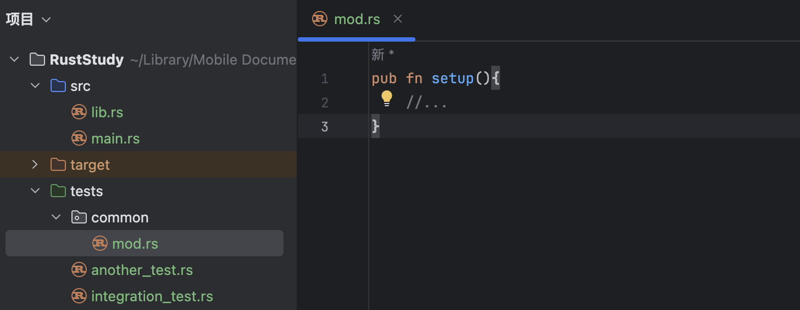

# 11.10 Integration Tests

## 11.10.1 What Are Integration Tests
In Rust, integration tests live completely outside the library being tested. Integration tests call the library the same way other code does, which also means they can only call public APIs.

**The purpose of integration tests is to verify that multiple parts of the library work together correctly.** This differs from unit tests, which are smaller and more focused. Unit tests test a single module in isolation and can also test private interfaces.

Sometimes code that works fine on its own can still fail when used together. Integration tests exist to find and solve such problems as early as possible. Therefore, **integration test coverage is important**.

## 11.10.2 The `tests` Directory
To create integration tests, first create a `tests` directory.

This directory sits alongside `src`, and `cargo` automatically looks for integration test files there. You can create any number of integration test files in this directory. During compilation, `cargo` treats each test file as a separate package, that is, a separate `crate`.

Here is a demonstration of creating integration test files:

### 1. Create the `tests` Directory
Create a folder named `tests` next to `src`:

### 2. Create a Test File
Create a `.rs` test file inside `tests` and give it a name. Here I used `integration_test.rs`:

### 3. Move the Test Code Into the Test File
Using the code from [11.9. Unit Tests](../11.9/11.9._Unit_Tests.md) (`lib.rs`) as an example:
```rust
pub fn add_two(a: usize) -> usize {
    internal_adder(a, 2)
}

fn internal_adder(left: usize, right: usize) -> usize {
    left + right
}

#[cfg(test)]
mod tests {
    use super::*;

    #[test]
    fn internal() {
        let result = internal_adder(2, 2);
        assert_eq!(result, 4);
    }
}
```

Because every integration test file is a separate crate, the file (`integration_test.rs`) must first import the contents of `lib.rs` into scope if it wants to test that crate.

In this example, since I named the project `RustStudy`, the package name is `RustStudy` as well. If you are unsure, check the `name` field in your `Cargo.toml`. In this example, you can write `use RustStudy;` to import it, and you can also import a specific function if you want.

After importing, you can write the test function directly. There is no need to write `#[cfg(test)]`, because code under the `tests` directory is only run when you execute `cargo test`. You only need to annotate the test function with `#[test]`.

The full code looks like this (`integration_test.rs`):
```rust
use RustStudy;

#[test]
fn it_adds_two() {
    let result = RustStudy::add_two(2);
    assert_eq!(result, 4);
}
```
Output:
```
$ cargo test
   Compiling RustStudy v0.1.0 (file:///projects/RustStudy)
    Finished `test` profile [unoptimized + debuginfo] target(s) in 0.15s
     Running unittests src/lib.rs (target/debug/deps/RustStudy-48a2c23cb22e1ddc)

running 1 test
test tests::internal ... ok

test result: ok. 1 passed; 0 failed; 0 ignored; 0 measured; 0 filtered out; finished in 0.00s

     Running tests/integration_test.rs (target/debug/deps/integration_test-e60608d740742c0c)

running 1 test
test it_adds_two ... ok

test result: ok. 1 passed; 0 failed; 0 ignored; 0 measured; 0 filtered out; finished in 0.00s

   Doc-tests RustStudy

running 0 tests

test result: ok. 0 passed; 0 failed; 0 ignored; 0 measured; 0 filtered out; finished in 0.00s
```

You can see that this output shows two tests being run: one from `lib.rs` (a unit test) and one from `integration_test.rs` (an integration test).

## 11.10.3 Running a Specific Integration Test
To run a specific integration test function, use `cargo test <test_name>`. To run all test functions in a specific test file, use `cargo test --test <file_name>`.

For example:


Now there are two files under `tests`. If I only want to run the test functions in `integration_test.rs`, I can run:
```bash
cargo test --test integration_test
```

## 11.10.4 Submodules in Integration Tests
Because each file under `tests` is compiled as a separate crate, these files do not share behavior with one another, unlike the files under `src`.

So if I want to extract repeated logic in test functions into a helper function to avoid duplication, how should I write it?

For example, I create a `common.rs` file under `tests` to store helper functions:


Try running the tests:
```
$ cargo test
   Compiling RustStudy v0.1.0 (file:///projects/RustStudy)
    Finished `test` profile [unoptimized + debuginfo] target(s) in 0.13s
     Running unittests src/lib.rs (target/debug/deps/RustStudy-48a2c23cb22e1ddc)

running 1 test
test tests::internal ... ok

test result: ok. 1 passed; 0 failed; 0 ignored; 0 measured; 0 filtered out; finished in 0.00s

     Running tests/common.rs (target/debug/deps/common-5306c3915df25199)

running 0 tests

test result: ok. 0 passed; 0 failed; 0 ignored; 0 measured; 0 filtered out; finished in 0.00s

     Running tests/integration_test.rs (target/debug/deps/integration_test-e60608d740742c0c)

running 1 test
test it_adds_two ... ok

test result: ok. 1 passed; 0 failed; 0 ignored; 0 measured; 0 filtered out; finished in 0.00s

   Doc-tests RustStudy

running 0 tests

test result: ok. 0 passed; 0 failed; 0 ignored; 0 measured; 0 filtered out; finished in 0.00s
```
You can see that `common.rs` appears in the test output. But since `common.rs` is only meant to store helper functions, it does not need to be tested itself. That is the wrong way to do it.

The correct approach is to create a `common` directory under `tests`, place a `mod.rs` file inside it, and move the helper functions there. Then delete the old `common.rs`:


This is another naming convention that Rust understands. Rust will not treat the `common` module as an integration test file, and `common` will no longer appear in the test output, because subdirectories under `tests` are not compiled as separate crates.

If you want to use the contents there in an integration test file, just write `mod <folder_name>;` at the top of the file. In this example, that would be `mod common;`. When using it, write `common::your_function`. In this example, that would be `common::setup()`.

## 11.10.5 Integration Tests for Binary Crates
If a project is a binary crate, meaning it only has `src/main.rs` and no `src/lib.rs`, you cannot create integration tests under `tests`, even if you do, you cannot import functions from `main.rs` into scope. That is because only a library crate, meaning one with `lib.rs`, can expose functions for other crates to use.

A binary crate means it runs independently. Therefore, Rust binary projects usually put this logic in `lib.rs` and keep only a simple call in `main.rs`. In that way, the project is treated as a library crate and can use integration tests to check the code.
