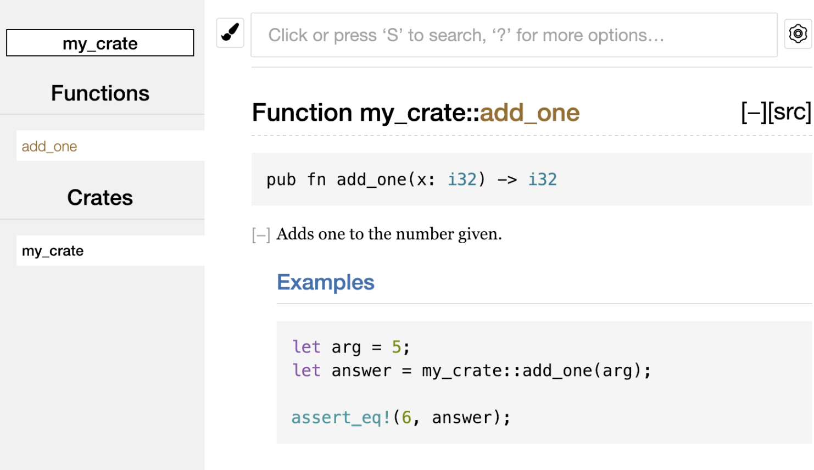
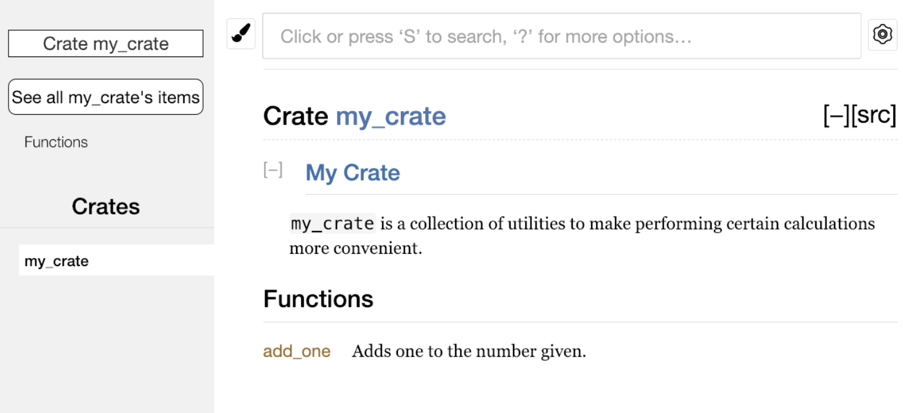

# 14.2 Documentation Comments and Publishing Crates

## 14.2.1 crates.io
[crates.io](https://crates.io/) is the official package management platform for the Rust programming language, similar to package managers in other languages such as npm for JavaScript and pip for Python. Its main uses include:
- **Hosting Rust libraries (crates):** Developers can publish their own Rust libraries on crates.io, and other developers can download and use them.
- **Dependency management:** Cargo, Rust’s build tool and package manager, downloads required dependencies from crates.io to simplify project development.
- **Search and discovery:** Users can search for existing libraries on crates.io and find solutions that fit their project needs.
- **Versioning and updates:** [crates.io](https://crates.io/) supports version management, so developers can upload new versions of libraries and users can update dependencies easily.

In the guessing game from [Chapter 2](../../Chapter-02/2.2/2.2._Number_Guessing_Game_Pt.2_-_Generating_Random_Numbers.md), we already used the third-party `rand` crate from [crates.io](https://crates.io/) to get random numbers. We can use crates provided by others, and we can also publish our own crates to [crates.io](https://crates.io/) for others to use.

Rust and Cargo include features that make your published packages easier for people to find and use. Next we will discuss some of those features and then explain how to publish a package.

## 14.2.2 Documentation Comments
Use `///` to write documentation comments. Documentation comments are used to generate project documentation. They are different from `//`, which is used for code comments. Documentation comments are annotations for the whole project.

This documentation is HTML documentation and supports Markdown. It displays documentation comments for public APIs and usually explains how readers should use the API.

Documentation comments are usually placed directly before the item they describe.

Here is an example:
```rust
/// Adds one to the number given.
///
/// # Examples
///
/// ```
/// let arg = 5;
/// let answer = my_crate::add_one(arg);
///
/// assert_eq!(6, answer);
/// ```
pub fn add_one(x: i32) -> i32 {
    x + 1
}
```
*PS: In Markdown, `#` marks a heading, and ` ``` ` marks a code block.*

## 14.2.3 Commands for Generating HTML Documentation
Running `cargo doc` in the terminal uses the `rustdoc` tool, which comes with Rust, to generate documentation. The generated documentation is placed in the `target/doc` directory.

`cargo doc --open` generates the documentation and opens the result in a web browser:


## 14.2.4 Common Sections
Here are some sections that crate authors often use in their documentation:
- `# Example` is the examples section, where sample code is placed in the code block.
- `Panic`: The function being documented may panic. Callers who do not want the program to panic should ensure that the function is not called in those cases.
- `Error`: If the function returns a `Result`, then describing the possible error types and the conditions that may cause those errors is helpful to callers, so they can write code that handles different errors in different ways.
- `Safety`: If the function calls `unsafe` (which we will cover later), there should be a section explaining why the function is unsafe and covering the invariants the caller is expected to uphold.

## 14.2.5 Documentation Comments as Tests
Code blocks in documentation comments are executed as tests when you run `cargo test`. You will see this part in the test results:
```text
   Doc-tests my_crate

running 1 test
test src/lib.rs - add_one (line 5) ... ok

test result: ok. 1 passed; 0 failed; 0 ignored; 0 measured; 0 filtered out; finished in 0.27s
```

## 14.2.6 Adding Documentation Comments for Items with Outer Comments
`//!` adds documentation to the outer item, rather than to the item that follows the comment. We usually use these documentation comments in the crate root file, conventionally `src/lib.rs`, or inside a module to document a crate or an entire module:
```rust
//! # My Crate
//!
//! `my_crate` is a collection of utilities to make performing certain
//! calculations more convenient.

/// Adds one to the number given.
///
/// # Examples
///
/// ```
/// let arg = 5;
/// let answer = my_crate::add_one(arg);
///
/// assert_eq!(6, answer);
/// ```
pub fn add_one(x: i32) -> i32 {
    x + 1
}
```
In this example, we added documentation describing what `my_crate` does, that is, comments on the outer item of `add_one`.

The HTML documentation changes accordingly as well:

