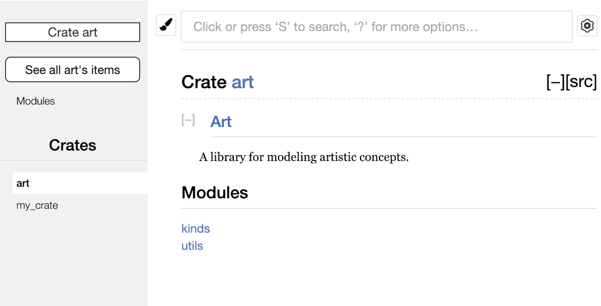
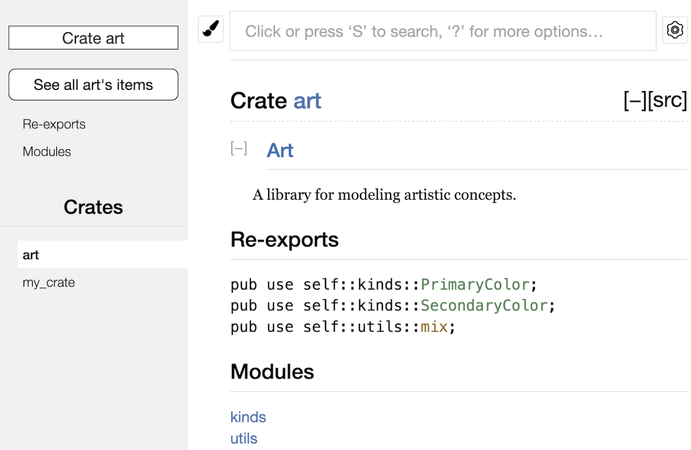

## 14.3.1 Re-Exporting APIs with `pub use`
In Chapter 7, we introduced the `mod` keyword. We use it to organize code into modules. The `pub` keyword introduced there can make modules or methods public so that external code can call them. External code then uses the `use` keyword to bring modules or methods into the current scope.

Using these keywords lets us organize code in a developer-friendly way. However, this structure is not always very friendly for the end users of the codebase. For example, the structure of a crate may be very convenient for developers during development, but not very convenient for users. Developers often split the program into many layers, and users may find it difficult to locate a type hidden deep inside that structure. For example, `my_crate::some_module::another_module::UsefulType` is cumbersome, while `my_crate::UsefulType` is much easier to use.

For this kind of problem, there is no need to reorganize the internal code structure. Instead, `pub use` can be used to re-export items and create a public-facing structure different from the internal private structure. Re-exporting takes a public item from one location and makes it public at another location, as if it had been defined there originally.

Here is an example:
`lib.rs`:
```rust
//! # Art
//!
//! A library for modeling artistic concepts.

pub mod kinds {
    /// The primary colors according to the RYB color model.
    pub enum PrimaryColor {
        Red,
        Yellow,
        Blue,
    }

    /// The secondary colors according to the RYB color model.
    pub enum SecondaryColor {
        Orange,
        Green,
        Purple,
    }
}

pub mod utils {
    use crate::kinds::*;

    /// Combines two primary colors in equal amounts to create
    /// a secondary color.
    pub fn mix(c1: PrimaryColor, c2: PrimaryColor) -> SecondaryColor {
        //...
    }
}
```
- Under the `kinds` module there are two enum types, `PrimaryColor` and `SecondaryColor`, used to store color variants.
- Under the `utils` module there is a function called `mix`. Its job is to mix two `PrimaryColor` values into a `SecondaryColor`. The code inside is not shown here.
- Putting the enum types under `kinds` and the function under `utils` is very developer-friendly.

`main.rs`:
```rust
use art::kinds::PrimaryColor;
use art::utils::mix;

fn main() {
    let red = PrimaryColor::Red;
    let yellow = PrimaryColor::Yellow;
    mix(red, yellow);
}
```
This uses the enum types and the `mix` function from `lib.rs`. Because it requires three levels to bring them into scope, and because the enum type and function live in different modules, it is quite inconvenient for users.

The generated crate documentation looks like this:


If we refactor the code using re-exports:
`lib.rs`:
```rust
//! # Art
//!
//! A library for modeling artistic concepts.

pub use self::kinds::PrimaryColor;
pub use self::kinds::SecondaryColor;
pub use self::utils::mix;

pub mod kinds {
    /// The primary colors according to the RYB color model.
    pub enum PrimaryColor {
        Red,
        Yellow,
        Blue,
    }

    /// The secondary colors according to the RYB color model.
    pub enum SecondaryColor {
        Orange,
        Green,
        Purple,
    }
}

pub mod utils {
    use crate::kinds::*;

    /// Combines two primary colors in equal amounts to create
    /// a secondary color.
    pub fn mix(c1: PrimaryColor, c2: PrimaryColor) -> SecondaryColor {
        //...
    }
}
```

`main.rs`:
```rust
use art::mix; 
use art::PrimaryColor;

fn main() {
    let red = PrimaryColor::Red;
    let yellow = PrimaryColor::Yellow;
    mix(red, yellow);
}
```
At this point, calling the enum type and the function no longer requires writing module paths layer by layer.

The generated crate documentation now looks like this:

The documentation includes a Re-exports section, and all re-exported items are listed there. For actual users of the crate, this makes it very convenient to find these types and functions.
