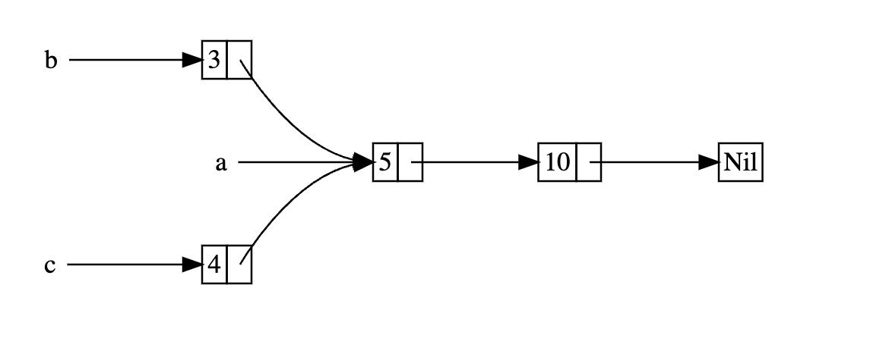

# 15.5 `Rc<T>` - Reference-Counting Smart Pointer and Shared Ownership

## 15.5.1 What Is `Rc<T>`
Ownership is clear in most situations. For a given value, a programmer can accurately infer which variable owns it.

However, in some scenarios, a single value can be held by multiple owners at the same time, as shown below:


In this data structure, each node has multiple edges pointing to it, so conceptually those nodes belong to every edge pointing at them at the same time. As long as a node still has edges pointing to it, it should not be cleaned up. This is multiple ownership.

To support multiple ownership, Rust provides the `Rc<T>` type. `Rc` is short for Reference Counting. This type maintains a counter inside the instance to record how many references point to the value, so it can determine whether the value is still in use. If the reference count is `0`, the value can be safely cleaned up, and no dangling-reference problems will occur.

## 15.5.2 Use Cases for `Rc<T>`
You can use `Rc<T>` when you want to share some heap data among multiple parts of a program, but **at compile time you cannot determine which part of the program will be the last one to use that data**.

Conversely, if we can **determine at compile time which part of the program will use the data last**, then we only need to **make that part of the code the owner**. In that case, the compile-time ownership rules are enough to guarantee correctness.

It is worth noting that `Rc<T>` can only be used in single-threaded scenarios. Later articles will discuss how to use reference counting in multi-threaded code.

## 15.5.3 Example of `Rc<T>` in Use
Before using it, note that `Rc<T>` is not in the prelude, so you must import it manually first.

`Rc` has a few basic functions:
- `Rc::clone(&a)` increases the reference count
- `Rc::strong_count(&a)` returns the reference count, specifically the strong-reference count
- Since there are strong references, there are also weak references, that is, `Rc::weak_count`

Let’s explore the actual use of `Rc<T>` with an example:

*There are three `List`s, named `a`, `b`, and `c`. `b` and `c` share `a`. Other details are shown in the diagram:*

```rust
enum List {
    Cons(i32, Box<List>),
    Nil,
}

use List::{Cons, Nil};

fn main() {
    // Newlines in main are only to make the list structure clearer; they are not required.
    let a = Cons(5,
                 Box::new(Cons(10,
                               Box::new(Nil))));

    let b = Cons(3,
                 Box::new(a));
    let c = Cons(4,
                 Box::new(a));
}
```
- First we create a linked list `List`; its structure was explained in detail in *[15.1. Using `Box<T>` to Point to Data on the Heap](../15.1/15.1._Using_Box_T__to_Point_to_Data_on_the_Heap.md)*, so we will not repeat it here.
- In `main`, we first write out the structure of `a`.
- Then we write the first layer of `b` and `c`; for the nested next layer, we just write `a`.

There is no logical problem, so let’s run it:
```text
error[E0382]: use of moved value: `a`
  --> src/main.rs:17:27
   |
10 |     let a = Cons(5,
   |         - move occurs because `a` has type `List`, which does not implement the `Copy` trait
...
15 |                  Box::new(a));
   |                           - value moved here
16 |     let c = Cons(4,
17 |                  Box::new(a));
   |                           ^ value used here after move
```
The error says that a moved value was used. This is because when `b` was written, `a` was moved into `b`, so ownership of `a` was transferred to `b`.

How do we fix this?

One way is to change the definition of `List` so that `Cons` holds a reference instead of ownership, and then give it the corresponding lifetime parameter. But that lifetime parameter would require every element in `List` to live at least as long as `List` itself. The borrow checker will prevent us from compiling such code:
```rust
let a = Cons(10, &Nil);
```
`Nil` is a *zero-sized* enum variant, but in the expression `Cons(10, &Nil)` or `&Nil`, the compiler treats it as a **temporary value**. This temporary value usually only lives for the current statement (or an even smaller scope), and then it is automatically dropped.

Simply put, `&Nil` is a temporary value that is used and then destroyed, so its lifetime is shorter than that of the `enum`. The temporary `Nil` variant value is dropped before `a` can take a reference to it.

The correct approach is to use `Rc<T>`, a **reference-counting smart pointer**, to let multiple owners share the same heap data and automatically free the memory when no owners remain:
```rust
enum List {
    Cons(i32, Rc<List>),
    Nil,
}

use List::{Cons, Nil};
use std::rc::Rc;

fn main() {
    // Newlines in main are only to make the list structure clearer; they are not required.
    let a = Rc::new(Cons(5,
                         Rc::new(Cons(10,
                                      Rc::new(Nil)))));

    let b = Cons(3,
                 Rc::clone(&a));
    let c = Cons(4,
                 Rc::clone(&a));
}
```
When declaring `b` and `c`, we use `Rc::clone` and pass `&a` as the argument, so `b` and `c` do not take ownership of `a`. Each time `Rc::clone` is used, the reference count inside the smart pointer increases by 1.

When `a` is created, `Rc::new` counts as the first reference, so the counter is `1`. `b` and `c` each use `Rc::clone` once, so the count increases by 1 each time, and the final count is `3`. The data inside the `a` smart pointer is cleaned up only when the reference count becomes `0`.

In fact, `Rc<T>` also has a `clone` method (not the `clone` method from the `Clone` trait), and its source code is exactly the same as `Rc::clone`, so writing `a.clone()` when assigning `b` and `c` is also possible. But because this may be misunderstood as a deep copy—especially by beginners—while it actually only increases the reference count, it is not recommended. `Rc::clone` is the better choice.

Next, let’s modify `main` and print some helpful information to see how the reference count changes when `c` goes out of scope:
```rust
fn main() {
    let a = Rc::new(Cons(5, Rc::new(Cons(10, Rc::new(Nil)))));
    println!("count after creating a = {}", Rc::strong_count(&a));
    let b = Cons(3, Rc::clone(&a));
    println!("count after creating b = {}", Rc::strong_count(&a));
    {
        let c = Cons(4, Rc::clone(&a));
        println!("count after creating c = {}", Rc::strong_count(&a));
    }
    println!("count after c goes out of scope = {}", Rc::strong_count(&a));
}
```
Here, `c` goes out of scope before `a` and `b`, so the reference count decreases by 1 after `c` goes out of scope.

Output:
```text
count after creating a = 1
count after creating b = 2
count after creating c = 3
count after c goes out of scope = 2
```
What we do not see in this example is that when `b` and `a` go out of scope at the end of `main`, the count becomes `0`, and `Rc<List>` is fully cleaned up.

Because `Rc<T>` implements the `Drop` trait, the reference counter is automatically decremented by 1 when `Rc<T>` goes out of scope. **Using `Rc<T>` allows a single value to have multiple owners, and the count ensures that the value remains valid as long as any owner still exists.**

## 15.5.4 Summary of `Rc<T>`
`Rc<T>` allows programmers to share read-only data between different parts of a program through **immutable references**.

Again, `Rc<T>` references are immutable. If `Rc<T>` allowed programmers to hold multiple mutable references, it would violate the borrow rules—**multiple mutable references to the same region would lead to data races and inconsistent data.**

In real development, you will certainly encounter cases where data needs to be mutable. For that, Rust provides the interior mutability pattern and `RefCell<T>`, and programmers can combine it with `Rc<T>` to handle this immutability restriction. That is what the next article will discuss.
