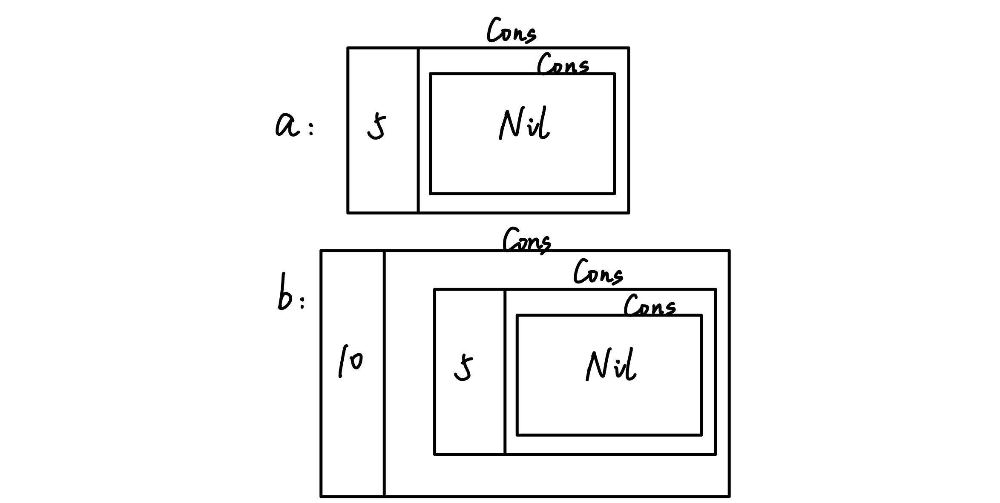
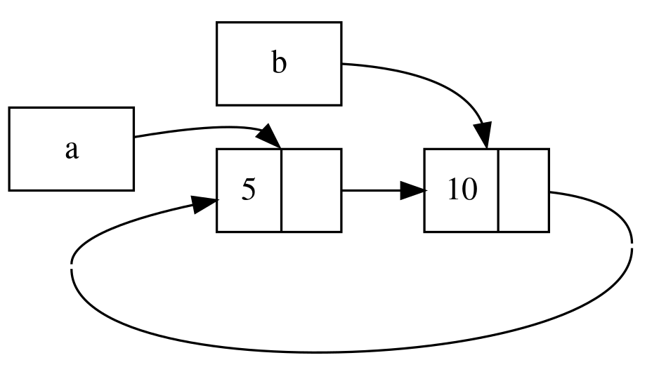

# 15.7 Reference Cycles Causing Memory Leaks

## 15.7.1 Memory Leaks
Rust’s extremely high level of safety makes memory leaks **hard to happen**, but **not impossible**.

For example, using `Rc<T>` and `RefCell<T>` can create reference cycles and cause memory leaks: the reference count of each pointer never decreases to `0`, so the values are never cleaned up.

Take a look at an example:
```rust
use crate::List::{Cons, Nil};
use std::cell::RefCell;
use std::rc::Rc;

#[derive(Debug)]
enum List {
    Cons(i32, RefCell<Rc<List>>),
    Nil,
}

impl List {
    fn tail(&self) -> Option<&RefCell<Rc<List>>> {
        match self {
            Cons(_, item) => Some(item),
            Nil => None,
        }
    }
}

fn main() {
    let a = Rc::new(Cons(5, RefCell::new(Rc::new(Nil))));

    println!("a initial rc count = {}", Rc::strong_count(&a));
    println!("a next item = {:?}", a.tail());

    let b = Rc::new(Cons(10, RefCell::new(Rc::clone(&a))));

    println!("a rc count after b creation = {}", Rc::strong_count(&a));
    println!("b initial rc count = {}", Rc::strong_count(&b));
    println!("b next item = {:?}", b.tail());

    if let Some(link) = a.tail() {
        *link.borrow_mut() = Rc::clone(&b);
    }

    println!("b rc count after changing a = {}", Rc::strong_count(&b));
    println!("a rc count after changing a = {}", Rc::strong_count(&a));
}
```
- First, we create a linked list `List`, wrapping `Rc<T>` in `RefCell<T>` so that the internal value can be modified.
- Through an `impl` block, we define a method called `tail` for `List`, which gets the second element carried by the `Cons` variant. If it exists, it returns the value wrapped in `Some`; if it is `Nil`, it returns `None`.
- Then in `main`, we create two `List` instances, `a` and `b`, and `b` internally shares the value of `a`. This kind of linked-list code is ugly to look at, so I put the structure diagram here:

- `main` also uses `Rc::strong_count` to get the strong-reference counts of `a` and `b`, uses the custom `tail` method to get the second element carried by `Cons`, and prints them with `println!`.
- Next, the `if let` statement binds the second value of `a`’s `Cons` to `link`. It uses `borrow_mut` to obtain a mutable reference to `&Cons`, uses the dereference operator `*` to turn it into `Cons`, and then shares `b`’s value into `link` through `Rc::clone`, which changes the internal structure of `a` into this:


Output:
```text
a initial rc count = 1
a next item = Some(RefCell { value: Nil })
a rc count after b creation = 2
b initial rc count = 1
b next item = Some(RefCell { value: Cons(5, RefCell { value: Nil }) })
b rc count after changing a = 2
a rc count after changing a = 2
```
- Lines 1 through 5: when `a` is first created, the reference count is `1`. When `b` is declared, `a` is shared, so `a`’s reference count becomes `2`, and `b` is `1`.
- Lines 6 through 7: the `if let` statement changes the internal structure of `a` so that `a`’s second element points to `b`, and `b`’s reference count increases to `2`. At this point, `a` points to `b`, and `b` points back to `a`, which creates a reference cycle.

When `a` and `b` both go out of scope, Rust drops variable `b`, which reduces `b`’s reference count from `2` to `1`. At this point, the heap memory for `Rc<List>` is not deleted because its reference count is `1`, not `0`. Then Rust drops `a`, which reduces the reference count of `a`’s `Rc<List>` instance from `2` to `1`, as shown below. This instance’s memory also cannot be deleted because another `Rc<List>` instance still references it. The memory allocated for the list will remain unreclaimed forever.

Next, let’s look at what the cycle contains using this line:
```rust
println!("a next item = {:?}", a.tail());
```
Rust will try to print this cycle, where `a` points to `b`, which points to `a`, and so on, until the stack overflows. The final result will be a stack overflow error.

## 15.7.2 How to Prevent Memory Leaks
So is there any way to prevent memory leaks? That depends on the developer; you cannot rely on Rust alone.

Otherwise, you need to reorganize the data structure so that references are split into ownership-holding and non-owning references. Some references are used to express ownership, and some do not express ownership. In a reference cycle, one part has an ownership relationship, and another part does not. In this way, only the ownership-related links affect whether values are cleaned up.

## 15.7.3 Replacing `Rc<T>` with `Weak<T>` to Prevent Cycles
We know that `Rc::clone` creates a strong reference to the data and increases the reference count inside `Rc<T>` by 1, and `Rc<T>` is cleaned up only when `strong_count` becomes `0`.

However, an `Rc<T>` instance can create a weak reference to a value by calling `Rc::downgrade`. The return type of this method is `Weak<T>` (also a smart pointer). Each call to `Rc::downgrade` increases `weak_count` instead of `strong_count`, so weak references do not affect the cleanup of `Rc<T>`.

## 15.7.4 Strong vs. Weak
A strong reference is about how to analyze ownership of an `Rc<T>` instance. A weak reference does not express ownership, and using it does not create reference cycles: when the strong-reference count becomes `0`, the weak references automatically disconnect.

Before using a weak reference, you need to make sure that the value it points to still exists. Calling the `upgrade` method on a `Weak<T>` instance returns `Option<Rc<T>>`, and the `Option` enum is used to verify whether the value exists.

Take a look at an example:
```rust
use std::cell::RefCell;
use std::rc::Rc;

#[derive(Debug)]
struct Node {
    value: i32,
    children: RefCell<Vec<Rc<Node>>>,
}

fn main() {
    let leaf = Rc::new(Node {
        value: 3,
        children: RefCell::new(vec![]),
    });

    let branch = Rc::new(Node {
        value: 5,
        children: RefCell::new(vec![Rc::clone(&leaf)]),
    });
}
```
The `Node` struct represents a node with two fields:
- The `value` field stores the current value, and its type is `i32`.
- The `children` field stores child nodes, and its type is `RefCell<Vec<Rc<Node>>>`. `Rc<T>` is used here so that all child nodes share ownership. More specifically, we want a `Node` to own its child nodes, and we also want to share that ownership with the variable that stores the node itself so that we can directly access every `Node` in the tree. To do that, we define the `Vec<T>` items as values of type `Rc<Node>`.

The requirement here is that each node can point to both its parent node and its child nodes.

Now look at the `main` function:
- `leaf` is created as a `Node` instance, with `value` equal to `3` and `children` equal to an empty `Vector` wrapped in `RefCell`.
- `branch` is created as a `Node` instance, with `value` equal to `5`, and its `children` points to `leaf`.

This means that the `Node` inside `leaf` has two owners. At the moment, `leaf` can be accessed through the `children` field of `branch`; however, the reverse is not yet possible through `leaf`, so we still need to modify it.

To achieve this, we need a bidirectional reference. But bidirectional references create reference cycles, so we need to use `Weak<T>` to avoid cycles:
```rust
struct Node {
    value: i32,
    parent: RefCell<Weak<Node>>,
    children: RefCell<Vec<Rc<Node>>>,
}
```
We add a `parent` field to represent the parent node, and we use the weak reference `Weak<T>`. We do not use `Vec<>` here because this is a tree structure, and a node can only have one parent.

To write it this way, we need to bring `Weak<T>` into scope and refactor the code below. The full code after modification is:
```rust
use std::cell::RefCell;
use std::rc::{Rc, Weak};

#[derive(Debug)]
struct Node {
    value: i32,
    parent: RefCell<Weak<Node>>,
    children: RefCell<Vec<Rc<Node>>>,
}

fn main() {
    let leaf = Rc::new(Node {
        value: 3,
        parent: RefCell::new(Weak::new()),
        children: RefCell::new(vec![]),
    });

    println!("leaf parent = {:?}", leaf.parent.borrow().upgrade());

    let branch = Rc::new(Node {
        value: 5,
        parent: RefCell::new(Weak::new()),
        children: RefCell::new(vec![Rc::clone(&leaf)]),
    });

    *leaf.parent.borrow_mut() = Rc::downgrade(&branch);

    println!("leaf parent = {:?}", leaf.parent.borrow().upgrade());
}
```
After `leaf` is created, we first print the contents of its `parent` field (at this point, `parent` does not have any value yet). After `branch` is created, we print the contents of `leaf`’s `parent` field again (at this point, its value is `branch`).

The statement `*leaf.parent.borrow_mut() = Rc::downgrade(&branch);` changes `branch` from `Rc<Node>` into `Weak<Node>` and points it to `leaf`’s `parent` field:
- `leaf.parent` is the field that represents `leaf`’s parent node. Its type is `RefCell<Weak<Node>>`, so we can use `borrow_mut` to get a `RefMut<Weak<Node>>`.
- The dereference operator `*` lets us access the inner `Weak<Node>` value stored inside `RefMut<Weak<Node>>`.
- The `downgrade` method turns `branch` from `Rc<Node>` into `Weak<Node>` and assigns it to `parent`.

Output:
```text
leaf parent = None
leaf parent = Some(Node { value: 5, parent: RefCell { value: (Weak) },
children: RefCell { value: [Node { value: 3, parent: RefCell { value: (Weak) },
children: RefCell { value: [] } }] } })
```
- The first print shows that the `parent` field has not yet been assigned, so its value is the `None` variant under `Option`.
- The second print shows that the parent node has been set to `branch`, and the fact that the output does not go on forever shows that this code does not create a reference cycle.

Finally, let’s modify `main` by adding print statements and changing scopes to see the numbers of strong and weak references:
```rust
fn main() {
    let leaf = Rc::new(Node {
        value: 3,
        parent: RefCell::new(Weak::new()),
        children: RefCell::new(vec![]),
    });

    println!(
        "leaf strong = {}, weak = {}",
        Rc::strong_count(&leaf),
        Rc::weak_count(&leaf),
    );

    {
        let branch = Rc::new(Node {
            value: 5,
            parent: RefCell::new(Weak::new()),
            children: RefCell::new(vec![Rc::clone(&leaf)]),
        });

        *leaf.parent.borrow_mut() = Rc::downgrade(&branch);

        println!(
            "branch strong = {}, weak = {}",
            Rc::strong_count(&branch),
            Rc::weak_count(&branch),
        );

        println!(
            "leaf strong = {}, weak = {}",
            Rc::strong_count(&leaf),
            Rc::weak_count(&leaf),
        );
    }

    println!("leaf parent = {:?}", leaf.parent.borrow().upgrade());
    println!(
        "leaf strong = {}, weak = {}",
        Rc::strong_count(&leaf),
        Rc::weak_count(&leaf),
    );
}
```
The logic of the code is:
- After creating `leaf`, print how many strong and weak references it has.

- After that, add `{}` to create a new scope:
  - Put the declaration of `branch` and the operation that assigns `leaf`’s parent inside it.
  - Print the numbers of strong and weak references for `branch` and `leaf` at that moment.

- After leaving the scope:
  - Print `leaf`’s `parent`
  - Print the strong and weak references of `leaf`

Output:
```text
leaf strong = 1, weak = 0
branch strong = 1, weak = 1
leaf strong = 2, weak = 0
leaf parent = None
leaf strong = 1, weak = 0
```
- Line 1: `leaf` is created with one strong reference.
- Line 2: `branch` is created. Because `branch` uses a strong reference to connect to `leaf`, and its `parent` field uses `Weak::new()`, `branch` has one strong reference and one weak reference.
- Line 3: `branch` uses `leaf` through a strong reference, and it is itself also a strong reference at declaration time, so `leaf` has two strong references now.
- Line 4: because `branch` has already gone out of scope, `leaf`’s `parent` field is now `None`.
- Line 5: `branch` going out of scope causes its strong reference to `leaf` to become invalid, reducing `leaf`’s strong references by 1 to 1.
