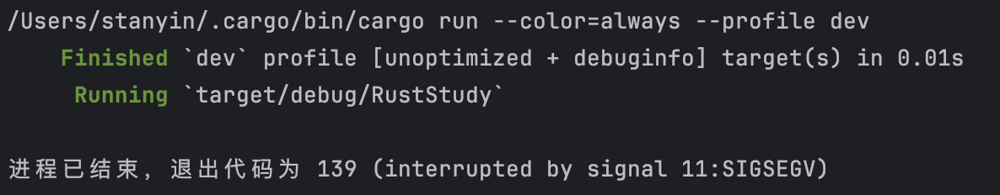

# 19.1 Unsafe Rust - Escaping Safety Restrictions

## 19.1.1 What Is Unsafe Rust
So far, all the code we have discussed has had Rust’s memory-safety guarantees enforced at compile time. However, Rust has a second language hidden inside it that does not enforce those memory-safety guarantees. It is called `unsafe Rust`. It works like ordinary Rust, but it gives us extra “superpowers”.

`unsafe Rust` exists because:
- Static analysis is very conservative. When the compiler decides whether a piece of code is safe, it would rather reject a program that actually runs correctly than let any potentially unsafe code through.
- Computer hardware itself is unsafe, and if Rust wants to reach the same low-level capabilities as C, it needs `unsafe Rust`. In other words, `unsafe Rust` allows low-level systems programming.

Using `unsafe Rust` tells the compiler: “I know what I am doing, and I accept the risks.”

## 19.1.2 Superpowers of Unsafe Rust
Use the `unsafe` keyword to switch into `unsafe Rust`. It opens a block, and anything written inside that block is unsafe code.

`unsafe Rust` can do five things, also known as its superpowers:
- Dereference raw pointers
- Call unsafe functions or methods
- Access or modify mutable static variables
- Implement unsafe traits
- Access fields of a `union`

Notes:
- `unsafe Rust` does not turn off the borrow checker or disable other safety checks. If you use references in your code, those references are still checked. The `unsafe` keyword only lets you perform the five operations above that the compiler does not memory-check for you. So even inside an `unsafe` block, you still retain some safety guarantees.
- Any memory-safety-related error must remain inside an `unsafe` block.
- Isolate unsafe code as much as possible. Ideally, wrap it in a safe abstraction and provide a safe API. Some standard library code uses `unsafe` blocks internally but exposes a safe abstraction on top of them. That effectively prevents unsafe code from leaking into callers, because using the safe abstraction is safe no matter whether `unsafe Rust` is used internally.

### Feature 1: Dereferencing Raw Pointers
`unsafe Rust` provides two pointer types that are similar to references. They are called *raw pointers*. You only need an `unsafe` block when *dereferencing a raw pointer*, because problems may occur. *Creating a raw pointer* does not itself create a problem, so it does not need to be inside an `unsafe` block.

Like references, raw pointers can be mutable or immutable:
- Mutable: `*mut T`
- Immutable: `*const T`

`*const T` means the pointer can be dereferenced, but the pointed-to value cannot be assigned through that pointer.

*Note: the `*` here is part of the type, not the dereference operator. The three tokens `*const T` together form a type, for example `*const String`.*

The difference between `*const T` and `*mut T` is small, and they can be freely converted between each other. Rust references (`&mut T` and `&T`) are converted to raw pointers by the compiler during compilation, which means **you can get raw-pointer performance without entering an `unsafe` block**.

The differences between references and raw pointers are:
- Raw pointers allow you to ignore the borrow rules by having both immutable and mutable pointers at the same time, or multiple mutable pointers to the same location.
- Raw pointers cannot guarantee that they point to valid memory, while references can.
- Raw pointers may be `null`.
- Raw pointers do not implement any automatic cleanup.

**If you give up safety guarantees, you can gain better performance and interoperability with other languages or hardware interfaces.**

Here is an example:
```rust
fn main() {
    let mut num = 5;

    let r1 = &num as *const i32;
    let r2 = &mut num as *mut i32;
}
```
This is an example of creating raw pointers. In `main`, we create both an immutable raw pointer and a mutable raw pointer.

This code is not inside an `unsafe` block, but it still compiles. So we can create raw pointers outside unsafe code, but dereferencing them can only be done inside `unsafe` code.

This code contains both a mutable pointer and an immutable pointer pointing to the same memory region within one scope, and Rust allows it. That means we can modify values through a mutable reference, but we must be very careful.

When creating raw pointers, we first write them using reference syntax and then convert them to the corresponding raw pointers with `as *const` and `as *mut`. Because these two raw pointers come from valid references, we know they are valid, but they may not stay valid forever. Next, let’s create a raw pointer whose validity we cannot guarantee:
```rust
fn main() {
    let address = 0x012345usize;
    let r = address as *const i32;
}
```
We directly write a pointer from a memory address. There may or may not be data at that address, but we can still create a raw pointer. The compiler will not report an error.

Now let’s try to dereference these raw pointers:
```rust
fn main() {
    let mut num = 5;

    let r1 = &num as *const i32;
    let r2 = &mut num as *mut i32;
    println!("r1 is: {}", *r1);
    println!("r2 is: {}", *r2);
}
```
This produces the error `dereference of raw pointer is unsafe and requires unsafe function or block`, which means raw-pointer dereferencing is only allowed inside an unsafe function or an unsafe block.

Putting the raw-pointer dereference inside an `unsafe` block works:
```rust
fn main() {
    let mut num = 5;

    let r1 = &num as *const i32;
    let r2 = &mut num as *mut i32;

    unsafe {
        println!("r1 is: {}", *r1);
        println!("r2 is: {}", *r2);
    }
}
```

Does this also work for the example where we create a raw pointer directly from a memory address?
```rust
fn main() {
    let address = 0x012345usize;
    let r = address as *const i32;
    unsafe {
        println!("r = {}", r);
    }
}
```
Output:

Yes, on my computer it prints nothing either, although it does not crash. You can try it on your own computer. Some systems will report an illegal access error, and some may even print a number.

If raw pointers are this dangerous, why use them at all? The reasons are:
- Interfacing with C
- Building safe abstractions that the borrow checker cannot understand

### Feature 2: Calling Unsafe Functions and Methods
Unsafe functions and methods are functions or methods declared with the `unsafe` keyword. Aside from that, they are not much different from ordinary functions or methods.

Before calling such a function or method, you must manually satisfy some conditions, usually by reading the documentation, because Rust cannot verify those conditions for you. In addition, calling an unsafe function or method must happen inside an `unsafe` block.

Here is an example:
```rust
unsafe fn dangerous() {}

fn main() {
    unsafe {
        dangerous();
    }
}
```
We declare a `dangerous` function with the `unsafe` keyword, so it is an unsafe function. That means `main` must call it inside an `unsafe` block.

Having unsafe code inside a function does not mean the entire function must be marked unsafe. In fact, wrapping unsafe code in a safe function is a common abstraction.

For example:
```rust
fn split_at_mut(values: &mut [i32], mid: usize) -> (&mut [i32], &mut [i32]) {
    let len = values.len();

    assert!(mid <= len);

    (&mut values[..mid], &mut values[mid..])
}

fn main() {
    let mut v = vec![1, 2, 3, 4, 5, 6];

    let r = &mut v[..];

    let (a, b) = r.split_at_mut(3);

    assert_eq!(a, &mut [1, 2, 3]);
    assert_eq!(b, &mut [4, 5, 6]);
}
```
- In `main`, there is a `Vec` named `v`. `r` is its full mutable slice, and then `split_at_mut` is called on `r`.
- `split_at_mut` takes `self` as a slice of `i32` elements and a `usize` value. It uses that `usize` as the index at which to split `self` into two mutable slices. Inside the function body, it first checks whether the incoming `usize` is within a valid range (no greater than the length of `self`), and then returns the front and back halves.

Output:
```
$ cargo run
   Compiling unsafe-example v0.1.0 (file:///projects/unsafe-example)
error[E0499]: cannot borrow `*values` as mutable more than once at a time
 --> src/main.rs:6:31
  |
1 | fn split_at_mut(values: &mut [i32], mid: usize) -> (&mut [i32], &mut [i32]) {
  |                         - let's call the lifetime of this reference `'1`
...
6 |     (&mut values[..mid], &mut values[mid..])
  |     --------------------------^^^^^^--------
  |     |     |                   |
  |     |     |                   second mutable borrow occurs here
  |     |     first mutable borrow occurs here
  |     returning this value requires that `*values` is borrowed for `'1`
  |
  = help: use `.split_at_mut(position)` to obtain two mutable non-overlapping sub-slices

For more information about this error, run `rustc --explain E0499`.
error: could not compile `unsafe-example` (bin "unsafe-example") due to 1 previous error
```
Rust’s borrow checker cannot understand that we are borrowing two different parts of the slice and that those two parts do not overlap. It only knows that we borrowed the same slice twice. So we need an unsafe function:
```rust
use std::slice;

fn split_at_mut(values: &mut [i32], mid: usize) -> (&mut [i32], &mut [i32]) {
    let len = values.len();
    let ptr = values.as_mut_ptr();

    assert!(mid <= len);

    unsafe {
        (
            slice::from_raw_parts_mut(ptr, mid),
            slice::from_raw_parts_mut(ptr.add(mid), len - mid),
        )
    }
}
```
- `as_mut_ptr` returns a raw pointer, specifically `*mut i32`.
- The tuple return uses an `unsafe` block, raw pointers, and pointer arithmetic. `slice::from_raw_parts_mut` in the `slice` module takes a raw pointer `ptr` and a length `mid` to create a slice:
  - `slice::from_raw_parts_mut(ptr, mid)` creates a slice with `mid` elements starting at `ptr`.
  - `slice::from_raw_parts_mut(ptr.add(mid), len - mid)` creates a slice with `len - mid` elements starting at `ptr.add(mid)`—that is, `mid` elements past `ptr`, which is the end of the first slice.

This function uses an `unsafe` block, but it is not itself marked `unsafe`. That is what a safe abstraction over unsafe code looks like.

What if we do not use a safe abstraction?
```rust
use std::slice;

fn main() {
    let address = 0x01234usize;
    let r = address as *mut i32;

    let values: &mut [i32] = unsafe { slice::from_raw_parts_mut(r, 10000) };
}
```
We do not necessarily own the memory at this arbitrary address, and we cannot guarantee that the slice created by this code contains valid `i32` values. Trying to treat `values` as a valid slice can lead to undefined behavior.

---
### Calling External Code or Being Called by External Code with `extern`
The `extern` keyword simplifies the process of defining and using a *Foreign Function Interface (FFI)*.

An FFI allows one programming language to define functions and let other programming languages call those functions.

Here is an example:
```rust
extern "C" {
    fn abs(input: i32) -> i32;
}

fn main() {
    unsafe {
        println!("Absolute value of -3 according to C: {}", abs(-3));
    }
}
```
- Any function declared inside an `extern` block is unsafe, because other languages do not enforce Rust’s rules, and Rust cannot check them. So calling external functions is implicitly marked unsafe, and the responsibility for safety is placed on the developer.
- In the `extern "C"` block, we list the names and signatures of external functions from another language that we want to call. The `"C"` part defines the *Application Binary Interface* (ABI) used by the external function. The ABI defines how the function is called at the assembly level. The `"C"` ABI is the most common and follows the ABI of the C programming language.

---

If Rust can call functions from other programming languages, can other programming languages call Rust code? The answer is yes.

We can use `extern` to create an interface that other languages can call into. To do that, add the `extern` keyword before `fn` and specify the ABI. You also need the `#[no_mangle]` attribute so Rust does not change the function name during compilation.

`mangle` refers to a compilation stage in which the compiler changes a function’s name so it includes more information for later compilation stages. These mangled names are usually hard to read, so if you want other languages to use the function normally, you must prevent Rust from renaming it.

Here is an example:
```rust
#[no_mangle]
pub extern "C" fn call_from_c() {
    println!("Just called a Rust function from C!");
}
```

### Feature 3: Accessing or Modifying a Mutable Static Variable
Rust supports global variables, but ownership rules can create some problems, such as data races.

Global variables in Rust are called static variables. They are declared with the `static` keyword, follow the UPPER_SNAKE_CASE naming convention, and must have their type annotated when declared. Their lifetime is *and can only be* `'static`, meaning they remain valid for the entire run of the program. You do not need to write that explicitly; Rust infers it. Accessing immutable static variables is safe.

For example:
```rust
static HELLO_WORLD: &str = "Hello, world!";

fn main() {
    println!("name is: {HELLO_WORLD}");
}
```
- `HELLO_WORLD` is the declared global variable, whose value is `"Hello, world!"` and whose type is the string slice `&str`.
- `main` prints this global variable.

The difference between a constant (`const`) and a mutable static variable (`static mut`) is:
- Static variables have a fixed memory address, so using their value always accesses the same data.
- Constants are copied when they are used.
- Static variables can be mutable, and accessing or modifying mutable statics is unsafe, so those operations must happen inside an `unsafe` block.

For example:
```rust
static mut COUNTER: u32 = 0;

fn add_to_count(inc: u32) {
    unsafe {
        COUNTER += inc;
    }
}

fn main() {
    add_to_count(3);

    unsafe {
        println!("COUNTER: {COUNTER}");
    }
}
```
*Accessing and modifying are unsafe operations*, so both are placed inside `unsafe` blocks.

The output here is clearly 3. But if multiple threads are involved, it is easy to introduce data races. In multi-threaded code, it is better to use the concurrency techniques we discussed earlier or a thread-safe smart pointer such as `Arc<T>`, so the compiler can safely check access to the data across threads.

### Feature 4: Implementing an Unsafe Trait
When a trait contains at least one method that includes an unsafe factor the compiler cannot verify, that trait is considered unsafe.

You declare an unsafe trait by placing the `unsafe` keyword before the `trait` definition. Such a trait can only be implemented inside an `unsafe` block.

For example:
```rust
unsafe trait Foo {
    // methods go here
}

unsafe impl Foo for i32 {
    // method implementations go here
}

fn main() {}
```
- `unsafe trait Foo` declares an unsafe trait named `Foo`.
- Implementing `Foo` for `i32` must happen inside an `unsafe` block, so `unsafe impl` is required.

### Feature 5: Accessing `union` Fields
A `union` is similar to a `struct`, but only one declared field is used at a time in a given instance. `union`s are mainly used when interoperating with `union`s from C code. Accessing a `union` field is unsafe because Rust cannot guarantee the type of the data currently stored in the `union` instance. For details, see the [Rust Reference](https://doc.rust-lang.org/reference/items/unions.html).

## 19.1.3 When to Use `unsafe` Code
Ensuring that `unsafe` code is correct is tricky, because the compiler cannot help maintain memory safety, and it is not easy for developers to guarantee correctness on their own.

Use `unsafe` code when you have a good reason to do so. Explicit `unsafe` annotations make it easier to trace the source of problems when they occur.
