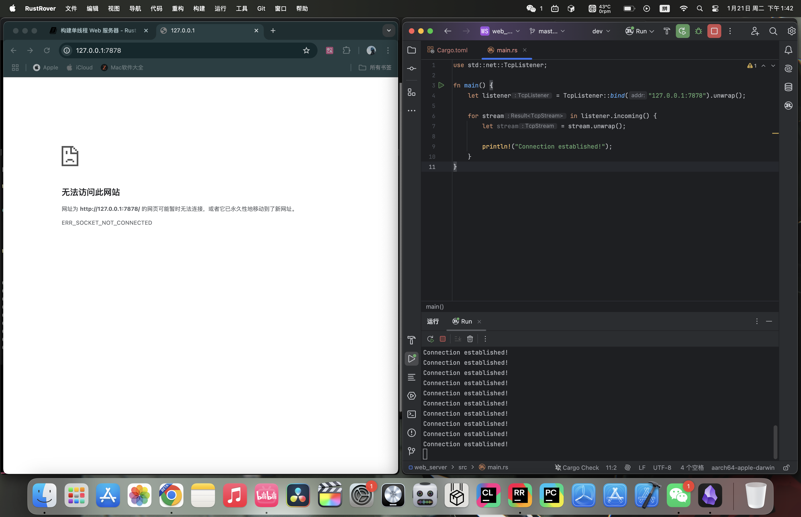
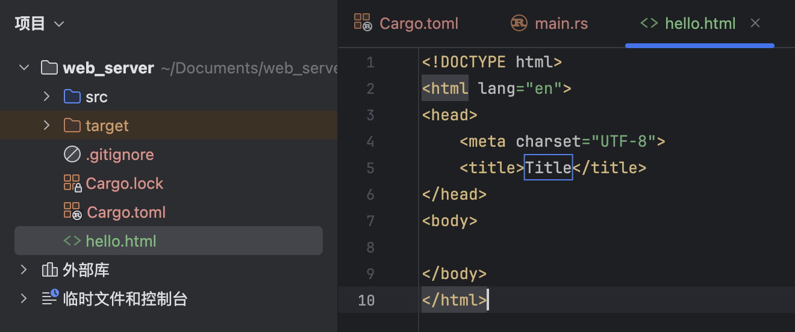

# 20.1 The Final Project - Single-Threaded Web Server

## 20.1.1 What Are TCP and HTTP?
The two main protocols involved in web servers are Hypertext Transfer Protocol (HTTP) and Transmission Control Protocol (TCP). Both are request-response protocols: a client sends a request, and a server listens for the request and sends a response to the client. The contents of these requests and responses are defined by the protocol.

TCP is a lower-level protocol. It describes the details of how information is transferred from one server to another, but it does not specify what that information is. HTTP builds on top of TCP by defining the contents of requests and responses. Technically, HTTP can be combined with other protocols, but in most cases HTTP sends data over TCP. We will use the raw bytes of TCP and HTTP requests and responses.

## 20.1.2 Listening on TCP
Now that we understand the basics, let’s get to work! First, create this project:
```bash
cargo new web_server
```

Open `main.rs`; the initial code looks like this:
```rust
use std::net::TcpListener;

fn main() {
    let listener = TcpListener::bind("127.0.0.1:7878").unwrap();

    for stream in listener.incoming() {
        let stream = stream.unwrap();

        println!("Connection established!");
    }
}
```
- `std::net::TcpListener` is a type provided by the standard library for listening to TCP connections.
- The `TcpListener::bind` function listens on the address you pass in. Here we pass `"127.0.0.1:7878"`, which is the local port 7878. Its return type is `Result<T, E>`, so we use `unwrap` for error handling. If binding succeeds, it returns a `TcpListener`, which is assigned to the `listener` variable.
- `TcpListener` has an `incoming` method that returns an iterator over a sequence of streams, namely `TcpStream`s. A single stream represents one open connection between the client and the server, and the `for` loop handles each connection in turn, producing a stream for us to process.

Let’s try running this code. In the terminal, run `cargo run` and then load `127.0.0.1:7878` in a web browser. The browser should display an error (for example “connection reset” or `ERR_SOCKET_NOT_CONNECTED`) because the server is not sending anything back yet. But when you look at the terminal, you should see one or more messages printed when the browser connects to the server—browsers often open several connections for a single page load:

Console output (one possible run; the exact count may differ):
```text
Connection established!
Connection established!
Connection established!
Connection established!
Connection established!
Connection established!
Connection established!
Connection established!
Connection established!
Connection established!
```

## 20.1.3 Reading the Request
We have already implemented TCP listening, so next let’s try reading the request. We will modify the code above directly:
```rust
use std::{
    io::{prelude::*, BufReader},
    net::{TcpListener, TcpStream},
};

fn main() {
    let listener = TcpListener::bind("127.0.0.1:7878").unwrap();

    for stream in listener.incoming() {
        let stream = stream.unwrap();

        handle_connection(stream);
    }
}

fn handle_connection(mut stream: TcpStream) {
    let buf_reader = BufReader::new(&stream);
    let http_request: Vec<_> = buf_reader
        .lines()
        .map(|result| result.unwrap())
        .take_while(|line| !line.is_empty())
        .collect();

    println!("Request: {:#?}", http_request);
}
```
- We define a function called `handle_connection` to handle client connections. The `stream` parameter is a mutable `TcpStream` value used to communicate with the client. The internal state of `TcpStream` may change as data is read and written, so it must be declared as `mut`.
- We wrap `stream` with `BufReader` to create a buffered reader named `buf_reader`.
- We use `map(|result| result.unwrap())` to unwrap the `Result` values and extract the strings. If reading fails, the program will panic because of `unwrap`.
- `take_while(|line| !line.is_empty())` filters items from the iterator until it reaches an empty line. HTTP requests use an empty line (`""`) to mark the end of the headers, so we collect only the non-empty lines.
- We collect all non-empty lines into a `Vec<_>` and store it as `http_request`.
- We print `http_request` with `println!`.

Try it:

The output in the terminal looks like this (headers vary by client; this example is from Chrome):
```text
Request: [
    "GET / HTTP/1.1",
    "Host: 127.0.0.1:7878",
    "Connection: keep-alive",
    "sec-ch-ua: \"Not(A:Brand\";v=\"99\", \"Google Chrome\";v=\"133\", \"Chromium\";v=\"133\"",
    "sec-ch-ua-mobile: ?0",
    "sec-ch-ua-platform: \"macOS\"",
    "Upgrade-Insecure-Requests: 1",
    "User-Agent: Mozilla/5.0 (Macintosh; Intel Mac OS X 10_15_7) AppleWebKit/537.36 (KHTML, like Gecko) Chrome/133.0.0.0 Safari/537.36",
    "Accept: text/html,application/xhtml+xml,application/xml;q=0.9,image/avif,image/webp,image/apng,*/*;q=0.8,application/signed-exchange;v=b3;q=0.7",
    "Sec-Fetch-Site: none",
    "Sec-Fetch-Mode: navigate",
    "Sec-Fetch-User: ?1",
    "Sec-Fetch-Dest: document",
    "Accept-Encoding: gzip, deflate, br, zstd",
    "Accept-Language: zh-CN,zh;q=0.9,en-US;q=0.8,en;q=0.7,zh-CN;q=0.6",
]
```

HTTP is a text-based protocol, and its requests use the following format:
```
Method Request-URI HTTP-Version CRLF
headers CRLF
message-body
```
The first line is the *request line*, which contains information about the client request. The first part of the request line indicates the *method* being used, such as `GET` or `POST`. It describes how the client is making the request. Our client used a `GET` request, which means it is asking for information.

The next part of the request line is `/`, which indicates the client’s requested *uniform resource identifier* (URI). A URI is almost the same as a *uniform resource locator* (URL), but not exactly. The distinction between URI and URL does not matter for the purposes of this chapter, but the HTTP specification uses the term URI, so we can use URL here as a substitute for URI.

The final part is the HTTP version used by the client, and then the request line ends with a *CRLF sequence* (`\r\n`), where `\r` is carriage return and `\n` is line feed. The CRLF sequence separates the request line from the rest of the request data. Notice that when we print CRLF, we see a new line instead of `\r\n`.

## 20.1.4 Writing the Response
Now that we can read the request, let’s write a response. The response has a format very similar to the request:
```
HTTP-Version Status-Code Reason-Phrase CRLF
headers CRLF
message-body
```
The first line is the *status line*, which contains the HTTP version used in the response, a numeric status code, and the text description corresponding to that status code, followed by a CRLF sequence.

With the format in hand, the code is easy to write:
```rust
let response = "HTTP/1.1 200 OK\r\n\r\n";

stream.write_all(response.as_bytes()).unwrap();
```
- `HTTP/1.1` is the HTTP version, `200` is the numeric status code, `OK` is the text description, and `\r\n\r\n` is the CRLF sequence.
- We call `as_bytes` on `response` to convert the string data into bytes. The `write_all` method on `stream` takes `&[u8]` and sends those bytes directly over the connection. Because `write_all` can fail, we use `unwrap`. In a real application, you could add other error-handling logic here.

Next, let’s return a real HTML document. Create `hello.html` in the project root:

Then write this:
```html
<!DOCTYPE html>
<html lang="en">
  <head>
    <meta charset="utf-8">
    <title>Hello!</title>
  </head>
  <body>
    <h1>Hello!</h1>
    <p>Hi from Rust</p>
  </body>
</html>
```
This is a minimal HTML5 document with a title and some text.

To return HTML, we need to modify `main.rs`. First, bring `std::fs` into scope:
```rust
use std::fs;
```
`fs` is the file system module.

Then modify the `response` variable slightly inside `handle_connection`:
```rust
let status_line = "HTTP/1.1 200 OK";
let contents = fs::read_to_string("hello.html").unwrap();
let length = contents.len();

let response =
    format!("{status_line}\r\nContent-Length: {length}\r\n\r\n{contents}");

stream.write_all(response.as_bytes()).unwrap();
```
- Use `fs::read_to_string` to convert the contents of the file into a string.
- Then use the `format!` macro to place the string into the response in the format we just wrote.

Complete code:
```rust
use std::{
    fs,
    io::{prelude::*, BufReader},
    net::{TcpListener, TcpStream},
};

fn main() {
    let listener = TcpListener::bind("127.0.0.1:7878").unwrap();

    for stream in listener.incoming() {
        let stream = stream.unwrap();

        handle_connection(stream);
    }
}

fn handle_connection(mut stream: TcpStream) {
    let buf_reader = BufReader::new(&stream);
    let http_request: Vec<_> = buf_reader
        .lines()
        .map(|result| result.unwrap())
        .take_while(|line| !line.is_empty())
        .collect();

    let status_line = "HTTP/1.1 200 OK";
    let contents = fs::read_to_string("hello.html").unwrap();
    let length = contents.len();

    let response =
        format!("{status_line}\r\nContent-Length: {length}\r\n\r\n{contents}");

    stream.write_all(response.as_bytes()).unwrap();
}
```

Try it:


## 20.1.5 Selective Responses
Right now, no matter what the client requests, our web server always returns the HTML file. Let’s add a feature to check whether the browser is visiting the normal route. A normal visit means accessing `127.0.0.1:7878/` or `127.0.0.1:7878`. Before returning the HTML file, if the browser requests anything else, return an error instead.

Create a `404.html` file in the project root with the following contents:
```html
<!DOCTYPE html>
<html lang="en">
  <head>
    <meta charset="utf-8">
    <title>Hello!</title>
  </head>
  <body>
    <h1>Oops!</h1>
    <p>Sorry, I don't know what you're asking for.</p>
  </body>
</html>
```

Put the earlier HTML-returning code inside an `if` branch. If the request is a normal visit, return the normal content; otherwise return `404.html`:
```rust
fn handle_connection(mut stream: TcpStream) {
    let buf_reader = BufReader::new(&stream);
    let request_line = buf_reader.lines().next().unwrap().unwrap();

    if request_line == "GET / HTTP/1.1" {
        let status_line = "HTTP/1.1 200 OK";
        let contents = fs::read_to_string("hello.html").unwrap();
        let length = contents.len();

        let response = format!(
            "{status_line}\r\nContent-Length: {length}\r\n\r\n{contents}"
        );

        stream.write_all(response.as_bytes()).unwrap();
    } else {
        let status_line = "HTTP/1.1 404 NOT FOUND";
        let contents = fs::read_to_string("404.html").unwrap();
        let length = contents.len();

        let response = format!(
            "{status_line}\r\nContent-Length: {length}\r\n\r\n{contents}"
        );

        stream.write_all(response.as_bytes()).unwrap();
    }
}
```
- We removed the part that prints the request, since we do not need it anymore.
- We determine whether the user is visiting normally by looking at the request line. The normal path still returns the normal content; anything else returns the contents of `404.html`.

There is a lot of duplication in the current code, so let’s refactor it a bit:
```rust
fn handle_connection(mut stream: TcpStream) {
    let buf_reader = BufReader::new(&stream);
    let request_line = buf_reader.lines().next().unwrap().unwrap();

    let (status_line, filename) = if request_line == "GET / HTTP/1.1" {
        ("HTTP/1.1 200 OK", "hello.html")
    } else {
        ("HTTP/1.1 404 NOT FOUND", "404.html")
    };

    let contents = fs::read_to_string(filename).unwrap();
    let length = contents.len();

    let response =
        format!("{status_line}\r\nContent-Length: {length}\r\n\r\n{contents}");

    stream.write_all(response.as_bytes()).unwrap();
}
```
We use tuple pattern matching and an `if` expression to determine the values of `status_line` and `filename`.

Try it:

Normal visit:


Invalid visit:


## 20.1.6 Summary
Here is the source code:

`main.rs`:
```rust
use std::{
    fs,
    io::{prelude::*, BufReader},
    net::{TcpListener, TcpStream},
};

fn main() {
    let listener = TcpListener::bind("127.0.0.1:7878").unwrap();

    for stream in listener.incoming() {
        let stream = stream.unwrap();

        handle_connection(stream);
    }
}

fn handle_connection(mut stream: TcpStream) {
    let buf_reader = BufReader::new(&stream);
    let request_line = buf_reader.lines().next().unwrap().unwrap();

    let (status_line, filename) = if request_line == "GET / HTTP/1.1" {
        ("HTTP/1.1 200 OK", "hello.html")
    } else {
        ("HTTP/1.1 404 NOT FOUND", "404.html")
    };

    let contents = fs::read_to_string(filename).unwrap();
    let length = contents.len();

    let response =
        format!("{status_line}\r\nContent-Length: {length}\r\n\r\n{contents}");

    stream.write_all(response.as_bytes()).unwrap();
}
```

`hello.html`:
```html
<!DOCTYPE html>
<html lang="en">
<head>
    <meta charset="utf-8">
    <title>Hello!</title>
</head>
<body>
<h1>Hello!</h1>
<p>Hi from Rust</p>
</body>
</html>
```

`404.html`:
```html
<!DOCTYPE html>
<html lang="en">
<head>
  <meta charset="utf-8">
  <title>Hello!</title>
</head>
<body>
<h1>Oops!</h1>
<p>Sorry, I don't know what you're asking for.</p>
</body>
</html>
```
