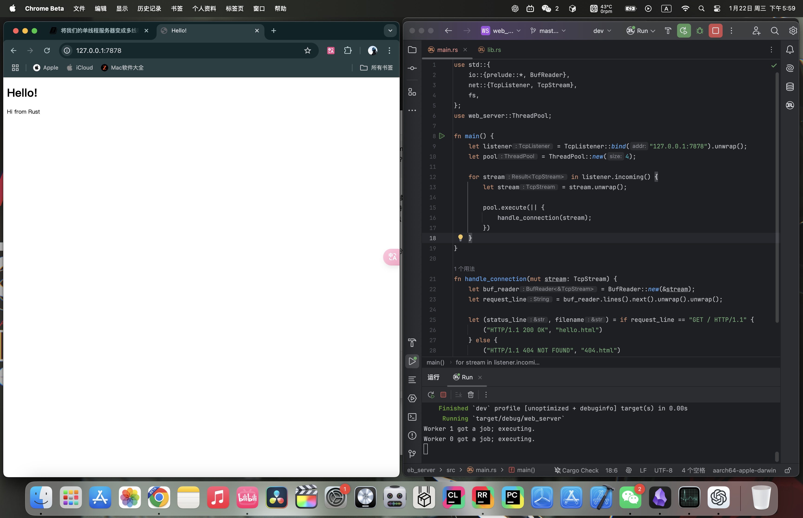

# 20.2 The Final Project - Multithreaded Web Server

## 20.2.1 Review

In our previous article, we described a simple local server. However, this server is single-threaded, meaning that requests are processed one by one. We have to handle each request individually. If a certain request takes a long time to process, the subsequent ones will have to wait in line. The performance of this single-threaded external server is extremely poor.

## 20.2.2 Slow Requests
We can use code to simulate a slow request:
```rust
use std::{
    fs,
    io::{prelude::*, BufReader},
    net::{TcpListener, TcpStream},
    thread,
    time::Duration,
};
// ...

fn handle_connection(mut stream: TcpStream) {
    // ...

    let (status_line, filename) = match &request_line[..] {
        "GET / HTTP/1.1" => ("HTTP/1.1 200 OK", "hello.html"),
        "GET /sleep HTTP/1.1" => {
            thread::sleep(Duration::from_secs(5));
            ("HTTP/1.1 200 OK", "hello.html")
        }
        _ => ("HTTP/1.1 404 NOT FOUND", "404.html"),
    };

    // ...
}
```
Some original code has been omitted, but that does not affect the explanation. The statement we added makes the code sleep for 5 seconds when the user visits `127.0.0.1:7878/sleep`, which simulates a slow request.

Now open two browser windows: one for [http://127.0.0.1:7878/](http://127.0.0.1:7878/) and one for [http://127.0.0.1:7878/sleep](http://127.0.0.1:7878/sleep). As before, you will see a quick response on the normal route. But if you enter `/sleep` and load the page, you will see that the browser waits the full 5 seconds before it finishes loading.

How can we improve this situation? Here we will use thread pool technology. Other options include a *fork/join model*, a *single-threaded asynchronous I/O model*, or a *multithreaded asynchronous I/O model*.

## 20.2.3 Using a Thread Pool to Improve Throughput
A thread pool is a collection of allocated threads that wait for tasks and can be used whenever tasks arrive. When the program receives a new task, it assigns the task to one of the threads in the pool, while the other threads can continue receiving other tasks at the same time. When the task is finished, that thread is returned to the pool.

Thread pools increase server throughput by allowing connections to be processed concurrently.

How do we create a thread for each connection? Take a look:
```rust
fn main() {
    let listener = TcpListener::bind("127.0.0.1:7878").unwrap();

    for stream in listener.incoming() {
        let stream = stream.unwrap();

        thread::spawn(|| {
            handle_connection(stream);
        });
    }
}
```
Each iteration of the iterator creates a new thread to handle the connection.

The drawback is that the number of threads is unlimited: a new thread is created for every request. If a hacker launches a DoS (Denial of Service) attack, our server will quickly collapse.

So based on the code above, we will make a change. We will use compiler-driven development to write the code (this is not a standard development methodology, but rather a joke among developers, unlike TDD test-driven development): write the function or type you expect to call first, and then fix the code step by step based on compiler errors.

### Using Compiler-Driven Development
Let’s write the code we want directly first, without worrying about whether it is right:
```rust
fn main() {
    let listener = TcpListener::bind("127.0.0.1:7878").unwrap();
    let pool = ThreadPool::new(4);

    for stream in listener.incoming() {
        let stream = stream.unwrap();

        pool.execute(|| {
            handle_connection(stream);
        });
    }
}
```
Although there is no `ThreadPool` type yet, according to the logic of compiler-driven development, we just write it first and worry about correctness later.

Run `cargo check`:
```
error[E0433]: failed to resolve: use of undeclared type `ThreadPool`
  --> src/main.rs:11:16
   |
9  |     let pool = ThreadPool::new(4);
   |                ^^^^^^^^^^ use of undeclared type `ThreadPool`

For more information about this error, try `rustc --explain E0433`.
error: could not compile `hello` (bin "hello") due to 1 previous error
```
This error tells us that we need a `ThreadPool` type or module, so we will build one now.

We will write the `ThreadPool`-related code in `lib.rs`. On the one hand, that keeps `main.rs` simple enough; on the other hand, it allows the `ThreadPool` code to live independently.

Open `lib.rs` and write a simple definition for `ThreadPool`:
```rust
pub struct ThreadPool;
```

Bring `ThreadPool` into scope in `main.rs`:
```rust
use web_server::ThreadPool;
```

Run `cargo check`:
```
error[E0599]: no function or associated item named `new` found for struct `ThreadPool` in the current scope
  --> src/main.rs:10:28
   |
10 |     let pool = ThreadPool::new(4);
   |                            ^^^ function or associated item not found in `ThreadPool`
```

This error shows that we now need an associated function named `new` on `ThreadPool`. We also know that `new` needs to accept a parameter that can take `4`, and it should return a `ThreadPool` instance. Let’s implement the simplest possible `new` function with those characteristics:
```rust
pub struct ThreadPool;

impl ThreadPool {
    pub fn new(size: usize) -> ThreadPool {
        ThreadPool
    }
}
```

Run `cargo check`:
```
error[E0599]: no method named `execute` found for struct `ThreadPool` in the current scope
  --> src/main.rs:17:14
   |
15 |         pool.execute(|| {
   |         -----^^^^^^^ method not found in `ThreadPool`

For more information about this error, try `rustc --explain E0599`.
error: could not compile `hello` (bin "hello") due to 1 previous error
```

Now we get an error because `ThreadPool` does not have an `execute` method. So let’s add one:
```rust
pub fn execute<F>(&self, f: F)
where
    F: FnOnce() + Send + 'static,
{
}
```
- In addition to `self`, the `execute` function takes a closure parameter. The thread handling the request will only call the closure once, so we use `FnOnce()`. The `()` means it is a closure that returns the unit type `()`. We also need the `Send` trait so the closure can be transferred from one thread to another, and `'static` because we do not know how long the thread will run.
- Another way to think about it is that we are replacing the original `thread::spawn` function with this one, so when we modify it we can borrow its function signature. Its signature is shown below. The main pieces we borrow are the generic `F` and its bounds, so the generic bounds for `execute` can be written in the same style.
```rust
pub fn spawn<F, T>(f: F) -> JoinHandle<T>
where
    F: FnOnce() -> T,
    F: Send + 'static,
    T: Send + 'static,
```

`cargo check` now reports no errors, but `cargo run` still fails, because `execute` and `new` do not actually do anything yet; they only satisfy the compiler.

You may have heard the saying about languages with strict compilers, such as Haskell and Rust: “If the code compiles, it works.” But that is not universally true. Our project compiles, but it does nothing. If we were building a real, complete project, this would be a good time to start writing unit tests to check that the code compiles and behaves the way we want it to, which is TDD test-driven development.

### Modifying the `new` Function, Part 1
Let’s first modify `new` so that it has real meaning:
```rust
impl ThreadPool {
    /// Create a new ThreadPool.
    ///
    /// The size is the number of threads in the pool.
    ///
    /// # Panics
    ///
    /// The `new` function will panic if the size is zero.
    pub fn new(size: usize) -> ThreadPool {
        assert!(size > 0);

        ThreadPool
    }

    // ...
}
```
- We use the `assert!` macro to check that the `new` function’s argument is greater than 0, because 0 would be meaningless.
- We add some documentation comments so that they appear when we run `cargo doc --open`:


### Modifying the `ThreadPool` Type
The `new` function has hit a bottleneck: `ThreadPool` has no concrete fields, so we cannot implement the goal of creating a specific number of threads. So next we will study how to store threads inside `ThreadPool`:
```rust
use std::thread;

pub struct ThreadPool {
    threads: Vec<thread::JoinHandle<()>>,
}
```
`ThreadPool` has a `threads` field of type `Vec<thread::JoinHandle<()>>`:
- We use `Vec<>` because we want to store multiple threads, but the exact number is unknown, so we use a `Vector`.
- Earlier, we looked at the signature of `thread::spawn`. Its return value is `JoinHandle<T>`, so by analogy we also use `thread::JoinHandle<>` to store threads.
  The reason `JoinHandle<T>` has a `T` is that the thread created by `thread::spawn` may return a value, and because we do not know the specific type, we use a generic to represent it. Our code is certain to have no return value, so we write `thread::JoinHandle<()>`, where `()` is the unit type.

### Modifying the `new` Function, Part 2
After changing the `ThreadPool` definition, let’s go back and modify `new`:
```rust
pub fn new(size: usize) -> ThreadPool {
    assert!(size > 0);

    let mut threads = Vec::with_capacity(size);

    for _ in 0..size {
        // create some threads and store them in the vector
    }

    ThreadPool { threads }
}
```
- `Vec::with_capacity` creates a `Vector` with preallocated capacity by taking `size` as its argument.
- We write a loop from `0` to `size` (not including `size`). The logic inside is not written yet, but the loop is meant to create threads and store them in the `Vector`.
- Finally, we return a `ThreadPool` value, and the `threads` field is assigned the `threads` variable from this function.

Next, we will study the `thread::spawn` function so that it is easier to write the loop inside `new`. `thread::spawn` immediately starts executing the code a thread should run after the thread is created. However, in our case, we want to create the threads and have them *wait* for code that we send later. The standard library’s thread implementation does not provide any method for that, so we have to implement it ourselves.

### Using a Worker Data Structure
We use a new data structure to implement this behavior, called a *Worker*, which is a common term in pool implementations. A Worker picks up code that needs to run and runs it on the Worker’s thread. Imagine the people working in a restaurant kitchen: the workers wait for customers to place orders and then accept and fulfill those orders. We use Workers to manage and implement the behavior we want.

Let’s create the `Worker` struct and the necessary methods:
```rust
struct Worker {
    id: usize,
    thread: thread::JoinHandle<()>,
}

impl Worker {
    fn new(id: usize) -> Worker {
        let thread = thread::spawn(|| {});

        Worker { id, thread }
    }
}
```
- `Worker` has two fields: `id`, of type `usize`, which identifies the worker; and `thread`, of type `thread::JoinHandle<()>`, which stores a thread.
- The `new` function creates a `Worker` instance, and the value of the `id` field is the parameter passed in.

*PS: External code, such as the server in `main.rs`, does not need to know the implementation details of how `Worker` is used inside `ThreadPool`, so we make the `Worker` struct and its `new` function private.*

Next, use `Worker` inside `ThreadPool`:
```rust
pub struct ThreadPool {
    workers: Vec<Worker>,
}
```

The `new` and `execute` functions on `ThreadPool` also need to change. We will modify `new` first and leave `execute` for later:
```rust
pub fn new(size: usize) -> ThreadPool {
    assert!(size > 0);

    let mut workers = Vec::with_capacity(size);

    for id in 0..size {
        workers.push(Worker::new(id));
    }

    ThreadPool { workers }
}
```
- Change the `threads`-related code to `workers`.
- Because the `Worker` field in `ThreadPool` is wrapped in a `Vector`, we can use the `push` method on `Vector` to add new elements.
- Inside the loop, we call `Worker::new` to create a `Worker` instance, and the `id` field is the value passed in as the parameter.

*PS: If the operating system cannot create a thread because there are not enough system resources, `thread::spawn` will panic. We do not consider that case in this example, but in real code it is better to account for it by using [`std::thread::Builder`](https://doc.rust-lang.org/std/thread/struct.Builder.html), which returns a `Result<JoinHandle<T>>`.*

### Sending Requests to Threads Through a Channel
Now that thread creation is done, the next question is how to receive tasks. This is where a channel comes in. Refactor the code like this:
```rust
use std::thread;
use std::sync::mpsc;

pub struct ThreadPool {
    workers: Vec<Worker>,
    sender: mpsc::Sender<Job>,
}

struct Job;
```
- Bring `mpsc` into scope with `use std::sync::mpsc;` so that we can use it later.
- Add a new field named `sender` to `ThreadPool`. Its type is `mpsc::Sender<Job>` (`Job` is a struct representing the work to be executed), and it stores the sending end of the channel.

Create the channel in `ThreadPool::new`:
```rust
impl ThreadPool {
    // ...
    pub fn new(size: usize) -> ThreadPool {
        assert!(size > 0);
        let (sender, receiver) = mpsc::channel();
        let mut workers = Vec::with_capacity(size);

        for id in 0..size {
            workers.push(Worker::new(id, receiver));
        }

        ThreadPool { workers, sender }
    }
    // ...
}
// ...
impl Worker {
    fn new(id: usize, receiver: Receiver<Job>) -> Worker {
        let thread = thread::spawn(|| {
            receiver;
        });

        Worker { id, thread }
    }
}
```
- Use `mpsc::channel()` to create a channel. The sender and receiver are named `sender` and `receiver`.
- Assign `sender` to the `sender` field of the return value; in other words, the thread pool owns the sending end of the channel.
- The receiver should belong to the `Worker`, so we also change `Worker::new` and add the `receiver` parameter.

Try `cargo check` now:
```
error[E0382]: use of moved value: `receiver`
  --> src/lib.rs:26:42
   |
22 |         let (sender, receiver) = mpsc::channel();
   |                      -------- move occurs because `receiver` has type `std::sync::mpsc::Receiver<Job>`, which does not implement the `Copy` trait
...
25 |         for id in 0..size {
   |         ----------------- inside of this loop
26 |             workers.push(Worker::new(id, receiver));
   |                                          ^^^^^^^^ value moved here, in previous iteration of loop
   |
note: consider changing this parameter type in method `new` to borrow instead if owning the value isn't necessary
  --> src/lib.rs:45:33
   |
45 |     fn new(id: usize, receiver: Receiver<Job>) -> Worker {
   |        --- in this method       ^^^^^^^^^^^^^ this parameter takes ownership of the value
help: consider moving the expression out of the loop so it is only moved once
   |
25 ~         let mut value = Worker::new(id, receiver);
26 ~         for id in 0..size {
27 ~             workers.push(value);
   |
```
The error occurs because the code tries to pass one `receiver` to multiple `Worker` instances, which will not work because there can only be one receiver end.

We want all threads to share the same `receiver` so that tasks can be distributed among them. In addition, taking items out of the channel queue requires changing `receiver`, so the threads need a safe way to share and mutate `receiver`. Otherwise, we could run into race conditions.

For multiple owners in a multithreaded context, we can use `Arc<T>` (`Rc<T>` is only for single-threaded code). For avoiding data races in multithreaded code, we can use the mutex `Mutex<T>`.

So we just wrap the original `receiver` in `Arc<T>` and `Mutex<T>`:
```rust
impl ThreadPool {
    /// ...
    pub fn new(size: usize) -> ThreadPool {
        assert!(size > 0);
        let (sender, receiver) = mpsc::channel();
        let mut workers = Vec::with_capacity(size);

        let receiver = Arc::new(Mutex::new(receiver));
        for id in 0..size {
            workers.push(Worker::new(id, Arc::clone(&receiver)));
        }

        ThreadPool { workers, sender }
    }
    //...
}
//...

impl Worker {
    fn new(id: usize, receiver: Arc<Mutex<mpsc::Receiver<Job>>>) -> Worker {
        let thread = thread::spawn(|| {
            receiver;
        });

        Worker { id, thread }
    }
}
```
- Rebind `receiver` so that it is wrapped in `Arc<T>` and `Mutex<T>`.
- Inside the loop, pass `Arc::clone(&receiver)` to each `Worker`.
- The `receiver` parameter in `Worker::new` must change to `Arc<Mutex<mpsc::Receiver<Job>>>`.

### Modifying `Job`
Our `Job` is still an empty struct and has no real effect, so we will change it into a type alias (see [19.5. Advanced Types](../../Chapter-19/19.5/19.5._Advanced_Types.md)):
```rust
type Job = Box<dyn FnOnce() + Send + 'static>;
```
`Job` is a closure that is called only once in one thread and has no return value (or, equivalently, returns the unit type `()`), so it must satisfy `FnOnce()`. It also needs to be transferable between threads, so it must satisfy the `Send` trait. `'static` is used because we do not know how long the thread will run, so we declare it to have a static lifetime.

### Modifying the `execute` Function
Next, let’s modify `execute`:
```rust
pub fn execute<F>(&self, f: F)
where
    F: FnOnce() + Send + 'static,
{
    let job = Box::new(f);

    self.sender.send(job).unwrap();
}
```
- Because `Job` is wrapped in `Box<T>`, the closure `f` must first be wrapped with `Box::new` before it can be sent out.
- Use the `sender` field on `self` as the sending end to send the `job`.

### Modifying `Worker::new`
Now that `execute` has changed, `Worker::new`, which acts as the receiver, must also change:
```rust
impl Worker {
    fn new(id: usize, receiver: Arc<Mutex<mpsc::Receiver<Job>>>) -> Worker {
        let thread = thread::spawn(move || loop {
            let job = receiver.lock().unwrap().recv().unwrap();
            println!("Worker {} got a job; executing.", id);
            job();
        });

        Worker { id, thread }
    }
}
```
- Use `lock` to lock `receiver` (which is wrapped in `Mutex<T>`) and obtain the mutex guard, using `unwrap` for error handling.
- Then use `recv` to receive the value sent through the channel, and use `unwrap` again for error handling.
- Print which `Worker` is doing the work.
- When `job();` is called, the compiler automatically dereferences `job` to its inner closure type and then calls the appropriate `call` method from the `FnOnce` or related trait implementation. That is because `Box<dyn FnOnce()>` implements `FnOnce`. In other words, `job();` is syntactic sugar for `(*job)();`.

---

## Version Differences
I am using Rust 1.84.0. In older Rust versions, you could not call `job();` directly, and you also could not use `(*job)();`, because the compiler did not directly know how to handle a boxed trait object. In newer Rust versions, direct calls on `Box<dyn Trait>` are supported by the compiler’s deref-and-call dispatch logic.

If your version of Rust rejects the code above, then either upgrade Rust or use a small workaround:
```rust
trait FnBox {
    fn call_box(self: Box<Self>);
}

impl<F: FnOnce()> FnBox for F {
    fn call_box(self: Box<F>) {
        (*self)();
    }
}

type Job = Box<dyn FnBox + Send + 'static>;
```
- The `FnBox` trait lets us call methods on a boxed type.
- We implement `call_box` for `FnOnce()` (because `Job` implements `FnOnce()`), which gives us ownership of the value inside the `Box` so that it can be called.
- We change the `Job` type from `FnOnce()` to `FnBox`, so the rest of the code does not need to change. Anything that implements `FnBox` can be used as a job in this workaround.

## 20.2.4 Trial Run
Finally, after all that work, let’s try running it:

If you refresh the page in the browser a few times, you can see other `Worker`s with different ids doing the work.

## 20.2.5 Summary
`main.rs`:
```rust
use std::{
    fs,
    io::{prelude::*, BufReader},
    net::{TcpListener, TcpStream},
};
use web_server::ThreadPool;

fn main() {
    let listener = TcpListener::bind("127.0.0.1:7878").unwrap();
    let pool = ThreadPool::new(4);

    for stream in listener.incoming() {
        let stream = stream.unwrap();

        pool.execute(|| {
            handle_connection(stream);
        });
    }
}

fn handle_connection(mut stream: TcpStream) {
    let buf_reader = BufReader::new(&stream);
    let request_line = buf_reader.lines().next().unwrap().unwrap();

    let (status_line, filename) = if request_line == "GET / HTTP/1.1" {
        ("HTTP/1.1 200 OK", "hello.html")
    } else {
        ("HTTP/1.1 404 NOT FOUND", "404.html")
    };

    let contents = fs::read_to_string(filename).unwrap();
    let length = contents.len();

    let response =
        format!("{status_line}\r\nContent-Length: {length}\r\n\r\n{contents}");

    stream.write_all(response.as_bytes()).unwrap();
}
```

`lib.rs`:
```rust
use std::{
    sync::{mpsc, Arc, Mutex},
    thread,
};

pub struct ThreadPool {
    workers: Vec<Worker>,
    sender: mpsc::Sender<Job>,
}

type Job = Box<dyn FnOnce() + Send + 'static>;

impl ThreadPool {
    /// Create a new ThreadPool.
    ///
    /// The size is the number of threads in the pool.
    ///
    /// # Panics
    ///
    /// The `new` function will panic if the size is zero.
    pub fn new(size: usize) -> ThreadPool {
        assert!(size > 0);
        let (sender, receiver) = mpsc::channel();
        let mut workers = Vec::with_capacity(size);

        let receiver = Arc::new(Mutex::new(receiver));
        for id in 0..size {
            workers.push(Worker::new(id, Arc::clone(&receiver)));
        }

        ThreadPool { workers, sender }
    }

    pub fn execute<F>(&self, f: F)
    where
        F: FnOnce() + Send + 'static,
    {
        let job = Box::new(f);

        self.sender.send(job).unwrap();
    }
}

struct Worker {
    id: usize,
    thread: thread::JoinHandle<()>,
}

impl Worker {
    fn new(id: usize, receiver: Arc<Mutex<mpsc::Receiver<Job>>>) -> Worker {
        let thread = thread::spawn(move || loop {
            let job = receiver.lock().unwrap().recv().unwrap();
            println!("Worker {} got a job; executing.", id);
            job();
        });

        Worker { id, thread }
    }
}
```

`hello.html`:
```html
<!DOCTYPE html>
<html lang="en">
<head>
    <meta charset="utf-8">
    <title>Hello!</title>
</head>
<body>
<h1>Hello!</h1>
<p>Hi from Rust</p>
</body>
</html>
```

`404.html`:
```html
<!DOCTYPE html>
<html lang="en">
<head>
  <meta charset="utf-8">
  <title>Hello!</title>
</head>
<body>
<h1>Oops!</h1>
<p>Sorry, I don't know what you're asking for.</p>
</body>
</html>
```
