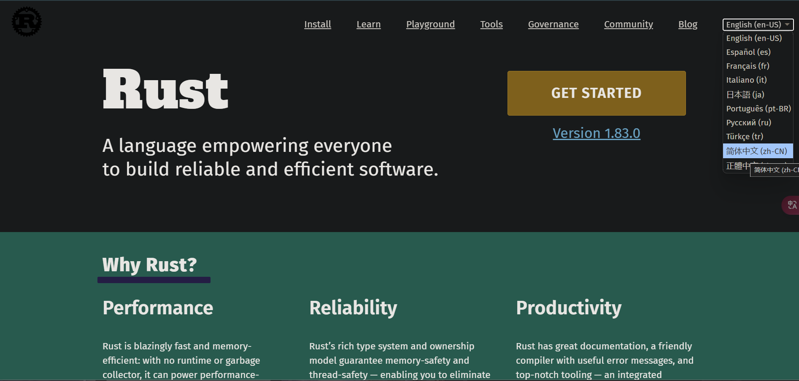

# 1.1 安装Rust

## 1.1.1. 官网安装

去[Rust官网](https://www.rust-lang.org/)，右上角可以设置语言

点击“Get Started”，你会看到如下的界面：

根据自己的系统版本来选择下载：32位下32-BIT，64位下64-BIT。目前大部分电脑都是64位，如果你不知道自己的电脑是64位还是32位，那么只要你的电脑不是老古董，下64位大概率没问题。

如果想要为**macOS**、**Linux**，或是**Windows的Linux子系统**安装Rust，就在终端执行如下命令：
`curl --proto '=https' --tlsv1.2 -sSf https://sh.rustup.rs | sh`

打开下载好的安装程序，会看到类似如下的菜单：
```text
Current installation options:

   default host triple: x86_64-pc-windows-msvc
     default toolchain: stable (default)
               profile: default
  modify PATH variable: yes

1) Proceed with standard installation (default - just press enter)
2) Customize installation
3) Cancel installation
>
```

这里有三个选项：
- 选项一（默认选项）：标准安装
- 选项二：自定义安装，可以自定义安装路径、安装的组件、安装的工具链版本等
- 选项三：取消安装

对于大多数人来说用选项一即可（先输入`1`再回车，或是直接回车都可以）

如果你看到类似如下的输出，那么Rust就已经成功安装了：
```text
info: downloading component 'cargo'
info: downloading component 'clippy'
info: downloading component 'rust-docs'
info: downloading component 'rust-std'
info: downloading component 'rustc'
info: downloading component 'rustfmt'
info: installing component 'cargo'
info: installing component 'clippy'
info: installing component 'rust-docs'
info: installing component 'rust-std'
info: installing component 'rustc'
info: installing component 'rustfmt'
info: default toolchain set to 'stable-x86_64-pc-windows-msvc'

  stable-x86_64-pc-windows-msvc installed - rustc 1.96.0 (ac68faa20 2026-05-25)

Rust is installed now. Great!

To get started you may need to restart your current shell.
This would reload its PATH environment variable to include
Cargo's bin directory (%USERPROFILE%\.cargo\bin).

Press the Enter key to continue.
```
安装程序会提示你需要重启Shell，按下回车键，程序就会退出，Rust也就安装完毕了。

## 1.1.2. Rust各项命令行操作

Rust的各项命令在Windows环境下可以在`Terminal`中执行（Win11自带；如果没有，去微软商城搜`Windows Terminal`下载即可）

- 更新Rust: `rustup update`
  Rust作为新兴的语言，目前的更新非常频繁，建议不时地执行此操作来获得最新版本。

- 卸载Rust: `rustup self uninstall`

- 安装验证: `rustc --version`或是`rustc -V`
  结果格式: `rustc x.y.z (xxxxxxxxx yyyy-mm-dd)`
  - `x.y.z`表示版本号
  - `xxxxxxxxx`表示当前版本的哈希值
  - `yyyy-mm-dd`表示该版本的提交日期

  示例：
  ```console
  $ rustc -V
  rustc 1.96.0 (ac68faa20 2026-05-25)
  ```

- 打开本地Rust文档手册：`rustup doc`

## 开发工具

- VS Code 安装Rust插件
- VIM
- Helix
- RustRover
- ...
