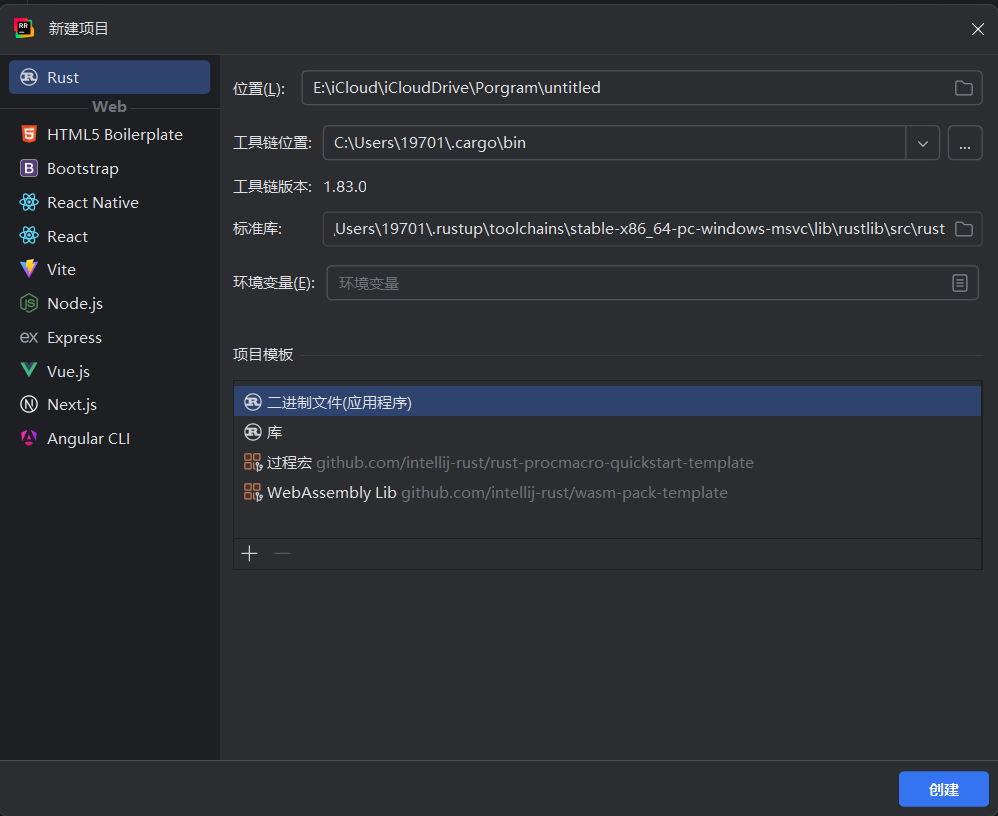
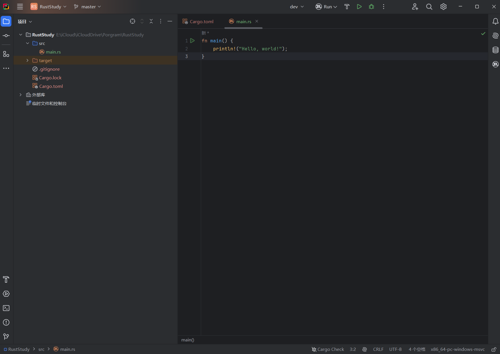
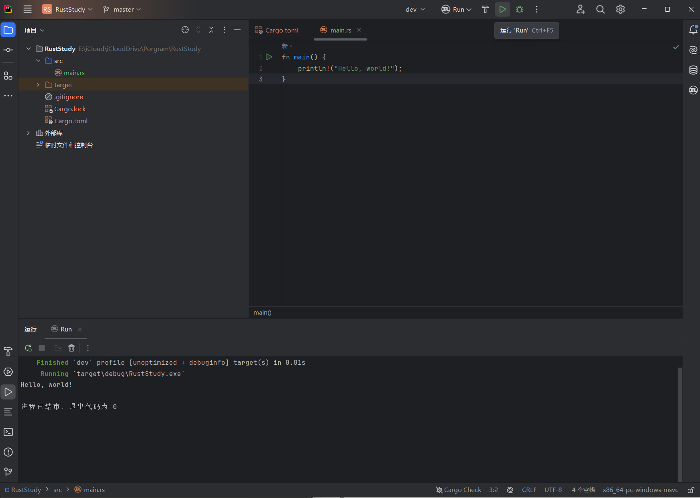
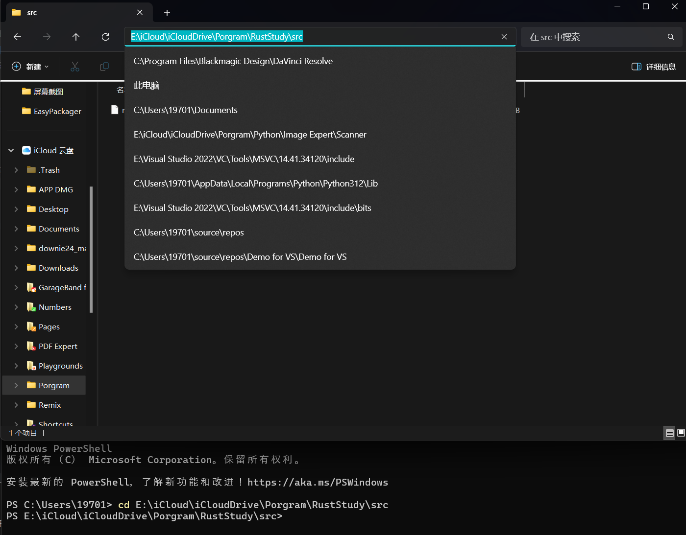
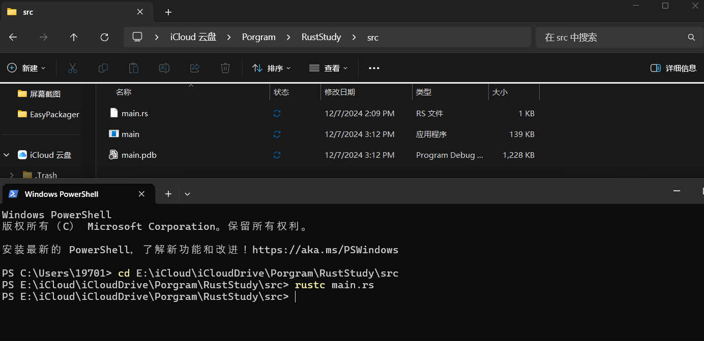
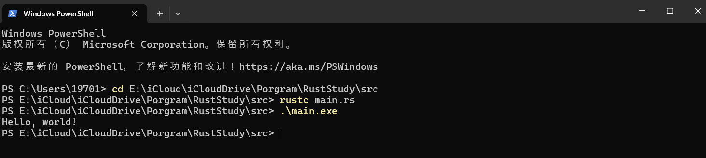

# 1.2 Rust的基本认识与“Hello World”

## 1.2.0. 题外话

本人非常推荐使用JetBrains开发的**RustRover** *(目前对非商业用途是免费的)* 作为编写Rust的IDE，在之后的文章中本人也会继续使用RustRover作为演示。本文章需要你有一定的编程经验（如果有C/C++的经验那就再好不过）

## 1.2.1. 编写Rust程序

- 文件后缀名:  `.rs`

- 命名规范: 蛇形命名法（小写字母，用下划线分割单词）
  例子:`hello_world.rs`

## 1.2.2. 打印Hello World

### Step 1：新建Rust项目

打开RustRover,点击新建项目，会出现如下的界面:

根据自己的需求来更改项目的储存路径或是选择工具链所在位置，点击创建即可。如果IDE没有识别到工具链，请你检查是否下载并安装了Rust，安装教程见 [1.1. 安装Rust](../1.1/1.1._安装Rust.md)。


### Step 2：写代码

因为RustRover会对新项目自动配置Cargo（详见 [1.3. Rust Cargo](../1.3/1.3._Rust_Cargo.md)），所以项目中会直接生成main.rs并且在其中写下了打印Hello World的代码：


理解代码：
```rust
fn main(){
    println!("Hello World");
}
```
- `fn`:表示建立一个函数（等同于js的`function`,go的`func`,python的`def`）

- `main(){}`:`main`是这个函数的函数名，`()`内放参数，没有就什么都不填,`{}`内是函数体。`main`函数很特别，它是每个rust可执行程序最先执行的代码

- `println!();`: `println!()`是打印函数，括号内填需要打印的内容,这个函数名中带有一个`!`,代表这是一个**宏函数**，这个概念之后会涉及。这个宏函数的调用需要以`;`结束，因为它们相当于语句。

- `"Hello World"`：`""`代表字符串，`Hello World`是这个字符串的内容

注意:Rust的缩进是4个空格而不是1个Tab,因为TAB有个缺点是不同编辑配置下显示可能不同，有些2字符位，有些4字符位，所以空格缩进比较稳当。
### Step 3：运行

直接点击RustRover左上角的运行按钮（或是 Windows/Linux 上的 `Shift + F10`，macOS 上的 `⌃R`），就能看到Hello World被成功打印出来了


对于非RustRover用户，你也可以通过`terminal`来运行：
- 打开终端，复制`.rs`文件所在的文件夹路径，输入命令`cd 文件夹路径`来在终端中打开此文件夹。


- 输入命令`rustc main.rs`来编译，如果你的程序名不是`main.rs`也可以换成自己的程序名。你会看到程序所在目录下多出了同名但后缀不同的另外两个文件(**Linux/macOS只有一个**，没有`.pdb`文件)，`.pdb`文件是 **Windows 平台** 的调试符号文件，`.exe`即是可执行文件。


- 对于**Windows**,在终端输入`.\main.exe`即可；对于**Linux/MacOS**，在终端输入`./main`即可。如果程序名字不是`main`只需要把这里的`main`换成你的程序名字就行。


**注意：编译和运行是单独的两步**
- 运行Rust程序之前必须先编译，命令为`rustc 你的程序名.rs`
- 编译成功后会生成一个二进制文件(Windows平台上还会生成`.pdb`文件)
- Rust是ahead-of-time编译的语言，意味着可以先编译程序，然后把可执行文件交给别人运行(无需安装Rust)
- rustc只适合简单Rust程序，**复杂的rust程序需要Cargo**（详见 [1.3. Rust Cargo](../1.3/1.3._Rust_Cargo.md)）

