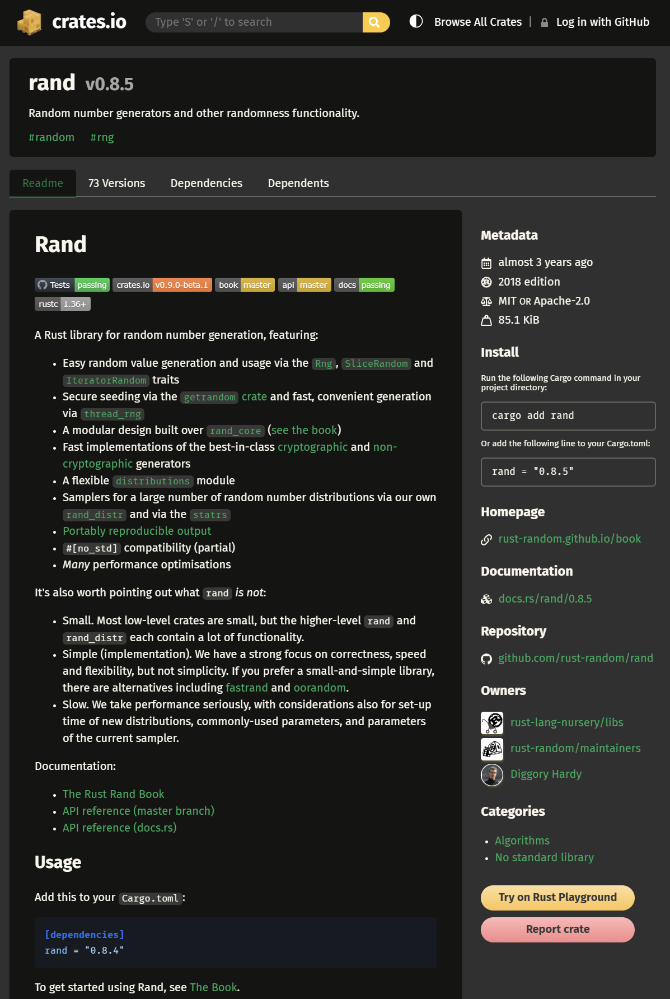

# 2.2 猜数游戏Pt.2 生成随机数

## 2.2.0 本篇知识点
在本篇中，你将学到:
- 外部 crate 的搜索与下载
- Cargo 依赖项管理
- 基于语义化版本的升级规则
- `rand` 随机数生成器
- ...

## 2.2.1 游戏目标
- **生成一个 1 到 100 间的随机数（本篇会涉及）**
- 提示玩家输入一个猜测
- 猜完之后，程序会提示猜测是太大了还是太小了
- 如果猜测正确，那么打印一个庆祝信息，程序退出

## 2.2.2 代码实现
### Step 1：寻找外部库
虽然 Rust 标准库内并没有提供与生成随机数相关的函数，但 Rust 团队开发了具有这个功能的外部库。在 [Rust 官方 crates 注册中心](https://crates.io/) 中搜索 `rand` 就可以找到它。这个页面提供了非常详细的 crate 介绍。


Rust 的 crate 一共分为两种：
- **库 crate（Library crate）**：提供功能或逻辑模块的 crate。它没有 `main` 函数，不能单独运行。通常用于与其他代码共享功能。`rand` 这个 crate 就属于库 crate。
- **二进制 crate（Binary crate）**：可执行程序，包含一个 `main` 函数，编译后会生成可运行的二进制文件。用于构建独立、可运行的 Rust 应用程序。

### Step 2：把这个外部 crate 写入 Cargo 依赖项
接下来就需要把这个外部库写入 Cargo 依赖项（有关 Cargo 的介绍在 [1.3. Rust Cargo 基础知识](../../Chapter-01/1.3/1.3._Rust_Cargo.md) 中已提及，这里不再重复），以供程序调用。

打开项目中的 `Cargo.toml` 文件，在 `dependencies` 下面添加依赖项，格式为 `依赖项名 = "依赖项版本"`（crate 页面的 `Install` 一栏下也有这种写法）。这个程序需要 `rand` 这个依赖项，并且使用 `0.8.5` 这个版本，就应该写 `rand = "0.8.5"`。如果这个依赖项还有自己的依赖项，Cargo 就会在编译时自动下载它们。

实际上，`0.8.5` 这种版本号写法是一种简写，其完整写法为 `^0.8.5`，表示任何与 `0.8.5` 版本公共 API 兼容的版本都可以（至少是 `0.8.5`，但低于 `0.9.0`）。比如某个依赖项的版本是 `1.2`，那就相当于 `^1.2.0`，意味着允许任意 `>=1.2.0` 且 `<2.0.0` 的版本——因此可以解析到 `1.3.0` 等更高的 `1.x` 版本，但不会升级到 `2.0.0` 或更高版本。

**Cargo 会把实际选中的精确版本记录在 `Cargo.lock` 中，并在之后的构建中复用这些版本，直到你更新依赖（例如使用 `cargo update`）。**

如果某个依赖项的更新会破坏基于旧版本依赖项编写的代码，那么重新构建后会发生什么呢？答案在 `Cargo.lock` 文件中。在构建时，Cargo 会检查是否已经存在 `Cargo.lock` 文件；如果有，就使用这个文件里指定的版本，从而避免兼容性问题。

如果想在当前标准下更新版本，可以在终端中使用 `cargo update`。具体步骤如下:
- 复制 Cargo 项目所在路径，打开终端，输入 `cd Cargo_project_path`
- 输入 `cargo update`

这个命令会更新 `Cargo.lock`：向注册表查询仍然满足 `Cargo.toml` 中要求的最新依赖版本；`Cargo.toml` 里写下的版本要求本身不会改变。举个例子，假如某个依赖项在 `Cargo.toml` 中声明的版本是 `1.2`，`cargo update` 就可以把锁定的版本升级到不低于 `1.2.0` 的最新 `1.x.x`，但不会升级到 `2.0.0` 或更高版本；同时 `Cargo.toml` 中写下的要求依然是 `1.2`。

### Step 3：在代码中使用这个依赖项
在程序开头需要使用关键字 `use` 来导入依赖项:
```rust
use rand::Rng;
```
`rand::Rng` 是一个 `trait`。`trait` 类似于其他语言中的接口（如 Java 的接口或 C++ 的纯虚基类），用于规定一组类型必须实现的函数和方法。`rand::Rng` 定义了随机数生成器所需的一些方法。

接下来在 `main` 中使用这个 trait 来生成随机数:
```rust
let range_number = rand::thread_rng().gen_range(1..101);
```
*PS：在旧版本中，应写为 `gen_range(1, 101)`。*

- `let range_number`：声明了一个叫做 `range_number` 的不可变变量
- `=`：赋值
- `rand::thread_rng()`：返回一个 `ThreadRng` 值，它是一个随机数生成器。这个随机数生成器位于本地线程空间，并通过操作系统获得种子。
- `.gen_range(1..101)`：`rand::thread_rng()` 上的一个方法，它接收一个范围，并在该范围内生成随机数。这里会生成从 1 开始、到但不包括 101 的数字。

最后再打印出这个随机数（`println!` 的使用在 [2.1 猜数游戏Pt.1 一次猜测](../2.1/2.1._猜数游戏Pt.1_一次猜测.md) 已作介绍，这里不再重复）:
```rust
println!("The secret number is: {}", range_number);
```

## 2.2.3 代码效果
这是完整的代码:
```rust
use std::io;
use rand::Rng;

fn main() {
    let range_number = rand::thread_rng().gen_range(1..101);

    println!("Number Guessing Game");

    println!("Guess a number");

    let mut guess = String::new();

    io::stdin().read_line(&mut guess).expect("Could not read the line");

    println!("The number you guessed is:{}", guess);

    println!("The secret number is: {}", range_number);
}
```

运行效果如下（每次运行的神秘数字都会不同）:
```
Number Guessing Game
Guess a number
10
The number you guessed is:10

The secret number is: 65
```
