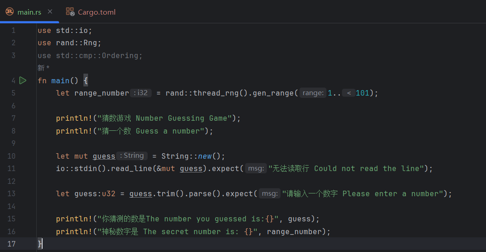
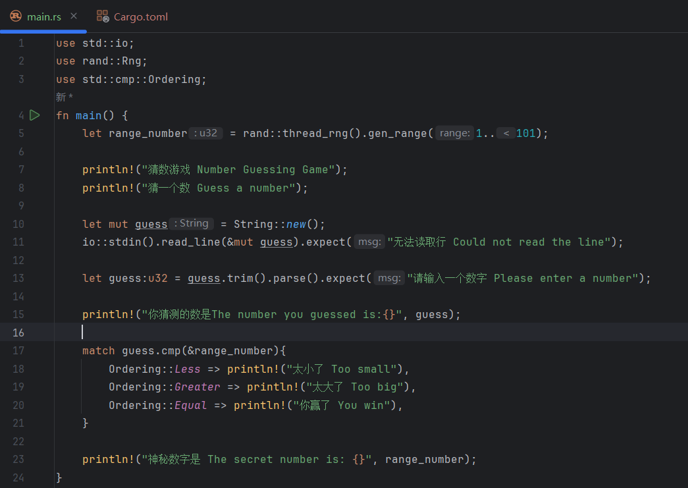

# 2.3 猜数游戏Pt.3 输入数与随机数的对比

## 2.3.0 本篇知识点
在本篇中，你将学到:
- `match` 的用法
- 遮蔽（shadowing）
- 类型转换
- `Ordering` 类型

## 2.3.1 游戏目标
- 生成一个 1 到 100 间的随机数
- 提示玩家输入一个猜测
- **猜完之后，程序会提示猜测是太大了还是太小了（本篇会涉及）**
- 如果猜测正确，那么打印一个庆祝信息，程序退出

## 2.3.2 代码实现
这是截止到 [2.2 猜数游戏Pt.2 生成随机数](../2.2/2.2._猜数游戏Pt.2_生成随机数.md) 所写出来的代码:
```rust
use std::io;
use rand::Rng;

fn main() {
    let range_number = rand::thread_rng().gen_range(1..101);

    println!("Number Guessing Game");

    println!("Guess a number");

    let mut guess = String::new();

    io::stdin().read_line(&mut guess).expect("Could not read the line");

    println!("The number you guessed is:{}", guess);

    println!("The secret number is: {}", range_number);
}
```

### Step 1：数据类型的转换
由代码可知，`guess` 是字符串，而 `range_number` 是 `u32`。`gen_range` 的返回类型会跟随范围中的数值类型。在这里，因为 `1` 和 `101` 被推断为 `u32`，所以返回值也是 `u32`。这两个变量类型不同，不能直接比较。我们需要把字符串转换成整数。
```rust
let guess: u32 = guess.trim().parse().expect("Please enter a number");
```

- `let guess: u32`：声明一个名为 `guess`、类型为 `u32`（无符号 32 位整数，也就是不能表示负数）的变量。
  但这里有一个问题：在之前的代码中（`let mut guess = String::new();`）已经声明了一个叫做 `guess` 的变量，不会报错吗？答案是不会，因为 Rust 允许用同名的新变量遮蔽旧变量。这叫做**遮蔽（shadowing）**（*当一个变量、函数或类型的名称在当前作用域中被重新定义时，会隐藏外部作用域中同名的变量、函数或类型*）。它允许代码复用同一个变量名，而无需声明新的变量。这个特性会在 [3.1 变量与可变性](../../Chapter-03/3.1/3.1._变量与可变性.md) 仔细介绍。

  这里可以举一个例子:
```rust
fn main() {
    let a = 1;
    println!("{}", a);
    let a = "one";
    println!("{}", a);
}
```
这么做程序不会报错，并且会打印出:
```
1
one
```
当程序执行到第二行时，`a` 被赋值为 `1`，所以打印出的是 `1`；在第四行，程序注意到 `a` 被复用了，就会抛弃原来的值 `1`，把 `a` 赋值为 `"one"`，所以下一行打印的就是 `one`。这就是**遮蔽**。

- `=`：赋值
- `guess.trim()`：这里的 `guess` 指的是旧的 `guess`，类型为字符串，内容是用户输入。因为 `read_line()` 也会把用户的回车记录进去，所以需要使用 `.trim()`。`.trim()` 的作用是去掉字符串前后的空格和换行，类似于 Python 中的 `.strip()`。
- `.parse()`：它可以把字符串解析为**某种数值类型**。用户的正常输入会是 1 到 100 间的数，这个数可以放进 `i32`、`u32` 或 `i64` 等类型。那么解析后到底是哪种类型呢？你得告诉 Rust 你要哪种类型，所以在声明变量时才要显式指定为 `u32`（类似于 Python 中的静态类型标注，在变量名后面加上 `:desired_type`）。
  当然，转换有可能会失败。比如说输入 `xyz`，就没法解析成整数。Rust 足够聪明，让 `.parse()` 返回一个 `Result` 类型（在 [2.1 猜数游戏Pt.1 一次猜测](../2.1/2.1._猜数游戏Pt.1_一次猜测.md) 中讲到过）。这种枚举有两个变体：`Ok` 和 `Err`。如果转换成功，枚举就会返回 `Ok` 和转换后的结果；如果失败，就会返回 `Err` 和失败原因。
- `.expect()`：它是 `Result` 类型上的一个方法，与 `.parse()` 的返回值类型相同。如果解析失败，`.parse()` 就会返回 `Err`，`.expect()` 会立即触发 `panic!`，终止当前程序，并打印 `expect` 中的错误信息。反之，`.parse()` 就会返回 `Ok`，`.expect()` 会把附加的值返回出来，也就是把转换好的数字赋给 `guess`。

### Step 2：数字的比较
在成功转换数据类型后，我们就可以比较这两个数字了。
先在代码开头导入类型:
```rust
use std::cmp::Ordering;
```
这段代码表示从 `std` 标准库里引入一个叫做 `Ordering` 的类型。`Ordering` 是一个枚举，它有三个**变体**（可以把它理解为三个可能的值）：`Ordering::Less`、`Ordering::Greater` 和 `Ordering::Equal`，分别表示小于、大于和等于。

再在 `main` 里写下对比代码:
```rust
match guess.cmp(&range_number) {
    Ordering::Less => println!("Too small"),
    Ordering::Greater => println!("Too big"),
    Ordering::Equal => println!("You win"),
}
```
- `guess.cmp(&range_number)`：`guess` 上有一个方法叫 `.cmp()`（`cmp` 是 compare 的缩写）。它会比较点号前面的值和括号里的值。这里点号前面的值是 `guess`，括号里的值是对 `range_number` 的引用（`&` 是取地址符，代表引用）。`.cmp()` 的返回值类型是 `Ordering`，也就是上文导入的类型。

  这里还涉及到了 Rust 的类型推断。这里有两张 IDE 截图，一张是还没写这段 `match` 表达式时，一张是写了之后。注意看 `let range_number = rand::thread_rng().gen_range(1..101);` 这一行（第 5 行）：
  
  
  可以看到，没有写 `match` 表达式时，IDE 提示 `range_number` 的类型是 `i32`；写了 `match` 之后，IDE 提示 `range_number` 的类型是 `u32`。这是为什么呢？因为 `guess.cmp(&range_number)` 进行了比较，虽然 `range_number` 没有被显式标注类型，但 `guess` 已经被显式定义为 `u32`。得益于 Rust 强大的基于上下文的类型推断，`guess.cmp(&range_number)` 的需求会让 `range_number` 被推断为 `u32`。而没有 `match` 时，因为 Rust 默认的整数类型是 `i32`，且没有任何其他约束要求 `range_number` 是别的类型，所以编译器会推断为 `i32`。

- `match`：Rust 的模式匹配表达式。它让我们可以根据 `.cmp()` 返回的 `Ordering` 枚举值来决定下一步操作。一个 `match` 表达式由多个分支（也叫臂，英文是 arm）组成。每个分支都包含一个**匹配模式**（用来匹配输入值的条件）和一个**要执行的代码块**（模式匹配成功时运行的代码）。如果 `match` 后面的值（在这个程序中就是 `guess.cmp(&range_number)`）匹配上了某个分支，程序就会执行这个分支下的代码。

  在这个程序中，`Ordering::Less`、`Ordering::Greater` 和 `Ordering::Equal` 就是**匹配模式**，`println!("Too small")`、`println!("Too big")` 和 `println!("You win")` 就是对应的**代码块**。举个例子，如果 `guess` 等于 `range_number`，`.cmp()` 就会返回 `Ordering::Equal`，`match` 找到与之匹配的第三个分支，然后执行这个分支的代码块，也就是 `println!("You win")`。

  `match` 会从上到下检查分支。在这个程序里，就是先检查 `Ordering::Less`，再检查 `Ordering::Greater`，最后检查 `Ordering::Equal`。

  我们会在 [6.3 控制流运算符-match](../../Chapter-06/6.3/6.3._控制流运算符-match.md) 中更详细地讲解 `match`。

## 2.3.3 代码效果
以下是截至目前的完整代码:
```rust
use std::io;
use rand::Rng;
use std::cmp::Ordering;

fn main() {
    let range_number = rand::thread_rng().gen_range(1..101);

    println!("Number Guessing Game");
    println!("Guess a number");

    let mut guess = String::new();
    io::stdin().read_line(&mut guess).expect("Could not read the line");

    let guess: u32 = guess.trim().parse().expect("Please enter a number");

    println!("The number you guessed is:{}", guess);

    match guess.cmp(&range_number) {
        Ordering::Less => println!("Too small"),
        Ordering::Greater => println!("Too big"),
        Ordering::Equal => println!("You win"),
    }

    println!("The secret number is: {}", range_number);
}
```

效果如下:

