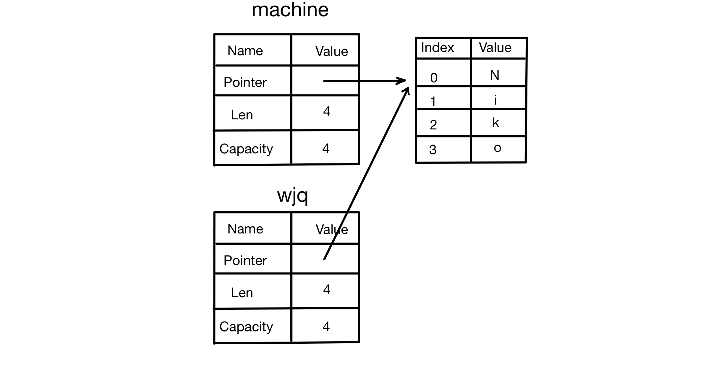
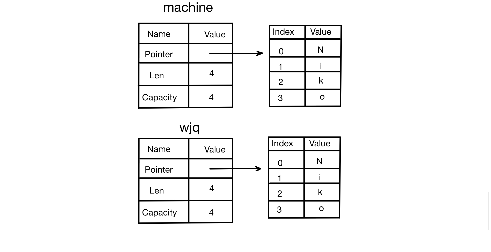

# 4.2 所有权规则、内存与分配

## 4.2.0 写在正文之前
在学习了 Rust 的通用编程概念后，就来到了整个 Rust 的重中之重——**所有权**。它跟其他语言都不太一样，很多初学者觉得学起来很难。这个章节就旨在让初学者能够完全掌握这个特性。

本章有三小节：
- 所有权：栈内存 vs. 堆内存
- **所有权规则、内存与分配（本文）**
- 所有权与函数


## 4.2.1 所有权规则
所有权有三条规则：
- 每个值都有一个变量，这个变量是该值的所有者
- 每个值同时只能有一个所有者
- 当所有者离开作用域后，这个值将被删除

## 4.2.2 变量作用域
作用域是程序中一个项目的有效范围。
```rust
fn main(){
	// machine 不可用
	let machine = 6657; // machine 可用
	// 可以对 machine 进行操作
} // machine 的作用域到此结束，machine 不再可用
```
在示例代码第三行声明了变量 `machine`，而在第二行还没有声明变量，所以在第二行它是不可用的。在第三行由于进行了声明，所以它可用了。而在第四行就可以对 `machine` 进行相关操作了。在第五行，`machine` 的作用域就结束了，从第五行及以后，`machine` 就不再可用了。

这个例子涉及两个重点：
- `machine` 在进入作用域后就变得有效了
- `machine` 会保持有效，直到离开作用域为止
这两点和其他语言都类似，所以就不多说了。

## 4.2.3 String 类型
为了演示所有权的一些相关规则，需要一个稍微复杂一点的数据类型，`String` 就满足需求。

`String` 类型比那些标量类型更复杂：之前提到的基础数据类型，它们的数据都存放在栈内存上，离开作用域时数据就会弹出栈；而 **`String` 类型是存储在堆内存上的**。

这章讲 `String` 主要是讲与所有权相关的部分。如果想要深入了解 `String` 本身，就得等到后面的章节。

字符串字面值（`&'static str`）是代码里直接写出的那些字符串值。但是它不能满足所有的需求。一是因为它们是**不可变**的；二是因为不是所有的字符串值都能在编写程序时确定（比如用户输入）。

对于这些情况，Rust 提供了第二种字符串类型 `String`。`String` 能在堆上分配，它能够存储在编译时未知大小的文本。

## 4.2.4 创建 `String` 类型的值
使用 `from` 函数从字符串字面值创建出 `String`，例如：
```rust
let machine = String::from("6657");
```
- `::` 表示 `from` 是 `String` 下的函数。可以把它理解为其他语言中的静态方法。

这样声明的 `String` 是可以修改的，例如：
```rust
fn main(){
	let mut machine = String::from("6657");
	machine.push_str(" up up!");
	println!("{}", machine);
}
```
- 在 `let` 后加上 `mut`，表示变量 `machine` 可以修改
- `.push_str()` 是这个变量上的一个方法，用来向值的末尾追加一个字符串字面值；示例中就是 `" up up!"`

其输出为：
```
6657 up up!
```

为什么 `String` 是可以修改的，而 `&'static str`（字符串字面值）不能：
- `String` 是一个**堆分配**的可变字符串类型，可以动态增长或缩小其内容。
- 字符串字面值是 `&'static str` 类型，存储在程序的**静态内存**中（只读区域）。

## 4.2.5 内存和分配
对于字符串字面值，因为它写在源代码中，所以在编译时就知道它的内容。其文本内容被直接硬编码到最终的可执行文件中。它速度快、高效，得益于它的不可变性。

为了支持可变性，`String` 需要在堆内存上分配内存，来保存编译时未知大小的文本。这要求操作系统在运行时请求内存（这一步通过 `String::from` 完成）。

用完 `String` 之后，需要某种方式把内存返回给操作系统：
- 在有 GC（垃圾回收器）的语言中，比如 C#，GC 会跟踪并清理不再使用的内存

- 在没有 GC 的语言中，比如 C/C++，就需要程序员去识别内存何时不再使用，并编写代码将它返回
  - 如果忘了，就会浪费内存
  - 如果提前做了，变量就会变为非法
  - 如果做了两次，就会出现非常严重的 Bug——**二次释放（double free）**。这可能导致某些仍在使用的数据发生损坏，并带来潜在的安全隐患。一次分配必须对应一次释放。

- Rust 采用了不同的机制：对于某个值来说，当拥有它的变量离开作用域时，Rust 会调用一个特殊的函数——**drop 函数**，内存会立即交还给操作系统，也就是立即释放。

## 4.2.6 变量与数据的交互方式
### 1. 移动（Move）
多个变量可以用一种独特的方式与同一份数据交互。
```rust
let x = 5;
let y = x;
```
在这个例子中，5 被绑定到变量 `x` 上；下一行相当于创建了 `x` 的副本，并把这个副本绑定到 `y` 上。由于整数是已知且固定大小的简单值，这两个 5 被压到了栈内存中。

但如果情况更加复杂，比如说是 `String` 类型，情况又会有所不同。
```rust
let machine = String::from("Niko");
let wjq = machine;
```
在这个例子中，第一行通过 `String` 下的 `from` 函数，从字符串字面值得到一个名为 `machine` 的 `String` 值。然后第二行把 `machine` 绑定到 `wjq` 上。

虽然代码看起来很相似，但 ***两者的运行方式完全不同***。

首先我们得了解，一个 `String` 由三个部分组成，如下图所示：


- 一个指向存放字符串内容的内存的指针
- 一个长度
- 一个容量

这部分数据被压到了栈内存中，而存放字符串内容的部分在堆内存上。长度（`len`）是存放字符串内容所需的字节数，容量（`capacity`）是 `String` 从操作系统总共获得的内存总字节数。

当把 `machine` 的值赋给 `wjq` 时，是把栈内存上的数据复制给了 `wjq`，而并没有复制指针所指向的堆内存上的数据。


当变量离开作用域时，Rust 会自动调用 `drop` 函数，并释放该变量使用的堆内存。这是上文说过的。但当 `machine` 和 `wjq` 同时离开作用域时，它们都会尝试释放相同的内存，从而引发非常严重的 bug——**二次释放（double free）**。其危害上文已经解释过，这里不再赘述。

为了保证内存安全，Rust 会直接让第一个变量 `machine` 失效，并把值移动到 `wjq` 上。当 `machine` 离开作用域时，Rust 不需要释放任何与 `machine` 相关的内存（当然 `wjq` 还是要释放的，因为它是有效的），因为 `machine` 已经失效。

如果在 `machine` 失效后还尝试使用它，就会报错（代码和结果如下）：
代码：
```rust
fn main(){
	let machine = String::from("Niko");
	let wjq = machine;
	println!("{}", machine);
}
```
结果：
```
error[E0382]: borrow of moved value: 'machine'
```

学过其他语言的人可能接触过浅拷贝和深拷贝。有些人会把复制指针、长度和容量视为浅拷贝，但由于 Rust 让 `machine` 失效了，所以这里使用一个新术语：移动（move）。

这里隐藏了一个设计原则：**Rust 不会自动创建数据的深拷贝**。也就是说，就运行时性能而言，任何自动赋值操作都是廉价的。

### 2. 克隆（Clone）
如果真想对堆内存上的 `String` 数据进行深拷贝，而不仅仅是栈内存上的数据，可以使用 `clone` 方法。
```rust
let machine = String::from("Niko");
let wjq = machine.clone();
```
通过这种方法，栈内存和堆内存上的数据都会被完整复制一份。


不过克隆比较消耗资源，所以要谨慎使用。

### 3. 栈上的数据：复制
对于栈上的数据，不需要克隆，复制就可以。
```rust
let x = 5;
let y = x;
println!("{},{}", x, y)
```
在这个例子中，`x` 和 `y` **都是有效的**，因为 `x` 是整数类型。整数类型是 Rust 中的基本类型（如 `i32`、`u32` 等）。它们的大小在编译时就已经确定，并且它们的值完全存储在栈内存中。由于这些类型实现了 **Copy trait**（可以把 trait 简单理解为接口），赋值操作实际上是对值的直接拷贝，而不是所有权的转移。

对于实现了 Copy trait 的类型，创建一个新变量（如 `y`）时会发生位拷贝操作，这种拷贝非常高效。同时，原变量（如 `x`）仍然保持有效。因此，在这种情况下，调用 `clone` 与直接赋值没有任何区别，因为两者的拷贝行为本质相同。

如果一个类型实现了 Copy trait，那么旧变量在赋值之后仍然可用。如果一个类型或者该类型的一部分实现了 **Drop trait**，那么 Rust 就**不会允许它实现 Copy trait**。

**一些拥有 Copy trait 的类型**：
- 任何仅由简单标量值组成的复合类型都可以实现 Copy trait
- 任何需要分配内存或某种其他资源的都不能实现 Copy trait

对于元组，如果其中所有元素都能实现 Copy trait，那么这个元组也可以；如果其中哪怕有一个不能实现 Copy trait，那整个元组就不能。
- `(i32, u32)` 可以实现 Copy trait
- `(i32, String)` 不能实现 Copy trait，因为 `String` 不能实现 Copy trait
