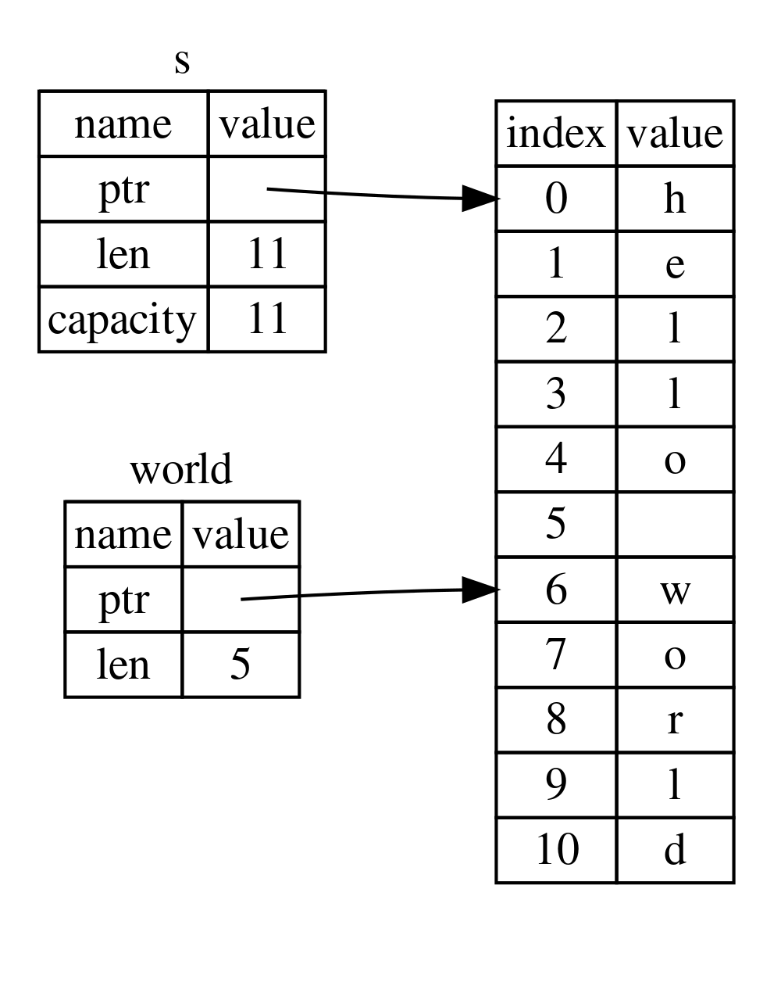

# 4.5 切片（Slice）

## 4.5.0 写在正文之前
这是第四章的最后一篇文章，在这里也顺便对这章做一个总结：

所有权、借用和切片这些概念，确保了 Rust 程序在编译时的内存安全。Rust 允许程序员以与其他系统编程语言相同的方式控制内存使用；但当数据所有者离开作用域时，让所有者自动清理数据，意味着你无需再编写和调试额外的代码来获得这种控制权。

看完这篇文章，相信你会由衷感叹 Rust 的所有权机制到底有多么神奇和先进。

## 4.5.1 切片的特性
- **1. 类型和结构**
  - 切片类型表示为 `&[T]` 或 `&mut [T]`，其中 `T` 是切片中元素的类型。
  - **不可变切片**：`&[T]`，只允许读取操作。
  - **可变切片**：`&mut [T]`，允许修改。

- **2. 不拥有数据**
  - 切片本质上是对底层数据的引用，因此它不拥有数据。
  - 切片的生命周期与底层数据一致。当底层数据被销毁时，切片也会失效。
## 4.5.2 字符串切片
以一道题为例：
*编写一个函数，它接受一个字符串作为参数，并返回它在这个字符串中找到的第一个单词。如果函数没有找到任何空格，那么就返回整个字符串。*
```rust
fn main() {
	let s = String::from("Hello world");
	let word_index = first_word(&s);
	println!("{}", word_index);
}
fn first_word(s:&String) -> usize {
	let bytes = s.as_bytes();
	for (i, &item) in bytes.iter().enumerate() {
		if item == b' ' {
			return i;
		}
	}
	s.len()
}
```
- 因为需要逐个元素地遍历 `String` 并检查每个值是否为空格，所以使用 `as_bytes` 方法将 `String` 转换为字节数组。
- 迭代器以后会讲到。现在只需要知道，`iter` 是一个用来逐一获取集合中每个元素的方法。`enumerate` 是一个工具，它在 `iter` 的基础上为每个元素附加一个索引，并将结果作为元组返回。返回元组的**第一个元素是索引，第二个元素是对该元素的引用**。

程序成功编译，输出是 5。那就是 `Hello` 后面空格的索引。

我们现在有办法找出字符串中第一个单词末尾的索引，但有一个问题。我们自己返回一个 `usize`，但它只是在 `&String` 上下文中才有意义的一个数字。换句话说，因为它是与 `String` 不同的值，所以**不能保证它在将来仍然有效**。

比如因为某些原因，代码在调用 `first_word` 之后写了 `s.clear();` 来清空 `s`。此时 `word_index` 这个变量就没有意义了。换句话说，Rust 编译器发现不了“代码使用了 `s.clear()` 但 `word_index` 仍然存在”这种错误。如果你之后还用 `word_index` 去打印字符，显然就会出错。

这类 API 设计要求你随时关注 `word_index` 的有效性，并确保这个索引与 `String` 变量 `s` 之间保持同步。偏偏这类工作往往相当繁琐，而且特别容易出错，所以针对这类问题，Rust 提供了**字符串切片**。

**字符串切片是指向字符串中一部分内容的引用。**

在原字符串名前加上 `&` 表示对它的引用，在后面加上 `[start_index..end_index]`，表示引用这个字符串的一部分。注意，`[]` 内的区间是**左闭右开**，所以**结束索引是切片终止位置的下一个索引**。通俗地说：包左不包右。
```rust
fn main() {
	let s = String::from("hello world");
	let hello = &s[0..5];
	let world = &s[6..11];
}
```
在这个例子中，把 `s` 从 0 到 5 的索引区间（包括 0 不包括 5），也就是 `"hello"`，赋给了 `hello` 变量；把从 6 到 11 的索引区间（包括 6 不包括 11），也就是 `"world"`，赋给了 `world` 变量。

由图可见，`world` 这个变量并不会独立于 `s` 而存在，这使得编译器能够在编译过程中发现许多潜在问题。

当然，对于索引写法，还有几种省略形式：

```rust
let hello = &s[0..5];
```
这个变量是从索引 0 开始截取的，Rust 允许这样的等价写法：
```rust
let hello = &s[..5];
```

```rust
let world = &s[6..11];
```
这个变量截取到了 `s` 的最后一个元素，Rust 允许这样的等价写法：
```rust
let world = &s[6..];
```

如果想截取整个字符串，可以写成：
```rust
let whole = &s[..];
```

### 注意事项
- 字符串切片的范围索引必须落在有效的 `UTF-8` 边界上。
- 如果尝试从一个多字节字符的中间创建字符串切片，程序会 panic 并退出。


### 重写代码
学了切片之后，就可以修改文章开头的代码来进一步优化了：
```rust
fn main() {
	let mut s = String::from("Hello world");
	let word = first_word(&s);
	println!("{}", word);
}
fn first_word(s:&String) -> &str {
	let bytes = s.as_bytes();
	for (i, &item) in bytes.iter().enumerate() {
		if item == b' ' {
			return &s[..i];
		}
	}
	&s[..]
}
```
- `&str` 表示字符串切片。

如果在 `let word = first_word(&s);` 与使用 `word` 的 `println!` 之间插入 `s.clear();`，Rust 就能够发现错误并报错：
```
error[E0502]: cannot borrow `s` as mutable because it is also borrowed as immutable
```
这是因为 `s.clear()` 带来的可变借用，与 `word` 持有的不可变借用发生了重叠，违反了借用规则。
*PS：`s.clear()` 等价于 `clear(&mut s)`*

## 4.5.3 字符串字面值就是切片
字符串字面值被直接存储在二进制程序之中，在程序运行时会加载到静态内存里。
```rust
let s = "Hello, World!";
```
变量 `s` 的类型是 `&str`，它是一个指向二进制程序中特定位置的切片。`&str` 是不可变的，所以字符串字面值也是不可变的。

## 4.5.4 将字符串切片作为参数传递
```rust
fn first_word(s:&String) -> &str {
```
这是刚刚优化过的代码中声明函数的那一行，这种写法本身完全没有问题。但有经验的 Rust 开发者会使用 `&str` 作为 `s` 的参数类型，因为这样函数就可以同时接受 `String` 和 `&str` 类型的参数了：
- 如果你传入的值已经是字符串切片，可以直接调用。
- 如果值是 `String`，可以传入 `&String` 类型的实参。当函数参数需要 `&str` 而你传递的是 `&String` 时，Rust 会隐式调用 `Deref`，将 `&String` 转换为 `&str`。

使用字符串切片而不是字符串引用作为函数参数，会使 API 更加通用，且不会损失任何功能。

基于此，还可以进一步优化之前的代码：
```rust
fn main() {
	let s = String::from("Hello world");
	let word = first_word(&s);
	println!("{}", word);
}
fn first_word(s:&str) -> &str {
	let bytes = s.as_bytes();
	for (i, &item) in bytes.iter().enumerate() {
		if item == b' ' {
			return &s[..i];
		}
	}
	&s[..]
}
```

这一行：
```rust
let word = first_word(&s);
```
也可以写成：
```rust
let word = first_word(&s[..]);
```
对于前者，Rust 会隐式调用 `Deref`，将 `&String` 转换为 `&str`；后者是手动转换为 `&str`。

## 4.5.5 其他类型的切片
```rust
fn main() {
    let number = [1, 2, 3, 4, 5];
    let num = &number[1..3];
    println!("{:?}", num);
}
```
数组也可以使用切片。`num` 这个切片的本质，就是存储了指向 `number` 中切片起始点（本例中是索引 1）的指针以及长度信息。

其输出是：
```
[2, 3]
```
