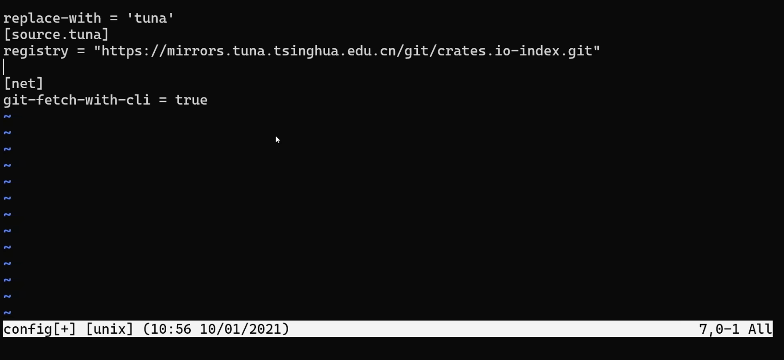

# 7.5 use关键字 Pt.2 ：重导出与换国内镜像源教程

## 7.5.1. 使用pub use重新导出名称

使用`use`将路径导入作用域内后，该名称在词法作用域内是**私有的**。

以 [7.4. use关键字 Pt.1：use的使用与as关键字](../7.4/7.4._use关键字_Pt.1：use的使用与as关键字.md) 的代码为例：
```rust
mod front_of_house {
    pub mod hosting {
        pub fn add_to_waitlist() { }
        fn seat_at_table() { }
    }
}

use crate::front_of_house::hosting::add_to_waitlist;

pub fn eat_at_restaurant() {
    add_to_waitlist();
}
```
对于外部代码来说,`eat_at_restaurant`是可以访问到的，因为它在声明时使用了`pub`关键字，但`eat_at_restaurant`下使用的`add_to_waitlist`外部代码是看不见的，因为`use`引入默认是私有的。如果想要外部代码也能访问到，就需要在`use`前增加`pub`关键字：
```rust
mod front_of_house {
    pub mod hosting {
        pub fn add_to_waitlist() { }
        fn seat_at_table() { }
    }
}

pub use crate::front_of_house::hosting::add_to_waitlist;

pub fn eat_at_restaurant() {
    add_to_waitlist();
}
```
这样子就可以让外部代码访问到`use`引入的条目。

当我们想要对外暴露代码的时候，我们可以使用这种技术，不按照内部代码的结构，而是做一些调整来对外进行暴露。这样代码内部的结构和外边看到的可能就会有点不一样。毕竟写代码的人和调用代码的人他们所期望的东西通常是不一样的。

最后总结一下:**`pub use`重导出既可以将该条目引入作用域，也可以使该条目被外部代码引入到它们的作用域。**

## 7.5.2. 使用外部的包(package)

首先要在`Cargo.toml`里添加依赖项的包(package)名与版本，而Cargo会从`crates.io`这个网站上下载这个包和这个包的依赖项到本地（也可以用野生的crate，去GitHub找，但非常不建议这么做）。然后就是在代码里使用`use`将特定条目引入到作用域。

还记得 [2.2. 猜数游戏 Pt.2 生成随机数](../../Chapter-02/2.2/2.2._猜数游戏Pt.2_生成随机数.md) 吗？那时候我们需要`rand`包来生成随机数，现在我们还是以引入`rand`包来举例：

## Step 1：修改`Cargo.toml`

打开项目的`Cargo.toml`文件，在`[dependencies]`下写上包名和版本，中间用`=`连接，如下：
```toml
[package]
name = "RustStudy"
version = "0.1.0"
edition = "2021"

[dependencies]
rand = "0.8.5"
```

## Step 2：在源代码中引入包

你想用包下的什么东西就用`use`指定对应的路径来引入即可。这里我需要生成随机数的方法，所以要把`Rng`这个 trait 引入作用域，引入这行的代码如下：
```rust
use rand::Rng;
```

Rust语言的标准库`std`也被当作是外部的包，但是它已经内置在Rust语言内了，所以就不需要在`Cargo.toml`里增加依赖项了，直接在源代码中用`use`引入就行，这有点类似于Python中的`re`、`os`、`ctype`这类库。

比如说我们想要引入`std`下的`collections`模块的`HashMap`这个结构体，就应该写：
```rust
use std::collections::HashMap;
```
但不用修改`Cargo.toml`。

## 7.5.3. 使用嵌套路径清理大量的use语句

有的时候使用同一个包或模块下的多个条目，前面部分都是一样的，但是还是得写几遍，占用几行，如果引入的东西比较多，需要写很多遍，根本不现实，所以Rust允许使用**嵌套路径**在**同一行内**来简化引入的代码。类似于`bash`的花括号展开特性。

其格式如下:
```rust
use 同样的部分::{不同的部分1, 不同的部分2, ...}
```

看个例子：
```rust
use std::cmp::Ordering;
use std::io;
```
它们有公共的部分`std`，所以就可以用嵌套路径写为：
```rust
use std::{cmp::Ordering, io};
```

如果其中一个引用是另外一个引用的子路径，Rust还允许在使用嵌套路径时使用`self`关键字，如下例：
```rust
use std::io;
use std::io::Write;
```
这部分就可以简写为:
```rust
use std::io::{self, Write};
```

## 7.5.4. 通配符`*`

使用`*`可以把路径中所有的公共条目都引入到作用域。比如我想把`std`库下`collections`模块所有的公共条目都引入进去，就可以这么写：
```rust
use std::collections::*;
```
但是这种引入要非常谨慎的使用，通常不这样用。

它的应用场景是：
- 在测试的时候把所有被测试的代码引入到`test`模块
- 有时候被用于预导入(prelude)模块

## 7.5.5. 给Rust依赖项下载换源

由于`crates.io`的网站在国外，所以国内下载很慢，可以换成清华大学镜像。

注意：Cargo 读取的配置文件在用户目录下的 `.cargo` 里，而不是项目根目录。Windows 上默认路径是 `%USERPROFILE%\.cargo\config.toml`（也就是用户文件夹下的 `.cargo\config.toml`）。

打开Windows Terminal（*Win11自带，Win10需要去微软商店里下载，不花钱*），先确保 `.cargo` 目录存在，然后进入该目录：
```
mkdir %USERPROFILE%\.cargo
cd %USERPROFILE%\.cargo
```

如果还没有配置文件，可以新建一个（文件名推荐 `config.toml`；**如果文件已经存在，不要用下面这条命令覆盖，直接编辑即可**）：
```
type nul > config.toml
```

编辑它：输入如下指令，回车：
```
vim config.toml
```

把这段贴进去（清华大学当前推荐的稀疏索引写法；需要 Cargo 1.68 及以上）：
```
[source.crates-io]
replace-with = 'tuna'

[source.tuna]
registry = "sparse+https://mirrors.tuna.tsinghua.edu.cn/crates.io-index/"
```
把光标（*不是鼠标指针！*）下移，从

移到

然后输入
```
:wq
```
再按回车就会保存。

然后再重新`build`你的项目就可以。
