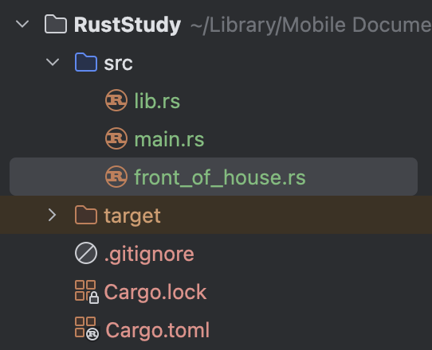
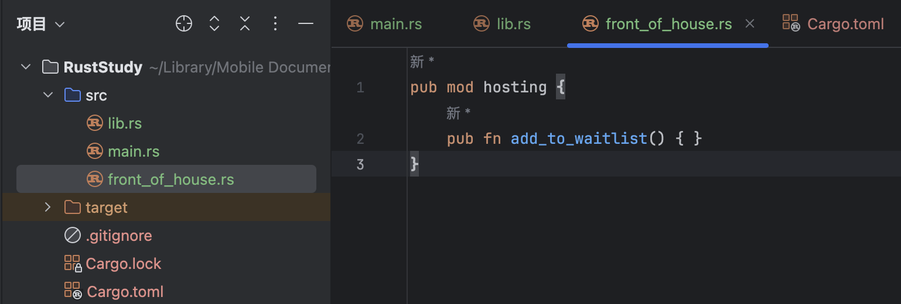
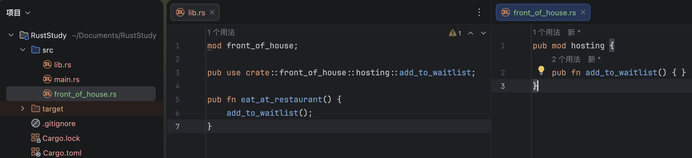
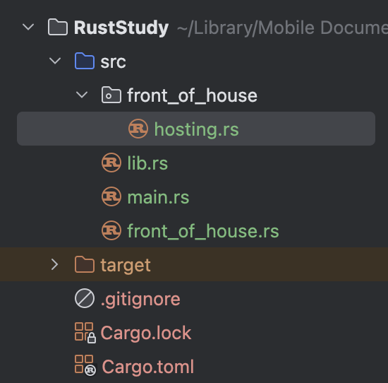
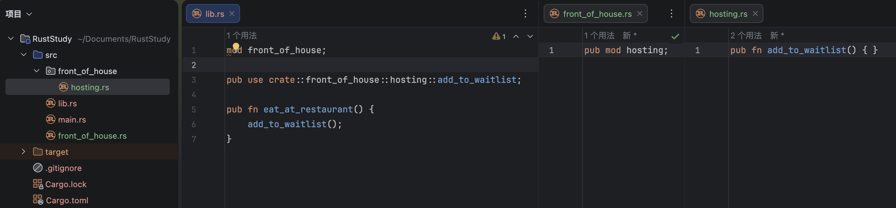
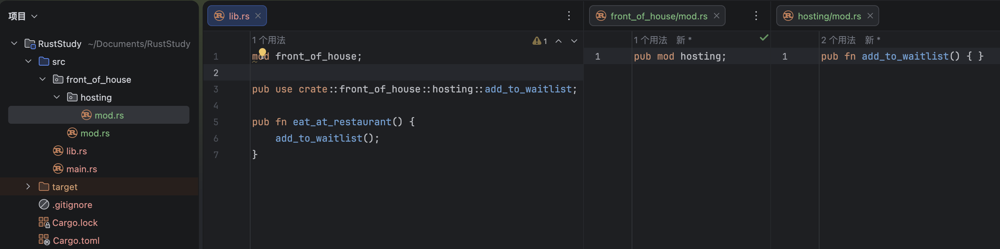

# 7.6 将模块拆分为不同文件

## 7.6.1. 将模块的内容移动到其他文件

如果在模块定义时模块名后边跟的是`;`而不是代码块，Rust就会在`src`目录下找与模块同名的`.rs`文件加载其中的内容。无论模块的内容是在同一个文件里面还是在不同的文件里面，模块树的结构都不会发生变化。

来看一个例子(`lib.rs`)：
```rust
mod front_of_house {
    pub mod hosting {
        pub fn add_to_waitlist() { }
    }
}

pub use crate::front_of_house::hosting::add_to_waitlist;

pub fn eat_at_restaurant() {
    add_to_waitlist();
}
```
这样写就是把所有模块放在同一个文件里。如果要把它放在不同的文件里，就要这么写：

## Step 1：新建文件

假如要把`front_of_house`分出去，就需要在`src`目录下创建同名的`.rs`文件：


## Step 2：剪切代码

把原本在`front_of_house`下的代码从原位置剪切到这个`front_of_house.rs`这个文件里，也就是把这一段剪切走：
```rust
pub mod hosting {
    pub fn add_to_waitlist() { }
}
```


## Step 3：修改原处

打开`front_of_house`原来定义的地方（`lib.rs`）。这个时候就不用后面的代码块了，把它连着`{}`都删去，加上`;`即可(其它的无关代码不要动)，原本代码是（`lib.rs`）：
```rust
mod front_of_house {
    pub mod hosting {
        pub fn add_to_waitlist() { }
    }
}

pub use crate::front_of_house::hosting::add_to_waitlist;

pub fn eat_at_restaurant() {
    add_to_waitlist();
}
```
改成（`lib.rs`）：
```rust
mod front_of_house;

pub use crate::front_of_house::hosting::add_to_waitlist;

pub fn eat_at_restaurant() {
    add_to_waitlist();
}
```


## 7.6.2. 子模块的拆分

如果`front_of_house`下面有很多模块怎么办？这时就需要把这些子模块放到不同的文件里，以便更好地组织代码。但该怎么做呢？像刚才那样，把所有子模块都放在`src`目录下吗？那样`src`里文件会太多，而且模块之间的层级关系也体现不出来。

Rust给出了一个不错的方案：把所有子模块文件放在以父模块命名的文件夹里。具体来说，需要先创建一个与父模块同名的文件夹，然后在该文件夹内用`.rs`文件来存放子模块或条目。

举个例子，如果我要把`hosting`独立出去成一个单独的文件，操作不仅仅是在`src`下创建一个同名`.rs`文件，而是需要先新建一个父模块的同名文件夹，在这个例子中父模块的名字是`front_of_house`，所以就要创建名字为`front_of_house`的文件夹。

然后再在这个文件夹下创建与条目名/模块名相同的`.rs`文件，在这个例子中是要把`hosting`独立出去，所以这个文件应该叫做`hosting.rs`。


在`hosting.rs`里存储`hosting`的内容，也就是：
```rust
pub fn add_to_waitlist() { }
```

现在可以像之前处理`lib.rs`那样，把`front_of_house.rs`里`hosting`模块的代码块连同`{}`删掉，并加上`;`。把它从（`front_of_house.rs`）：
```rust
pub mod hosting {
    pub fn add_to_waitlist() { }
}
```
改成简单的：
```rust
pub mod hosting;
```


Rust也支持以`module_name/mod.rs`的形式拆分模块。所有模块内容都存放在`mod.rs`中，文件夹名即表示模块名。这种方式在Rust中仍然完全受支持，但在现代Rust代码中，它通常更像是旧式模块布局的延续，而不是默认偏好。

如果用这种方式拆分模块，看起来会是这样：


## 7.6.3. 拆分的优点

随着模块变大，该技术让程序员可以把模块的内容移动到其他文件中。
