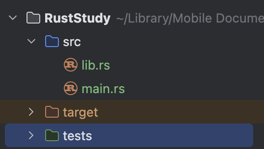
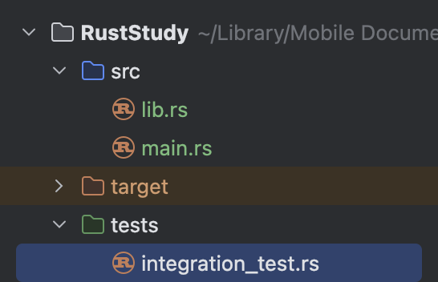
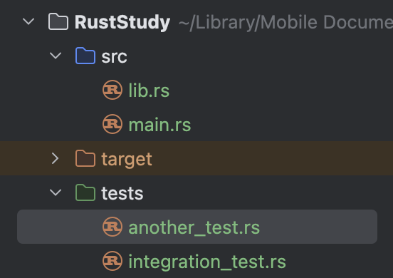
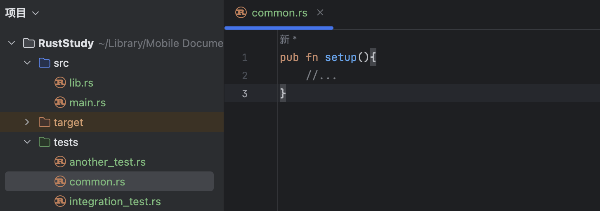

# 11.10 集成测试

## 11.10.1. 什么是集成测试
在Rust里，集成测试完全位于被测试库的外部。集成测试调用库的方式和其他代码一样，这也意味着它们只能调用公共API。

**集成测试的目的是验证库的多个部分能否正确地一起工作。** 这一点有别于单元测试；单元测试比较小也比较专注。单元测试单独测试一个模块，还可以测试私有接口。

有时单独运行没问题的代码，合在一起使用时仍可能出问题。集成测试正是为了尽早发现并解决这类问题而存在的。因此，**集成测试的覆盖率很重要**。

## 11.10.2. `tests`目录
要创建集成测试，首先创建`tests`目录。

这个目录与`src`并列，`cargo`会自动在那里寻找集成测试文件。你可以在这个目录下创建任意数量的集成测试文件。编译时，`cargo`会把每个测试文件当作一个单独的包，也就是一个单独的`crate`。

下面演示如何创建集成测试文件：

### 1. 创建`tests`目录
在`src`旁边创建一个名为`tests`的文件夹：

### 2. 创建测试文件
在`tests`下创建一个`.rs`测试文件，并给它取名。这里我用的是`integration_test.rs`：

### 3. 把测试代码移到测试文件里
以 [11.9. 单元测试](../11.9/11.9._单元测试.md) 的代码为例（`lib.rs`）：
```rust
pub fn add_two(a: usize) -> usize {
    internal_adder(a, 2)
}

fn internal_adder(left: usize, right: usize) -> usize {
    left + right
}

#[cfg(test)]
mod tests {
    use super::*;

    #[test]
    fn internal() {
        let result = internal_adder(2, 2);
        assert_eq!(result, 4);
    }
}
```

因为每个集成测试文件都是一个单独的crate，所以这个文件（`integration_test.rs`）如果想测试那个crate，就必须先把`lib.rs`的内容导入作用域。

在这个例子中，由于我把项目命名为`RustStudy`，所以包名也是`RustStudy`。如果不清楚，可以到`Cargo.toml`里看`name`字段。在这个例子中，可以写`use RustStudy;`来导入；如果想导入某个具体函数也可以。

导入之后可以直接写测试函数。不需要写`#[cfg(test)]`，因为`tests`目录下的代码只有在执行`cargo test`时才会运行。只需要给测试函数标注`#[test]`即可。

完整代码如下（`integration_test.rs`）：
```rust
use RustStudy;

#[test]
fn it_adds_two() {
    let result = RustStudy::add_two(2);
    assert_eq!(result, 4);
}
```
输出：
```
$ cargo test
   Compiling adder v0.1.0 (file:///projects/adder)
    Finished `test` profile [unoptimized +debuginfo] target(s) in 1.31s
     Running unittests src/lib.rs (target/debug/deps/adder-1082c4b063a8fbe6)

running 1 test
test tests::internal ... ok

test result: ok. 1 passed; 0 failed; 0 ignored; 0 measured; 0 filtered out; finished in 0.00s

     Running tests/integration_test.rs (target/debug/deps/integration_test-1082c4b063a8fbe6)

running 1 test
test it_adds_two ... ok

test result: ok. 1 passed; 0 failed; 0 ignored; 0 measured; 0 filtered out; finished in 0.00s

   Doc-tests adder

running 0 tests

test result: ok. 0 passed; 0 failed; 0 ignored; 0 measured; 0 filtered out; finished in 0.00s
```

可以看到，这个输出显示运行了两个测试：一个来自`lib.rs`（单元测试），一个来自`integration_test.rs`（集成测试）。

## 11.10.3. 运行指定的集成测试
要运行某个特定的集成测试函数，使用`cargo test <test_name>`。要运行某个测试文件中的所有测试函数，使用`cargo test --test <file_name>`。

看个例子：


现在`tests`下有两个文件。如果我只想运行`integration_test.rs`里的测试函数，可以运行：
```bash
cargo test --test integration_test
```

## 11.10.4. 集成测试中的子模块
因为`tests`下的每个文件都被编译成单独的crate，所以这些文件彼此不共享行为，这与`src`下的文件不同。

那么，如果想把测试函数中重复的逻辑提取到一个helper函数里以避免重复，该怎么写呢？

例如，我在`tests`下创建了`common.rs`来存放helper函数：


试着运行测试：
```
$ cargo test
   Compiling adder v0.1.0 (file:///projects/adder)
    Finished `test` profile [unoptimized +debuginfo] target(s) in 0.89s
     Running unittests src/lib.rs (target/debug/deps/adder-1082c4b063a8fbe6)

running 1 test
test tests::internal ... ok

test result: ok. 1 passed; 0 failed; 0 ignored; 0 measured; 0 filtered out; finished in 0.00s

     Running tests/common.rs (target/debug/deps/common-92948b65e88960b4)

running 0 tests

test result: ok. 0 passed; 0 failed; 0 ignored; 0 measured; 0 filtered out; finished in 0.00s

     Running tests/integration_test.rs (target/debug/deps/integration_test-92948b65e88960b4)

running 1 test
test it_adds_two ... ok

test result: ok. 1 passed; 0 failed; 0 ignored; 0 measured; 0 filtered out; finished in 0.00s

   Doc-tests adder

running 0 tests

test result: ok. 0 passed; 0 failed; 0 ignored; 0 measured; 0 filtered out; finished in 0.00s
```
可以看到，`common.rs`出现在了测试输出中。但因为`common.rs`只是用来存放helper函数的，它本身不需要被测试。这种写法是错误的。

正确做法是在`tests`下创建`common`目录，在里面放一个`mod.rs`文件，并把helper函数移过去，然后删除原来的`common.rs`：


这是Rust能理解的另一种命名约定。Rust不会把`common`模块当作集成测试文件，测试输出中也不会再出现`common`，因为`tests`下的子目录不会被编译成单独的crate。

如果要在集成测试文件中使用那里的内容，只需在文件开头写`mod <folder_name>;`。在这个例子中就是`mod common;`。使用时写`common::your_function`。在这个例子中就是`common::setup()`。

## 11.10.5. 针对二进制crate的集成测试
如果项目是二进制crate，也就是只有`src/main.rs`而没有`src/lib.rs`，就不能在`tests`下创建集成测试；即使创建了，也无法把`main.rs`里的函数导入作用域。因为只有库crate（也就是有`lib.rs`的）才能把函数暴露给其他crate使用。

二进制crate意味着独立运行。因此，Rust的二进制项目通常会把这些逻辑放在`lib.rs`里，而在`main.rs`里只保留简单调用。这样项目就会被视为库crate，就可以用集成测试来检查代码。
