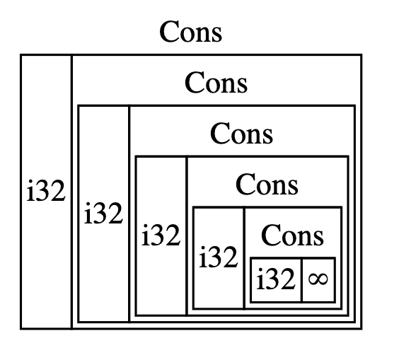

# 15.1 使用Box T 智能指针来指向堆内存上的数据

## 15.1.1 `Box<T>`

`Box<T>` 可以被简单地理解为一个箱子。它是最简单的智能指针，允许你把数据存储在堆上，而不是栈上。

具体实现是：`Box<T>` 在栈上有一小块内存，存放指向堆上数据的指针。也就是说，**实际数据存储在堆上**。除了把数据放在堆上之外，它没有其他开销，代价是也没有额外功能。

乍看之下，`Box<T>` 和普通指针好像没什么区别，但其真正不同之处在于：`Box<T>` 实现了 `Deref` 和 `Drop` 这两个 trait。

## 15.1.2 `Box<T>` 的常见场景

当某个类型的大小无法在编译时确定，但使用它的上下文又需要知道其确切大小时，`Box<T>` 是一个好选择。

当你有大量数据，想移交所有权，但又需要确保在操作过程中不会被复制时。

当你使用某个值时，只关心它是否实现了特定的 trait，而不关心其具体类型时。

## 15.1.3 使用 `Box<T>` 在堆上存储数据

看个例子：
```rust
fn main() {
    let b = Box::new(5);
    println!("b = {b}");
}
```
我们将变量 `b` 定义为一个包含 `Box` 的值，该 `Box` 指向分配在堆上的值 `5`。这个程序会打印 `b = 5`。

和其他任何拥有所有权的值一样，当 `b` 离开作用域时，它会像其他拥有所有权的值一样释放内存——作用域结束时，堆上和栈上的内存都会被释放。

## 15.1.4 使用 `Box<T>` 赋能递归类型

在编译时，Rust 需要知道一个类型所占的空间大小。但是有一种被称为*递归*的类型，它的大小无法在编译时确定。


以这个图为例，`Cons` 类型有两个字段：一个字段是 `i32`，另一个字段是 `Cons` 类型本身。

在编译时，Rust 需要知道类型的大小。`i32` 的大小是固定的，但第二个 `Cons` 字段——也就是 `Cons` 类型本身——的大小无法确定。

针对这种情况，可以使用 `Box<T>`。对于递归类型，`Box<T>` 使其大小可以被确定。

这种东西在函数式语言中是存在的，叫做 `Cons List`。

## 15.1.5 关于 `Cons List`

`Cons List` 是来自 Lisp 语言的一种数据结构。在这种结构中，每个成员由两个元素组成：一个是当前项的值，比如上图中的 `i32`；另一个是下一个元素。

这种数据结构就这样一直递归下去，直到最后一个元素。最后一个成员只包含一个 `Nil` 值，没有下一个元素，而 `Nil` 值充当终止标记。

**`Nil` 和 `None` 的概念不一样。`None` 表示无效或缺失的值，而 `Nil` 是一个终止标记。**

从上图可以看出，`Cons List` 是一种链表。

## 15.1.6 `Cons List` 在 Rust 中的替代者

**`Cons List` 并不是 Rust 中的常用集合。通常情况下，`Vec<T>` 是更好的选择。**

下面这个 `List` 定义与上图中的 `Cons List` 结构相匹配：
```rust
enum List {
    Cons(i32, List),
    Nil,
}
```
`List` 枚举有两个变体：`Cons` 和 `Nil`。`Cons` 变体附带了两份数据：一个是 `i32` 类型，一个是 `List` 类型。

这么写逻辑上没问题，但编译时会报错：
```text
$ cargo run
   Compiling cons-list v0.1.0 (file:///projects/cons-list)
error[E0072]: recursive type `List` has infinite size
 --> src/main.rs:1:1
  |
1 | enum List {
  | ^^^^^^^^^
2 |     Cons(i32, List),
  |               ---- recursive without indirection
  |
help: insert some indirection (e.g., a `Box`, `Rc`, or `&`) to break the cycle
  |
2 |     Cons(i32, Box<List>),
  |               ++++    +

error[E0391]: cycle detected when computing when `List` needs drop
 --> src/main.rs:1:1
  |
1 | enum List {
  | ^^^^^^^^^
  |
  = note: ...which immediately requires computing when `List` needs drop again
  = note: cycle used when computing whether `List` needs drop
  = note: see https://rustc-dev-guide.rust-lang.org/overview.html#queries for more information

Some errors have detailed explanations: E0072, E0391.
For more information about an error, try `rustc --explain E0072`.
error: could not compile `cons-list` (bin "cons-list") due to 2 previous errors
```
这是因为 Rust 需要知道类型的大小，但无法计算出递归类型的大小。

## 15.1.7 Rust 计算类型大小的方法

先看看 Rust 如何确定类型所占的空间大小。举个例子：
```rust
enum Message {
    Quit,
    Move { x: i32, y: i32 },
    Write(String),
    ChangeColor(i32, i32, i32),
}
```
为了确定为 `Message` 值分配多少空间，Rust 会遍历每个变体，看哪个变体需要最多空间。

Rust 认为 `Message::Quit` 不需要任何空间，`Message::Move` 需要足够存放两个 `i32` 值的空间，依此类推。因为同一时刻只有一种变体存在，所以 `Message` 值所需的空间就是其最大变体所需的空间——在常见的 64 位平台上通常是 `Write(String)`，因为 `String` 比三个 `i32` 更大。

## 15.1.8 使用 `Box` 来获得确定大小的递归类型

正如前面所说，Rust 需要知道类型的大小，但无法计算递归类型的大小。所以我们可以改用大小已知的类型，而 `Box<T>` 正好满足需求：它不存储数据本身，而是存储指向数据的指针，指针的大小是固定的 `usize`。

Rust 知道 `Box<T>` 的大小，因为 `Box<T>` 本质上是一个指针。指针不直接存储值，所以不论它指向的数据如何变化，指针本身的大小都不会变。也就是说，指针的大小不会随它所指向数据的大小变化而变化。

基于这一点，就可以修改原来的代码。具体来说，把大小不确定的部分——也就是嵌套的 `List` 类型——改成 `Box<List>`：
```rust
enum List {
    Cons(i32, Box<List>),
    Nil,
}
```
这仍旧是递归，但不再直接存储 `List`，而是间接指向堆上的 `List` 值，属于曲线救国。

## 15.1.9 `Box` 类型总结

- 只提供间接存储和堆分配。
- 没有额外功能。
- 没有性能开销。
- 适用于需要间接存储的场景，例如 `Cons List`。
- 实现了 `Deref` 和 `Drop` trait。
