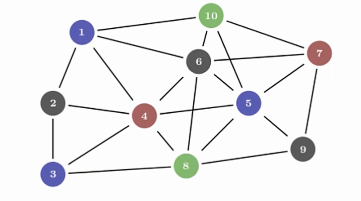

# 15.5 Rc T ：引用计数智能指针与共享所有权

## 15.5.1 什么是 `Rc<T>`

所有权在大部分情况下都是清晰的。对于一个给定的值，程序员可以准确地推断出哪个变量拥有它。

但是在某些场景中，单个值也可能同时被多个所有者持有，如下图：


在这个数据结构中，每个节点都有多条边指向它，所以从概念上讲，这些节点同时属于所有指向它们的边。只要一个节点还有边指向它，就不应该被清理掉。这就是多重所有权。

为了支持多重所有权，Rust 提供了 `Rc<T>` 类型。`Rc` 是 Reference Counting（引用计数）的缩写。这个类型会在实例内部维护一个计数器，记录有多少引用指向该值，从而判断这个值是否仍在使用。如果引用计数为 `0`，就可以安全地清理该值，并且不会出现悬垂引用问题。

## 15.5.2 `Rc<T>` 的使用场景

当你希望把堆上的一些数据分享给程序的多个部分使用，但**在编译时又无法确定到底是程序的哪个部分会最后使用这些数据**时，就可以使用 `Rc<T>`。

相反，如果我们能**在编译时确定程序的哪个部分会最后使用数据**，那么只需要**让这部分代码成为数据的所有者**即可。此时，编译时的所有权规则就足以保证正确性。

需要注意的是，`Rc<T>` 只能用于单线程场景。以后的文章会讨论如何在多线程代码中使用引用计数。

## 15.5.3 `Rc<T>` 使用示例

使用前需要注意：`Rc<T>` 不在预导入模块中，所以必须先手动导入。

`Rc` 有这么一些基本函数：
- `Rc::clone(&a)` 增加引用计数
- `Rc::strong_count(&a)` 返回引用计数，具体来说是强引用计数
- 既然有强引用，就会有弱引用，也就是 `Rc::weak_count`

用一个例子来探究 `Rc<T>` 的实际应用：

*一共有三个 `List`，分别是 `a`、`b` 和 `c`。其中 `b` 和 `c` 共享 `a`。其余细节如图：*

```rust
enum List {
    Cons(i32, Box<List>),
    Nil,
}

use List::{Cons, Nil};

fn main() {
    // main 函数里换行只是为了让链表结构更清晰，不是必要的。
    let a = Cons(5,
                 Box::new(Cons(10,
                               Box::new(Nil))));

    let b = Cons(3,
                 Box::new(a));
    let c = Cons(4,
                 Box::new(a));
}
```
- 首先创建了一个链表 `List`；其结构在 *[15.1. 使用 `Box<T>` 来指向堆内存上的数据](../15.1/15.1._使用Box_T_智能指针来指向堆内存上的数据.md)* 中已有详细解释，这里不再重复。
- 在 `main` 中，先写出 `a` 的结构。
- 然后写出 `b` 和 `c` 的第一层；嵌套的下一层直接写 `a` 即可。

逻辑上没有问题，运行一下试试：
```text
error[E0382]: use of moved value: `a`
  --> src/main.rs:17:27
   |
10 |     let a = Cons(5,
   |         - move occurs because `a` has type `List`, which does not implement the `Copy` trait
...
15 |                  Box::new(a));
   |                           - value moved here
16 |     let c = Cons(4,
17 |                  Box::new(a));
   |                           ^ value used here after move
```
报错内容是使用了已移动的值。这是因为在写 `b` 时，`a` 被移动进了 `b`，于是 `a` 的所有权就转移给了 `b`。

这该怎么改呢？

一种办法是修改 `List` 的定义，让 `Cons` 持有引用而不是所有权，并给它对应的生命周期参数。但这个生命周期参数会要求 `List` 中所有元素的存活时间至少要和 `List` 本身一样长。借用检查器会阻止我们编译这样的代码：
```rust
let a = Cons(10, &Nil);
```
`Nil` 是一个*零大小*（zero-sized）的枚举变体，但在表达式 `Cons(10, &Nil)` 或 `&Nil` 中，编译器会把它视作一个**临时值**。这个临时值通常只在当前语句（或更小的作用域）中存活，随后就会被自动丢弃。

简单来说，`&Nil` 是一个临时值，用完就被销毁，因此其生命周期比 `enum` 短。临时创建的 `Nil` 变体值会在 `a` 取得其引用之前就被丢弃。

正确的做法是使用 `Rc<T>`，用**引用计数智能指针**让多个所有者共享同一块堆上的数据，并在不再有所有者时自动释放内存：
```rust
enum List {
    Cons(i32, Rc<List>),
    Nil,
}

use List::{Cons, Nil};
use std::rc::Rc;

fn main() {
    // main 函数里换行只是为了让链表结构更清晰，不是必要的。
    let a = Rc::new(Cons(5,
                         Rc::new(Cons(10,
                                      Rc::new(Nil)))));

    let b = Cons(3,
                 Rc::clone(&a));
    let c = Cons(4,
                 Rc::clone(&a));
}
```
在声明 `b` 和 `c` 时，使用 `Rc::clone` 并把 `&a` 作为参数传入，这样 `b` 和 `c` 就不会获取 `a` 的所有权。每使用一次 `Rc::clone`，智能指针内部的引用计数就会加 `1`。

创建 `a` 时，`Rc::new` 算第一次引用，因此计数器为 `1`。`b` 和 `c` 各使用了一次 `Rc::clone`，计数各加 `1`，最终计数为 `3`。只有当引用计数变为 `0` 时，`a` 这个智能指针中的数据才会被清理。

其实 `Rc<T>` 实现了 `Clone` trait，所以在给 `b` 和 `c` 赋值时写 `a.clone()` 也是可以的——它调用的就是与 `Rc::clone(&a)` 相同的方法。但因为这么写可能会被误解为深拷贝——尤其是对新手来说——而它实际上只是增加引用计数，所以不推荐这么写。更好的选择是 `Rc::clone`。

接下来我们修改一下 `main`，并打印一些帮助信息，看看当 `c` 离开作用域时引用计数如何变化：
```rust
fn main() {
    let a = Rc::new(Cons(5, Rc::new(Cons(10, Rc::new(Nil)))));
    println!("count after creating a = {}", Rc::strong_count(&a));
    let b = Cons(3, Rc::clone(&a));
    println!("count after creating b = {}", Rc::strong_count(&a));
    {
        let c = Cons(4, Rc::clone(&a));
        println!("count after creating c = {}", Rc::strong_count(&a));
    }
    println!("count after c goes out of scope = {}", Rc::strong_count(&a));
}
```
这里 `c` 会比 `a` 和 `b` 先离开作用域，所以在 `c` 离开作用域后，引用计数会减 `1`。

输出：
```text
count after creating a = 1
count after creating b = 2
count after creating c = 3
count after c goes out of scope = 2
```
在此示例中我们看不到的是：当 `b` 和 `a` 在 `main` 末尾离开作用域时，计数变为 `0`，`Rc<List>` 会被完全清理。

因为 `Rc<T>` 实现了 `Drop` trait，所以当 `Rc<T>` 离开作用域时，引用计数器会自动减 `1`。**使用 `Rc<T>` 允许单个值拥有多个所有者，并且计数可以确保只要还有任何所有者存在，该值就保持有效。**

## 15.5.4 `Rc<T>` 总结

`Rc<T>` 通过**不可变引用**，使程序员可以在程序的不同部分之间共享只读数据。

再次强调，`Rc<T>` 引用是不可变的。如果 `Rc<T>` 允许程序员持有多个可变引用，就会违反借用规则——**多个指向同一区域的可变引用会导致数据竞争以及数据不一致。**

而在实际开发中肯定会遇到需要数据可变的情况。针对这一点，Rust 提供了内部可变性模式和 `RefCell<T>`，程序员可以将其与 `Rc<T>` 结合使用，以处理这种不可变性限制。下一篇文章会讲到。
