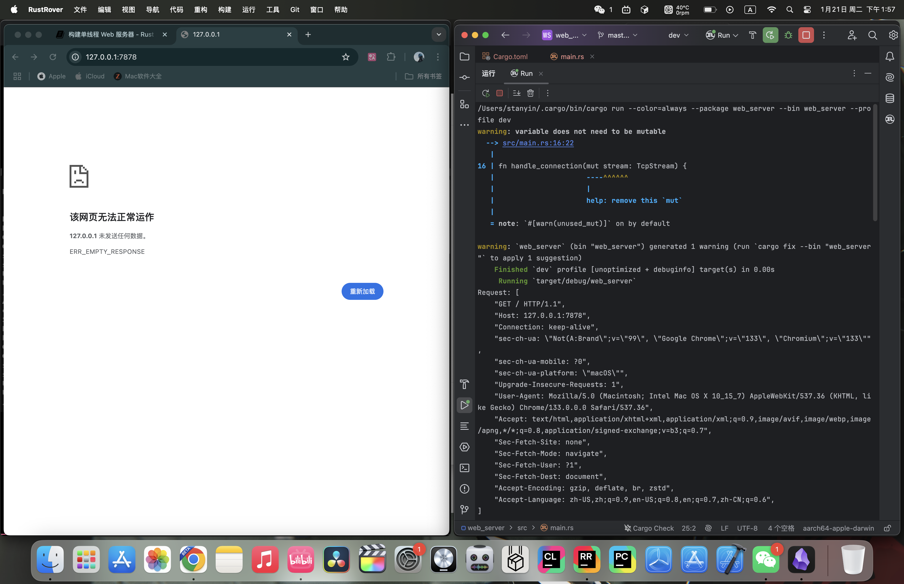
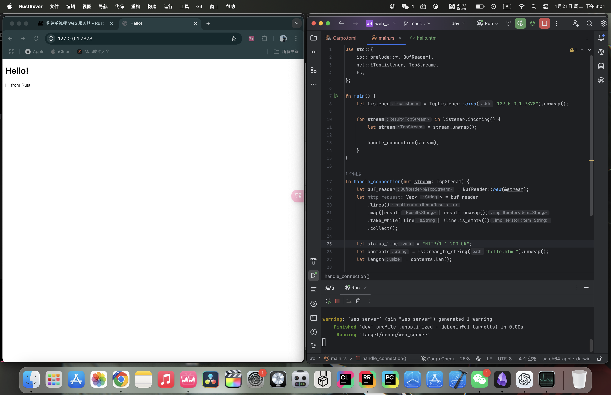

# 20.1 最后的项目：单线程Web服务器

## 20.1.1. 什么是TCP和HTTP
Web 服务器涉及的两个主要协议是超文本传输协议（Hypertext Transfer Protocol，HTTP）和传输控制协议（Transmission Control Protocol，TCP）。这两种协议都是请求-响应协议：客户端发送请求，服务器监听请求并向客户端发送响应。这些请求和响应的内容由协议定义。

TCP 是较低级别的协议。它描述信息如何从一台服务器传输到另一台服务器的细节，但不指定该信息是什么。HTTP 通过定义请求和响应的内容构建在 TCP 之上。从技术上讲，可以将 HTTP 与其他协议结合使用，但在大多数情况下，HTTP 通过 TCP 发送数据。我们将使用 TCP 和 HTTP 请求与响应的原始字节。

## 20.1.2. 监听TCP
了解了这些基础之后，我们就开始实践吧！首先创建这个项目：
```bash
cargo new web_server
```

打开 `main.rs`，初始代码如下：
```rust
use std::net::TcpListener;

fn main() {
    let listener = TcpListener::bind("127.0.0.1:7878").unwrap();

    for stream in listener.incoming() {
        let stream = stream.unwrap();

        println!("Connection established!");
    }
}
```
- `std::net::TcpListener` 是标准库提供的用于监听 TCP 连接的类型。
- `TcpListener::bind` 函数会监听你传入的地址。这里我们传入 `"127.0.0.1:7878"`，也就是本地的 7878 端口。它的返回类型是 `Result<T, E>`，因此我们使用 `unwrap` 进行错误处理。如果绑定成功，就会返回一个 `TcpListener`，并赋给 `listener` 变量。
- `TcpListener` 有一个 `incoming` 方法，它会返回一个产生流序列的迭代器，也就是 `TcpStream`。单个流表示客户端和服务器之间打开的一个连接，而 `for` 循环会依次处理每一个连接，为我们生成可供处理的流。

让我们尝试运行这段代码。在终端运行 `cargo run`，然后在浏览器中加载 `127.0.0.1:7878`。浏览器应该会显示错误（例如“连接重置”或 `ERR_SOCKET_NOT_CONNECTED`），因为服务器当前还没有发回任何数据。但当你查看终端时，应该会看到浏览器连接到服务器时打印出的一条或多条消息——浏览器加载单个页面时往往会打开多个连接：

控制台输出如下（某次可能的运行结果；具体条数可能不同）：
```text
Connection established!
Connection established!
Connection established!
Connection established!
Connection established!
Connection established!
Connection established!
Connection established!
Connection established!
Connection established!
```

## 20.1.3. 读取请求
我们已经实现了 TCP 监听，接下来尝试读取请求。我们直接在上文的代码上修改：
```rust
use std::{
    io::{prelude::*, BufReader},
    net::{TcpListener, TcpStream},
};

fn main() {
    let listener = TcpListener::bind("127.0.0.1:7878").unwrap();

    for stream in listener.incoming() {
        let stream = stream.unwrap();

        handle_connection(stream);
    }
}

fn handle_connection(mut stream: TcpStream) {
    let buf_reader = BufReader::new(&stream);
    let http_request: Vec<_> = buf_reader
        .lines()
        .map(|result| result.unwrap())
        .take_while(|line| !line.is_empty())
        .collect();

    println!("Request: {:#?}", http_request);
}
```
- 我们定义了一个名为 `handle_connection` 的函数来处理客户端连接。参数 `stream` 是一个可变的 `TcpStream` 值，用于与客户端通信。`TcpStream` 的内部状态可能会随着数据读取和写入发生变化，因此必须声明为 `mut`。
- 我们用 `BufReader` 包裹 `stream`，创建一个名为 `buf_reader` 的缓冲读取器。
- 我们使用 `map(|result| result.unwrap())` 解包 `Result` 值并提取其中的字符串。如果读取失败，程序会因 `unwrap` 而恐慌。
- `take_while(|line| !line.is_empty())` 会过滤迭代器中的元素，直到遇到空行为止。HTTP 请求使用空行（`""`）标记请求头结束，因此我们只收集非空行。
- 我们将所有非空行收集到一个 `Vec<_>` 中，并存储为 `http_request`。
- 我们用 `println!` 打印 `http_request`。

试一下：

终端输出如下（请求头因客户端而异；本例来自 Chrome）：
```text
Request: [
    "GET / HTTP/1.1",
    "Host: 127.0.0.1:7878",
    "Connection: keep-alive",
    "sec-ch-ua: \"Not(A:Brand\";v=\"99\", \"Google Chrome\";v=\"133\", \"Chromium\";v=\"133\"",
    "sec-ch-ua-mobile: ?0",
    "sec-ch-ua-platform: \"macOS\"",
    "Upgrade-Insecure-Requests: 1",
    "User-Agent: Mozilla/5.0 (Macintosh; Intel Mac OS X 10_15_7) AppleWebKit/537.36 (KHTML, like Gecko) Chrome/133.0.0.0 Safari/537.36",
    "Accept: text/html,application/xhtml+xml,application/xml;q=0.9,image/avif,image/webp,image/apng,*/*;q=0.8,application/signed-exchange;v=b3;q=0.7",
    "Sec-Fetch-Site: none",
    "Sec-Fetch-Mode: navigate",
    "Sec-Fetch-User: ?1",
    "Sec-Fetch-Dest: document",
    "Accept-Encoding: gzip, deflate, br, zstd",
    "Accept-Language: zh-CN,zh;q=0.9,en-US;q=0.8,en;q=0.7,zh-CN;q=0.6",
]
```

HTTP 是基于文本的协议，它的请求采用以下格式：
```
Method Request-URI HTTP-Version CRLF
headers CRLF
message-body
```
第一行是*请求行*，保存有关客户端请求的信息。请求行的第一部分指示正在使用的*方法*，例如 `GET` 或 `POST`。它描述客户端如何发出此请求。我们的客户端使用了 `GET` 请求，这意味着它正在询问信息。

请求行的下一部分是 `/`，它表示客户端请求的*统一资源标识符*（URI）。URI 几乎与*统一资源定位符*（URL）相同，但不完全相同。URI 和 URL 之间的区别对于本章的目的并不重要，但 HTTP 规范使用了术语 URI，因此我们可以在这里用 URL 代替 URI。

最后一部分是客户端使用的 HTTP 版本，然后请求行以*CRLF 序列*（`\r\n`）结束，其中 `\r` 是回车，`\n` 是换行。CRLF 序列将请求行与其余请求数据分开。请注意，当打印 CRLF 时，我们会看到一个新行，而不是 `\r\n`。

## 20.1.4. 编写响应
现在我们已经能读取请求，接下来写响应。响应的格式与请求非常相似：
```
HTTP-Version Status-Code Reason-Phrase CRLF
headers CRLF
message-body
```
第一行是*状态行*，其中包含响应中使用的 HTTP 版本、一个数字状态码，以及该状态码对应的文本描述，后面跟着一个 CRLF 序列。

有了格式就好写代码：
```rust
let response = "HTTP/1.1 200 OK\r\n\r\n";

stream.write_all(response.as_bytes()).unwrap();
```
- `HTTP/1.1` 是 HTTP 版本，`200` 是数字状态码，`OK` 是文本描述，`\r\n\r\n` 是 CRLF 序列。
- 我们在 `response` 上调用 `as_bytes`，将字符串数据转换为字节。`stream` 上的 `write_all` 方法接受 `&[u8]`，并直接通过连接发送这些字节。由于 `write_all` 可能失败，我们使用 `unwrap`。在实际应用中，你也可以在这里添加其他错误处理逻辑。

接下来返回一个真正的 HTML 文档。在项目根目录创建 `hello.html`：

然后这样写：
```html
<!DOCTYPE html>
<html lang="en">
  <head>
    <meta charset="utf-8">
    <title>Hello!</title>
  </head>
  <body>
    <h1>Hello!</h1>
    <p>Hi from Rust</p>
  </body>
</html>
```
这是一个最小的 HTML5 文档，带有标题和一些文本。

为了返回 HTML，我们需要修改 `main.rs`。首先把 `std::fs` 引入作用域：
```rust
use std::fs;
```
`fs` 是文件系统模块。

然后在 `handle_connection` 中稍微修改一下 `response` 变量：
```rust
let status_line = "HTTP/1.1 200 OK";
let contents = fs::read_to_string("hello.html").unwrap();
let length = contents.len();

let response =
    format!("{status_line}\r\nContent-Length: {length}\r\n\r\n{contents}");

stream.write_all(response.as_bytes()).unwrap();
```
- 使用 `fs::read_to_string` 把文件内容转换为字符串。
- 然后使用 `format!` 宏，按刚才写的格式把字符串放入响应中。

完整代码：
```rust
use std::{
    fs,
    io::{prelude::*, BufReader},
    net::{TcpListener, TcpStream},
};

fn main() {
    let listener = TcpListener::bind("127.0.0.1:7878").unwrap();

    for stream in listener.incoming() {
        let stream = stream.unwrap();

        handle_connection(stream);
    }
}

fn handle_connection(mut stream: TcpStream) {
    let buf_reader = BufReader::new(&stream);
    let http_request: Vec<_> = buf_reader
        .lines()
        .map(|result| result.unwrap())
        .take_while(|line| !line.is_empty())
        .collect();

    let status_line = "HTTP/1.1 200 OK";
    let contents = fs::read_to_string("hello.html").unwrap();
    let length = contents.len();

    let response =
        format!("{status_line}\r\nContent-Length: {length}\r\n\r\n{contents}");

    stream.write_all(response.as_bytes()).unwrap();
}
```

试一下：


## 20.1.5. 有选择地响应
现在，无论客户端请求什么，我们的 Web 服务器都会返回这个 HTML 文件。让我们添加功能，检查浏览器是否在访问正常路由。正常访问指的是访问 `127.0.0.1:7878/` 或 `127.0.0.1:7878`。在返回 HTML 文件之前，如果浏览器请求了其他任何内容，则返回错误。

在项目根目录创建一个 `404.html` 文件，内容如下：
```html
<!DOCTYPE html>
<html lang="en">
  <head>
    <meta charset="utf-8">
    <title>Hello!</title>
  </head>
  <body>
    <h1>Oops!</h1>
    <p>Sorry, I don't know what you're asking for.</p>
  </body>
</html>
```

把之前返回 HTML 的代码放进 `if` 分支。如果请求是正常访问，就返回正常内容；否则返回 `404.html`：
```rust
fn handle_connection(mut stream: TcpStream) {
    let buf_reader = BufReader::new(&stream);
    let request_line = buf_reader.lines().next().unwrap().unwrap();

    if request_line == "GET / HTTP/1.1" {
        let status_line = "HTTP/1.1 200 OK";
        let contents = fs::read_to_string("hello.html").unwrap();
        let length = contents.len();

        let response = format!(
            "{status_line}\r\nContent-Length: {length}\r\n\r\n{contents}"
        );

        stream.write_all(response.as_bytes()).unwrap();
    } else {
        let status_line = "HTTP/1.1 404 NOT FOUND";
        let contents = fs::read_to_string("404.html").unwrap();
        let length = contents.len();

        let response = format!(
            "{status_line}\r\nContent-Length: {length}\r\n\r\n{contents}"
        );

        stream.write_all(response.as_bytes()).unwrap();
    }
}
```
- 我们删去了打印请求的部分，因为不再需要它。
- 我们通过请求行判断用户是否在正常访问。正常路径仍然返回正常内容；其他任何请求则返回 `404.html` 的内容。

当前代码有很多重复的地方，我们来稍微重构一下：
```rust
fn handle_connection(mut stream: TcpStream) {
    let buf_reader = BufReader::new(&stream);
    let request_line = buf_reader.lines().next().unwrap().unwrap();

    let (status_line, filename) = if request_line == "GET / HTTP/1.1" {
        ("HTTP/1.1 200 OK", "hello.html")
    } else {
        ("HTTP/1.1 404 NOT FOUND", "404.html")
    };

    let contents = fs::read_to_string(filename).unwrap();
    let length = contents.len();

    let response =
        format!("{status_line}\r\nContent-Length: {length}\r\n\r\n{contents}");

    stream.write_all(response.as_bytes()).unwrap();
}
```
我们使用元组模式匹配和 `if` 表达式来确定 `status_line` 和 `filename` 的值。

试一下：

正常访问：


非正常访问：


## 20.1.6. 总结
以下是源代码：

`main.rs`:
```rust
use std::{
    fs,
    io::{prelude::*, BufReader},
    net::{TcpListener, TcpStream},
};

fn main() {
    let listener = TcpListener::bind("127.0.0.1:7878").unwrap();

    for stream in listener.incoming() {
        let stream = stream.unwrap();

        handle_connection(stream);
    }
}

fn handle_connection(mut stream: TcpStream) {
    let buf_reader = BufReader::new(&stream);
    let request_line = buf_reader.lines().next().unwrap().unwrap();

    let (status_line, filename) = if request_line == "GET / HTTP/1.1" {
        ("HTTP/1.1 200 OK", "hello.html")
    } else {
        ("HTTP/1.1 404 NOT FOUND", "404.html")
    };

    let contents = fs::read_to_string(filename).unwrap();
    let length = contents.len();

    let response =
        format!("{status_line}\r\nContent-Length: {length}\r\n\r\n{contents}");

    stream.write_all(response.as_bytes()).unwrap();
}
```

`hello.html`:
```html
<!DOCTYPE html>
<html lang="en">
<head>
    <meta charset="utf-8">
    <title>Hello!</title>
</head>
<body>
<h1>Hello!</h1>
<p>Hi from Rust</p>
</body>
</html>
```

`404.html`:
```html
<!DOCTYPE html>
<html lang="en">
<head>
  <meta charset="utf-8">
  <title>Hello!</title>
</head>
<body>
<h1>Oops!</h1>
<p>Sorry, I don't know what you're asking for.</p>
</body>
</html>
```
