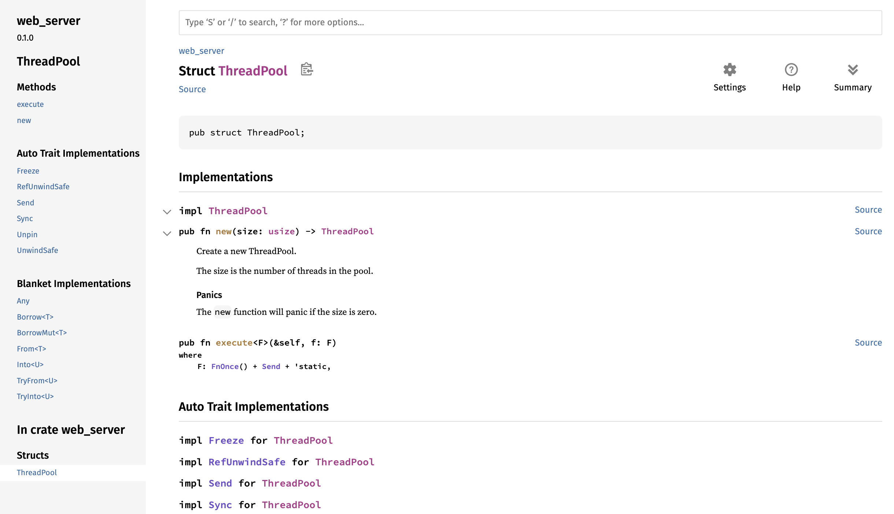

# 20.2 最后的项目：多线程Web服务器

## 20.2.1. 回顾

我们在上一篇文章中写了一个简单的本地服务器，但是这个服务器是单线的，也就是说请求一个一个进去之后我们得一个一个地处理，如果某个请求处理得慢，那后面的都得排队等着。这种单线程外部服务器的性能是非常差的。

## 20.2.2. 慢速请求

我们用代码来模拟慢速请求：
```rust
use std::{
    fs,
    io::{prelude::*, BufReader},
    net::{TcpListener, TcpStream},
    thread,
    time::Duration,
};
// ...

fn handle_connection(mut stream: TcpStream) {
    // ...

    let (status_line, filename) = match &request_line[..] {
        "GET / HTTP/1.1" => ("HTTP/1.1 200 OK", "hello.html"),
        "GET /sleep HTTP/1.1" => {
            thread::sleep(Duration::from_secs(5));
            ("HTTP/1.1 200 OK", "hello.html")
        }
        _ => ("HTTP/1.1 404 NOT FOUND", "404.html"),
    };

    // ...
}
```
省略了一些原代码，但是不影响。我们增加的语句是如果用户访问的是`127.0.0.1:7878/sleep`时会调用`thread::sleep(Duration::from_secs(5));`，这句话使代码的执行休眠5秒，也就是模拟的慢速请求。

然后打开两个浏览器窗口：一个用于[http://127.0.0.1:7878/](http://127.0.0.1:7878/)另一个为[http://127.0.0.1:7878/sleep](http://127.0.0.1:7878/sleep)。如果像以前一样，您会看到它快速响应。但是如果你输入`/sleep`然后加载 ，你会看到一直等到 `sleep`在加载前已经休眠了整整5秒。

如何改善这种情况呢？这里我们使用线程池技术，也可以选择其它技术比如*fork/join模型*、 *单线程异步 I/O 模型*或*多线程异步I/O模型*。

## 20.2.3. 使用线程池提高吞吐量

线程池是一组分配出来的线程，它们被用于等待并随时可能的任务。当程序接收到一个新任务时，它会给线程池里边一个线程分配这个任务，其余线程与此同时还可以接收其它任务。当任务执行完后，这个线程就会被重新放回线程池。

线程池通过允许并发处理连接的方式增加了服务器的吞吐量。

如何为每个连接都创建一个线程呢？看代码：
```rust
fn main() {
    let listener = TcpListener::bind("127.0.0.1:7878").unwrap();

    for stream in listener.incoming() {
        let stream = stream.unwrap();

        thread::spawn(|| {
            handle_connection(stream);
        });
    }
}
```
迭代器每迭代一次就创建一个新线程来处理。

这样写的缺点在于线程数量没有限制，每一个请求就创建一个新线程。如果黑客使用DoS(Denial of Service，拒绝服务攻击)，我们的服务器就会很快瘫掉。

所以在上边代码的基础上我们进行修改，我们使用编译驱动开发编写代码（不是一个标准的开发方法论，是开发者之间的一种戏称，不同于TDD测试驱动开发）:把期望调用的函数或是类型写上，再根据编译器的错误一步步修改。

### 使用编译驱动开发

我们把我们想写的代码直接写上，先*不论对错*：
```rust
fn main() {
    let listener = TcpListener::bind("127.0.0.1:7878").unwrap();
    let pool = ThreadPool::new(4);

    for stream in listener.incoming() {
        let stream = stream.unwrap();

        pool.execute(|| {
            handle_connection(stream);
        })
    }
}
```
虽然说并没有`ThreadPool`这个类型，但是根据编译驱动开发编写代码的逻辑，我觉得应该这么写就先写上，不管对错。

使用`cargo check`检查一下：
```
error[E0433]: failed to resolve: use of undeclared type `ThreadPool`
  --> src/main.rs:11:16
   |
9  |     let pool = ThreadPool::new(4);
   |                ^^^^^^^^^^ use of undeclared type `ThreadPool`

For more information about this error, try `rustc --explain E0433`.
error: could not compile `hello` (bin "hello") due to 1 previous error
```
这个错误告诉我们我们需要一个`ThreadPool`类型或模块，所以我们现在就构建一个。

我们在`lib.rs`中写`ThreadPool`的相关代码，一方面保持了`main.rs`足够简洁，另一方面也使`ThreadPool`相关代码能更加独立地存在。

打开`lib.rs`，写下`ThreadPool`的简单定义：
```rust
pub struct ThreadPool;
```

在`main.rs`里把`ThreadPool`引入作用域：
```rust
use web_server::ThreadPool;
```

使用`cargo check`检查一下：
```
error[E0599]: no function or associated item named `new` found for struct `ThreadPool` in the current scope
  --> src/main.rs:10:28
   |
10 |     let pool = ThreadPool::new(4);
   |                            ^^^ function or associated item not found in `ThreadPool`
```

这个错误表明接下来我们需要创建一个名为的关联函数 `ThreadPool`的`new` 。我们还知道`new`需要有一个参数，该参数可以接受`4`作为参数，并且应该返回一个`ThreadPool`实例。让我们实现具有这些特征的最简单的`new`函数：
```rust
pub struct ThreadPool;

impl ThreadPool {
    pub fn new(size: usize) -> ThreadPool {
        ThreadPool
    }
}
```

使用`cargo check`检查一下：
```
error[E0599]: no method named `execute` found for struct `ThreadPool` in the current scope
  --> src/main.rs:17:14
   |
15 |         pool.execute(|| {
   |         -----^^^^^^^ method not found in `ThreadPool`

For more information about this error, try `rustc --explain E0599`.
error: could not compile `hello` (bin "hello") due to 1 previous error
```

现在发生错误是因为我们在`ThreadPool`上没有`execute`方法。那就补充一个方法：
```rust
pub fn execute<F>(&self, f: F)
where
    F: FnOnce() + Send + 'static,
{
}
```
- `execute`函数的参数除了`self`的应用还有一个闭包参数，运行请求的线程只会调用闭包一次，所以使用`FnOnce()`，`()`表示它是返回单位类型`()`的闭包。同时我们需要`Send` trait将闭包从一个线程传输到另一个线程，而`'static`是因为我们不知道线程执行需要多长时间。

- 也可以这么想：我们使用它替代的是原代码的`thread::spawn`函数，所以修改时就可以借鉴它的函数签名，它的签名如下。我们主要借鉴的是泛型`F`和它的约束，所以`excute`函数的泛型约束就可以按照`F`来写。
```rust
pub fn spawn<F, T>(f: F) -> JoinHandle<T>
where
	F: FnOnce() -> T,
	F: Send + 'static
	T: Send + 'static
```

使用`cargo check`检查没有错误，但是使用`cargo run`依旧会报错，因为`execute`和`new`都没有实现实际需要的效果，只是满足了编译器的检查。

你可能听说过关于具有严格编译器的语言（例如 Haskell 和 Rust）的一句话是“*if the code compiles, it works.如果代码可以编译，它就可以工作*”。但这句话并不普遍正确。我们的项目可以编译，但它什么也没做。如果我们正在构建一个真实的、完整的项目，那么这是**开始编写单元测试以检查代码是否编译并具有我们想要的行为的好时机（也就是TDD测试驱动开发）**。

### 修改`new`函数 Pt.1

我们先修改`new`函数使其具有实际意义：
```rust
impl ThreadPool {
    /// Create a new ThreadPool.
    ///
    /// The size is the number of threads in the pool.
    ///
    /// # Panics
    ///
    /// The `new` function will panic if the size is zero.
    pub fn new(size: usize) -> ThreadPool {
        assert!(size > 0);

        ThreadPool
    }

    // ...
}
```
- 我们使用`assert!`函数来判断`new`函数的参数要大于0，因为等于0时没有任何意义。
- 添加了一些文档注释，这样在运行`cargo doc --open`时就能看到文档解释：


### 修改`ThreadPool`类型

`new`函数的修改遇到瓶颈了：`ThreadPool`类型都没有具体字段我们实现不了创建具体线程数量的目标。所以接下来我们研究一下如何在`ThreadPool`里存储线程，代码如下：
```rust
use std::thread;

pub struct ThreadPool{
    threads: Vec<thread::JoinHandle<()>>,
}
```
`ThreadPool`下有`threads`字段，类型是`Vec<thread::JoinHandle<()>>`：
- `Vec<>`是因为我们要存储多个线程，但是具体数量又未知，所以使用`Vector`
- 之前我们看过`thread::spawn`函数的函数签名，其返回值是`JoinHandle<T>`，依葫芦画瓢，我们就也使用`thread::JoinHandle<>`来存储线程。
  `JoinHandle<T>`有`T`是因为`thread::spawn`的线程有可能会有返回值，不知道具体什么类型，所以用泛型来表示。而我们的代码是确定没有返回值的，所以就写`thread::JoinHandle<()>`，`()`是单元类型。

### 修改`new`函数 Pt.2

修改完`ThreadPool`的定义之后我们再返回来修改`new`函数：
```rust
pub fn new(size: usize) -> ThreadPool {
    assert!(size > 0);

    let mut threads = Vec::with_capacity(size);

    for _ in 0..size {
        // create some threads and store them in the vector
    }

    ThreadPool { threads }
}
```
- `Vec::with_capacity`函数传进去`size`来创建一个预分配好空间的`Vector`
- 写了一个从0到`size`的循环（不包括`size`），里面的逻辑暂时还没写，总之这个循环是准备用来创建线程并存到`Vector`里的
- 最后返回`ThreadPool`类型即可，`threads`字段的值就是这个函数中的`threads`

接下来我们来研究一下`thread::spawn`函数一遍我们更好写`new`里的循环。`thread::spawn`在线程创建后立即获取线程应运行的代码执行。然而，在我们的例子中，我们想要创建线程并让它们**等待**我们稍后发送的代码。标准库的线程实现不包含任何方法来做到这一点，所以我们必须手动实现它。

### 使用Worker数据结构

我们使用一种新的数据结构来实现这个效果，叫做*Worker* ，这是池实现中的常用术语。 Worker拾取需要运行的代码并在Worker的线程中运行代码。想象一下在餐厅厨房工作的人：工人们等待顾客下单，然后负责接受并履行这些订单。我们通过Worker来管理和实现我们所要的行为。

我们来创建`Worker`这个结构体及必要的方法：
```rust
struct Worker {
    id: usize,
    thread: thread::JoinHandle<()>,
}

impl Worker {
    fn new(id: usize) -> Worker {
        let thread = thread::spawn(|| {});

        Worker { id, thread }
    }
}
```
- `Worker`一共有两个字段，一个是`id`，类型为`usize`，表示标识；还有一个`thread`字段，类型是`thread::JoinHandle<()>`，存储一个线程
- `new`函数创建了`Worker`实例，`id`字段的值就是它的参数

*PS：外部代码（如`main.rs`中的服务器）不需要知道有关在`ThreadPool`中使用`Worker`结构的实现细节，因此我们将`Worker`结构及其`new`函数设为私有。*

接下来在`ThreadPool`里使用`Worker`：
```rust
pub struct ThreadPool {
    workers: Vec<Worker>,
}
```

`ThreadPool`上的`new`函数和`excute`函数也需要修改，这里先修改`new`函数，`excute`等一下修改：
```rust
pub fn new(size: usize) -> ThreadPool {
    assert!(size > 0);

    let mut workers = Vec::with_capacity(size);

    for id in 0..size {
        workers.push(Worker::new(id));
    }

    ThreadPool { workers }
}
```
- 把`threads`相关的代码改为`Workers`即可
- 由于`ThreadPool`的`Worker`字段是被`Vector`包裹的，所以使用`Vector`的`push`方法即可以往`Vector`里添加新元素
- 在循环中使用到了`Worker`上的`new`函数，创建了`Worker`实例，`id`字段的值就是传进去的参数

*PS：如果操作系统由于没有足够的系统资源而无法创建线程， `thread::spawn`将会出现恐慌。我们在这个例子中不考虑这种情况，但在实际编写时最好考虑到这点，使用[`std::thread::builder`](https://doc.rust-lang.org/std/thread/struct.Builder.html)，它会返回`Result<JoinHandle<T>>`。*

### 通过通道向线程发送请求

完成了线程的创建，接下来就要考虑如何接收任务了。这时就需要通道这个技术。重构一下代码：
```rust
use std::thread;
use std::sync::mpsc;

pub struct ThreadPool {
    workers: Vec<Worker>,
    sender: mpsc::Sender<Job>,
}

struct Job;
```
- 使用`use std::sync::mpsc;`把`mpsc`引入作用域以便后文使用
- 为`ThreadPool`新建了一个字段`sender`，类型是`mpsc::Sender<Job>`(`Job`是一个结构体，表示要执行的工作)，用于存储发送端

我们在`ThreadPool`的`new`方法上创建通道：
```rust
impl ThreadPool {
	// ...
	pub fn new(size: usize) -> ThreadPool {
	    assert!(size > 0);
	    let (sender, receiver) = mpsc::channel();
	    let mut workers = Vec::with_capacity(size);

	    for id in 0..size {
	        workers.push(Worker::new(id, receiver));
	    }

	    ThreadPool { workers, sender }
	}
	// ...
}
// ...
impl Worker {
    fn new(id: usize, receiver: Receiver<Job>) -> Worker {
        let thread = thread::spawn(|| {
            receiver;
        });

        Worker { id, thread }
    }
}
```
- 使用`mpsc::channel()`函数创建通道，发送端和接收端分别命名为`sender`和`receiver`
- 把`sender`赋给返回值的`sender`字段，就相当于线程池持有通道的发送端了
- 接收者应该是`Worker`，所以我们把`Worker`的`new`函数也要相应的更改，增加了`receiver`这个参数

这时候运行`cargo check`试试：
```
error[E0382]: use of moved value: `receiver`
  --> src/lib.rs:26:42
   |
22 |         let (sender, receiver) = mpsc::channel();
   |                      -------- move occurs because `receiver` has type `std::sync::mpsc::Receiver<Job>`, which does not implement the `Copy` trait
...
25 |         for id in 0..size {
   |         ----------------- inside of this loop
26 |             workers.push(Worker::new(id, receiver));
   |                                          ^^^^^^^^ value moved here, in previous iteration of loop
   |
note: consider changing this parameter type in method `new` to borrow instead if owning the value isn't necessary
  --> src/lib.rs:45:33
   |
45 |     fn new(id: usize, receiver: Receiver<Job>) -> Worker {
   |        --- in this method       ^^^^^^^^^^^^^ this parameter takes ownership of the value
help: consider moving the expression out of the loop so it is only moved once
   |
25 ~         let mut value = Worker::new(id, receiver);
26 ~         for id in 0..size {
27 ~             workers.push(value);
   |
```
报错是因为该代码尝试将一个`receiver`传递给多个`Worker`实例，这是行不通的，因为接收端只能有一个。

我们希望所有的线程都共享一个`receiver`，从而能在线程间分发任务。此外，从通道队列中取出`receiver`涉及改变 `receiver` ，因此线程需要一种安全的方式来共享和修改`receiver` 。否则，我们可能会遇到竞争条件。

针对多线程多重所有权的要求，可以使用`Arc<T>`（`Rc<T>`只能用于单线程）；针对多线程避免数据竞争的要求，可以使用互斥锁`Mutex<T>`。

这下只需要在原本的`receiver`上套`Arc<T>`和`Mutex<T>`就行了：
```rust
impl ThreadPool {
    /// ...
    pub fn new(size: usize) -> ThreadPool {
        assert!(size > 0);
        let (sender, receiver) = mpsc::channel();
        let mut workers = Vec::with_capacity(size);

        let receiver = Arc::new(Mutex::new(receiver));
        for id in 0..size {
            workers.push(Worker::new(id, Arc::clone(&receiver)));
        }

        ThreadPool { workers, sender }
    }
	//...
}
//...

impl Worker {
    fn new(id: usize, receiver: Arc<Mutex<mpsc::Receiver<Job>>>) -> Worker {
        let thread = thread::spawn(|| {
            receiver;
        });

        Worker { id, thread }
    }
}
```
- 重新声明`receiver`，把它用`Arc<T>`和`Mutex<T>`包裹
- 在循环中使用`Arc::clone(&receiver)`传给每个`Worker`
- `Worker`的`new`方法的`receiver`参数的类型需要改为`Arc<Mutex<mpsc::Receiver<Job>>>`

### 修改`Job`

我们的`Job`暂时还是一个空结构体，没有任何的实际效果，所以我们把它改为类型别名（详见19.5. 高级类型）：
```rust
type Job = Box<dyn FnOnce() + Send + 'static>;
```
`Job`是一个闭包，在一个线程中只被调用一次，没有返回值（或者叫返回值是单元类型`()`），所以得满足`FnOnce()`；并且这个闭包还要能够在线程间传递，所以得满足`Send` trait。`'static`是因为我们不知道线程执行需要多长时间，只好把它声明为静态生命周期。

### 修改`execute`函数

接下来我们来修改`execute`函数：
```rust
pub fn execute<F>(&self, f: F)
where
    F: FnOnce() + Send + 'static,
{
    let job = Box::new(f);

    self.sender.send(job).unwrap();
}
```
- 因为`Job`的最外层是`Box<T>`封装，所以想把闭包`f`发送出去就得先用`Box::new`函数来封装
- 使用`self`的`sender`字段作为发送端把`job`发送出去

### 修改`Worker`下的`new`函数

`excute`方法这么改了，那么作为接收端的`Worker`下的`new`函数也得改：
```rust
impl Worker {
    fn new(id: usize, receiver: Arc<Mutex<mpsc::Receiver<Job>>>) -> Worker {
        let thread = thread::spawn(move || loop {
            let job = receiver.lock().unwrap().recv().unwrap();
            println!("Worker {} got a job; executing.", id);
            job();
        });

        Worker { id, thread }
    }
}
```
- 使用`lock`锁定了`receiver`(`receiver`被封装在互斥锁`Mutex<T>`里)，获取互斥体，`unwrap`错误处理
- 再使用`recv`方法从通道接收传过来的内容，再使用`unwrap`错误处理
- 打印一下是哪个`Worker`在工作
- 当调用`job();`时，编译器会自动将`job`解引用为其内部的闭包类型，然后调用`FnOnce`或其他相应的trait实现的`call`方法。这是因为`Box<dyn FnOnce()>`实现了`FnOnce`。也就是说，`job();`是`(*job)();`的语法糖。

---

### 版本差异

我使用的是1.84.0的Rust，在早期（大概是1.0版本附近）时不能直接使用`job();`，也不能使用`(*job)();`，因为当时编译器不直接知道动态大小类型所占用的内存大小，所以不能直接解码。在后来的 **Rust RFC 127（实现于 Rust 1.20，发布于 2017 年）** 之后，Rust 为`Box<dyn Trait>`等类型添加了直接调用trait方法的能力，这背后利用了**自动解引用及调用调度逻辑**。

总而言之，如果你写成上文代码那样要报错的话要么就升级Rust版本，要么就增加并修改一些代码:
```rust
trait FnBox {
	fn call_box(self: Box(self))
}

impl<F: FnOnce()> FnBox for F {
	fn call_box(self: Box<F>) {
		(*self)();
	}
}

type Job = Box<FnBox + Send + 'static>
```
- `FnBox` trait这个方法使得我们可以在类型的`Box`上调用了
- 为`FnOnce()`写了`call_box`的具体实现（因为`Job`实现了`FnOnce()`），这样就可以获得`Box`里边东西的所有权，从而调用
- 把`Job`的类型从`FnOnce()`改成`FnBox`，这样其它代码就可以不用修改，所有实现了`FnBox`的类型肯定同时实现了`FnBox`

## 20.2.4. 试运行

终于改完了，让我们试运行一下：

如果你在浏览器里多刷新几次界面就能看到其它不同id的`Worker`在工作。

## 20.2.5. 总结

`main.rs`:
```rust
use std::{
    io::{prelude::*, BufReader},
    net::{TcpListener, TcpStream},
    fs,
};
use web_server::ThreadPool;

fn main() {
    let listener = TcpListener::bind("127.0.0.1:7878").unwrap();
    let pool = ThreadPool::new(4);

    for stream in listener.incoming() {
        let stream = stream.unwrap();

        pool.execute(|| {
            handle_connection(stream);
        })
    }
}

fn handle_connection(mut stream: TcpStream) {
    let buf_reader = BufReader::new(&stream);
    let request_line = buf_reader.lines().next().unwrap().unwrap();

    let (status_line, filename) = if request_line == "GET / HTTP/1.1" {
        ("HTTP/1.1 200 OK", "hello.html")
    } else {
        ("HTTP/1.1 404 NOT FOUND", "404.html")
    };

    let contents = fs::read_to_string(filename).unwrap();
    let length = contents.len();

    let response =
        format!("{status_line}\r\nContent-Length: {length}\r\n\r\n{contents}");

    stream.write_all(response.as_bytes()).unwrap();
}
```

`lib.rs`:
```rust
use std::{
    sync::{mpsc, Arc, Mutex},
    thread,
};

pub struct ThreadPool {
    workers: Vec<Worker>,
    sender: mpsc::Sender<Job>,
}

type Job = Box<dyn FnOnce() + Send + 'static>;

impl ThreadPool {
    /// Create a new ThreadPool.
    ///
    /// The size is the number of threads in the pool.
    ///
    /// # Panics
    ///
    /// The `new` function will panic if the size is zero.
    pub fn new(size: usize) -> ThreadPool {
        assert!(size > 0);
        let (sender, receiver) = mpsc::channel();
        let mut workers = Vec::with_capacity(size);

        let receiver = Arc::new(Mutex::new(receiver));
        for id in 0..size {
            workers.push(Worker::new(id, Arc::clone(&receiver)));
        }

        ThreadPool { workers, sender }
    }

    pub fn execute<F>(&self, f: F)
    where
        F: FnOnce() + Send + 'static,
    {
        let job = Box::new(f);

        self.sender.send(job).unwrap();
    }
}

struct Worker {
    id: usize,
    thread: thread::JoinHandle<()>,
}

impl Worker {
    fn new(id: usize, receiver: Arc<Mutex<mpsc::Receiver<Job>>>) -> Worker {
        let thread = thread::spawn(move || loop {
            let job = receiver.lock().unwrap().recv().unwrap();
            println!("Worker {} got a job; executing.", id);
            job();
        });

        Worker { id, thread }
    }
}
```

`hello.html`:
```html
<!DOCTYPE html>
<html lang="en">
<head>
    <meta charset="utf-8">
    <title>Hello!</title>
</head>
<body>
<h1>Hello!</h1>
<p>Hi from Rust</p>
</body>
</html>
```

`404.html`:
```html
<!DOCTYPE html>
<html lang="en">
<head>
  <meta charset="utf-8">
  <title>Hello!</title>
</head>
<body>
<h1>Oops!</h1>
<p>Sorry, I don't know what you're asking for.</p>
</body>
</html>
```