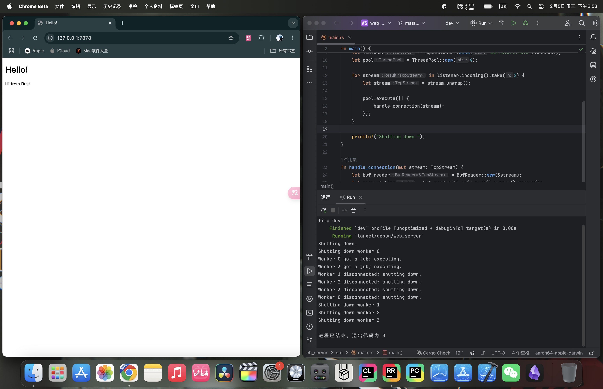

# 20.3.0. 回顾
在上一篇文章中我们完成了多线程Web服务器的构建，但是它的仍然有一些可以改进之处，这篇文章我们就来完善代码。

*注意：本文衔接于上一篇文章 [20.2. 最后的项目：多线程Web服务器](../20.2/20.2._最后的项目：多线程Web服务器.md)。如果你想要详细了解从零开始的构建Web服务器过程，请阅读完20章的所有文章。*

# 20.3.1. 为`ThreadPool`实现`Drop` trait
当我们想要停机（使用不太优雅的Ctrl + C方法来停止主线程）时，所有其他线程也会立即停止，即使它们正在处理请求。

管理变量清除的trait是`Drop` trait，我们只需要在本地写`drop`函数来覆盖默认实现即可，使线程能够在关闭之前完成当前正在处理的工作。我们还需要某种方式来避免线程接受新的请求并为停机做好准备

让我们来为`ThreadPool`类型实现`Drop` trait:
```rust
impl Drop for ThreadPool {
    fn drop(&mut self) {
        for worker in &mut self.workers {
            println!("Shutting down worker {}", worker.id);

            worker.thread.join().unwrap();
        }
    }
}
```
逻辑就是遍历每一个`worker`，然后调用`worker`里`thread`字段的`join`方法（详见 [16.1. 使用多线程同时运行代码](../../Chapter-16/16.1/16.1._使用多线程同时运行代码.md)）即可。

使用`cargo check`检查一下：
```
error[E0507]: cannot move out of `worker.thread` which is behind a mutable reference
    --> src/lib.rs:49:13
     |
49   |             worker.thread.join().unwrap();
     |             ^^^^^^^^^^^^^ ------ `worker.thread` moved due to this method call
     |             |
     |             move occurs because `worker.thread` has type `JoinHandle<()>`, which does not implement the `Copy` trait
     |
note: `JoinHandle::<T>::join` takes ownership of the receiver `self`, which moves `worker.thread`
    --> /Users/stanyin/.rustup/toolchains/stable-aarch64-apple-darwin/lib/rustlib/src/rust/library/std/src/thread/mod.rs:1863:17
     |
1863 |     pub fn join(self) -> Result<T> {
     |                 ^^^^
```
报错信息显示我们无法把`worker`的`thread`字段移出来，因为我们只有每个`worker`的可变引用但`join`方法要求我们获得`worker`的所有权。

为了实现取得所有权的要求，我们需要修改`Worker`的`thread`字段的类型，使用`Option<T>`包裹`thread::JoinHandle<()>`即可，这样我们就可以调用`Option<T>`的`take`方法来获得所有权：
```rust
struct Worker {
    id: usize,
    thread: Option<thread::JoinHandle<()>>,
}
```

使用了`thread`字段的地方都得因为`Option<T>`而修改：
```rust
impl Worker {  
    fn new(id: usize, receiver: Arc<Mutex<mpsc::Receiver<Job>>>) -> Worker {  
        let thread = thread::spawn(move || loop {  
            let job = receiver.lock().unwrap().recv().unwrap();  
            println!("Worker {} got a job; executing.", id);  
            job();  
        });  
  
        Worker {   
            id,   
            thread: Some(thread)   
        }  
    }  
}
```
把`thread`字段值从`thread`改为了`Some(thread)`。

```rust
impl Drop for ThreadPool {  
    fn drop(&mut self) {  
        for worker in &mut self.workers {  
            println!("Shutting down worker {}", worker.id);  
  
            if let Some(thread) = worker.thread.take() {  
                thread.join().unwrap();  
            }  
        }  
    }  
}
```
通过`if let`模式匹配来取出`worker`为`Some`变体时里的值（使用`take`方法可以获得所有权而不是可变引用）。

# 20.3.2. 向线程发出信号以退出
这么修改编译能够通过了，但是还没到达效果。*调用`drop`方法并不会真正地关停线程*，因为线程还在`loop`循环中持续地等待任务。

如果我们用这个`drop`方法丢弃`ThreadPool`主线程就会永远阻塞，以等待第一个线程的结束（每个线程里都一直在`loop`寻找作业，不会跳出循环）。

我们需要`ThreadPool`的`sender`字段有两种状态——有任务的状态（附带任务的发送端）和终止的状态：
```rust
pub struct ThreadPool {  
    workers: Vec<Worker>,  
    sender: Option<mpsc::Sender<Job>>,  
}
```
使用`Option<T>`修改可以使它表示两种状态。

使用了`sender`字段的地方都得修改：
```rust
impl Drop for ThreadPool {  
    fn drop(&mut self) {  
        drop(self.sender.take());  
          
        for worker in &mut self.workers {  
            println!("Shutting down worker {}", worker.id);  
  
            if let Some(thread) = worker.thread.take() {  
                thread.join().unwrap();  
            }  
        }  
    }  
}
```
添加了`drop(self.sender.take());`来显式丢弃发送端，这样通道就会关闭。发生这种情况时，`Worker`在无限循环中执行的所有对`recv`的调用都将返回错误，也就停止了运行。

```rust
pub fn new(size: usize) -> ThreadPool {  
    assert!(size > 0);  
    let (sender, receiver) = mpsc::channel();  
    let mut workers = Vec::with_capacity(size);  
  
    let receiver = Arc::new(Mutex::new(receiver));  
    for id in 0..size {  
        workers.push(Worker::new(id, Arc::clone(&receiver)));  
    }  
  
    ThreadPool {  
        workers,  
        sender: Some(sender),  
    }  
}
```
返回值的`sender`字段使用`Some`变体包裹。

```rust
pub fn execute<F>(&self, f: F)  
    where  
        F: FnOnce() + Send + 'static,  
    {  
        let job = Box::new(f);  
  
        self.sender.as_ref().unwrap().send(job).unwrap();  
    }  
}
```
使用`as_ref`就可以避免所有权问题：`send`需要所有权，但是不能给（`excute`函数的参数是引用`&self`，没有所有权），所以发送引用。

这样改还不够优雅，`Worker`在无限循环中执行的所有对`recv`的调用都将返回错误，最好是不要以报错而退出，所以还要修改：
```rust
fn new(id: usize, receiver: Arc<Mutex<mpsc::Receiver<Job>>>) -> Worker {  
    let thread = thread::spawn(move || loop {  
        let job = receiver.lock().unwrap().recv();  
          
        match job {  
            Ok(job) => {  
                println!("Worker {} got a job; executing.", id);  
                job();  
            },  
            Err(_) => break,  
        }  
    });
```
取消掉了`job`的最后一个`unwrap`，转而使用`match`分支来操作：`Ok`变体就执行`job`，`Err`变体就退出。

# 20.3.3. 试运行
为了测试修改之后的效果，我们修改`main.rs`只让服务器接收两个请求（通过`take`的限制迭代器迭代数量）：
```rust
fn main() {
    let listener = TcpListener::bind("127.0.0.1:7878").unwrap();
    let pool = ThreadPool::new(4);

    for stream in listener.incoming().take(2) {
        let stream = stream.unwrap();

        pool.execute(|| {
            handle_connection(stream);
        });
    }

    println!("Shutting down.");
}
```
输出：

你可能会看到不同的信息，因为线程池中哪个线程得到工作是随机的，但是应该是大致类似的。

# 20.3.4. 总结
`main.rs`:
```rust
use std::{  
    io::{prelude::*, BufReader},  
    net::{TcpListener, TcpStream},  
    fs,  
};  
use web_server::ThreadPool;  
  
fn main() {  
    let listener = TcpListener::bind("127.0.0.1:7878").unwrap();  
    let pool = ThreadPool::new(4);  
  
    for stream in listener.incoming() {  
        let stream = stream.unwrap();  
  
        pool.execute(|| {  
            handle_connection(stream);  
        })  
    }  
}  
  
fn handle_connection(mut stream: TcpStream) {  
    let buf_reader = BufReader::new(&stream);  
    let request_line = buf_reader.lines().next().unwrap().unwrap();  
  
    let (status_line, filename) = if request_line == "GET / HTTP/1.1" {  
        ("HTTP/1.1 200 OK", "hello.html")  
    } else {  
        ("HTTP/1.1 404 NOT FOUND", "404.html")  
    };  
  
    let contents = fs::read_to_string(filename).unwrap();  
    let length = contents.len();  
  
    let response =  
        format!("{status_line}\r\nContent-Length: {length}\r\n\r\n{contents}");  
  
    stream.write_all(response.as_bytes()).unwrap();  
}
```

`lib.rs`:
```rust
use std::{  
    sync::{mpsc, Arc, Mutex},  
    thread,  
};  
  
pub struct ThreadPool {  
    workers: Vec<Worker>,  
    sender: Option<mpsc::Sender<Job>>,  
}  
  
impl Drop for ThreadPool {  
    fn drop(&mut self) {  
        drop(self.sender.take());  
  
        for worker in &mut self.workers {  
            println!("Shutting down worker {}", worker.id);  
  
            if let Some(thread) = worker.thread.take() {  
                thread.join().unwrap();  
            }  
        }  
    }  
}  
  
type Job = Box<dyn FnOnce() + Send + 'static>;  
  
impl ThreadPool {  
    /// Create a new ThreadPool.  
    ///    /// The size is the number of threads in the pool.    ///    /// # Panics  
    ///    /// The `new` function will panic if the size is zero.    pub fn new(size: usize) -> ThreadPool {  
        assert!(size > 0);  
        let (sender, receiver) = mpsc::channel();  
        let mut workers = Vec::with_capacity(size);  
  
        let receiver = Arc::new(Mutex::new(receiver));  
        for id in 0..size {  
            workers.push(Worker::new(id, Arc::clone(&receiver)));  
        }  
  
        ThreadPool {  
            workers,  
            sender: Some(sender),  
        }  
    }  
  
    pub fn execute<F>(&self, f: F)  
    where  
        F: FnOnce() + Send + 'static,  
    {  
        let job = Box::new(f);  
  
        self.sender.as_ref().unwrap().send(job).unwrap();  
    }  
}  
  
struct Worker {  
    id: usize,  
    thread: Option<thread::JoinHandle<()>>,  
}  
  
impl Worker {  
    fn new(id: usize, receiver: Arc<Mutex<mpsc::Receiver<Job>>>) -> Worker {  
        let thread = thread::spawn(move || loop {  
            let job = receiver.lock().unwrap().recv();  
  
            match job {  
                Ok(job) => {  
                    println!("Worker {} got a job; executing.", id);  
                    job();  
                },  
                Err(_) => break,  
            }  
        });  
  
        Worker {  
            id,  
            thread: Some(thread),  
        }  
    }  
}
```

`hello.html`:
```html
<!DOCTYPE html>  
<html lang="en">  
<head>  
    <meta charset="utf-8">  
    <title>Hello!</title>  
</head>  
<body>  
<h1>Hello!</h1>  
<p>Hi from Rust</p>  
</body>  
</html>
```

`404.html`:
```html
<!DOCTYPE html>  
<html lang="en">  
<head>  
  <meta charset="utf-8">  
  <title>Hello!</title>  
</head>  
<body>  
<h1>Oops!</h1>  
<p>Sorry, I don't know what you're asking for.</p>  
</body>  
</html>
```